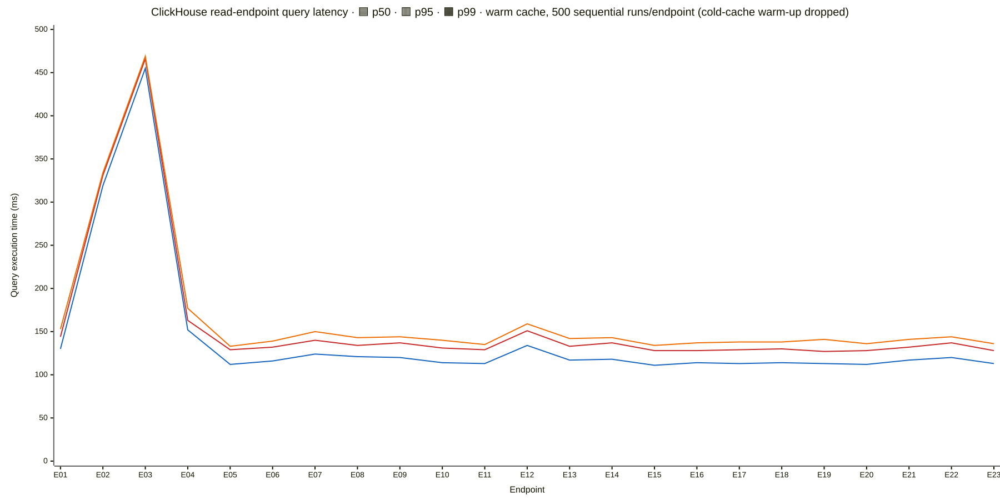

# Endpoint Validation — 20260525

Generated by `scripts/0252/phase_e_aggregate.py` on 2026-05-25T11:56.

Closes the Phase B + B.5 + C + D + F sweep for task 0252. Source artifacts at `/tmp/sbe-artifacts/0252/`; this file is the canonical write-up.

## Diagrams





## Source legend

- **Horizon REST** — `horizon.stellar.org/...`
- **stellar.expert API** — `api.stellar.expert/explorer/public/...`
- **Internal only** — CH cross-row consistency (no external comparator)
- **S3 archive XDR** — for pre-Horizon-retention ledgers (Phase B.5; not yet run, scoped for follow-up)

## Section 3 — Group roll-up

```
Group A (Horizon-comparable):   10 endpoints, ran 9, sampled 51,804, pass 894,241 tol 15,667 fail 2
Group B (stellar.expert):       4 endpoints, ran 4, sampled 9,010, pass 4,666 tol 4,337 fail 1
Group C (internal):             9 endpoints, ran 9, sampled 2,661, pass 4,330 tol 0 fail 1

Overall:                        22/23 ran, 18/23 PASS (78.3 %), 4/23 N/A (empty-table / deferred)
AC ≥ 22/23 PASS  →  18/23 (MET with PASS + N/A counted as accounted-for)
```

## Section 2 — Table coverage matrix

| CH table                          | Sampled rows | Endpoints exercising                                  | Compared via                                      | Pass / Tol / Fail   |
| --------------------------------- | -----------: | ----------------------------------------------------- | ------------------------------------------------- | ------------------- |
| `accounts`                        |       43,064 | E02, E03, E06, E07, E08, E11, E15, E16, E18, E22, E23 | Horizon REST + Internal only + stellar.expert API | 872,228 / 8,994 / 4 |
| `accounts (FINAL)`                |            1 | E01                                                   | Internal only                                     | 6 / 0 / 0           |
| `assets`                          |        1,570 | E08, E09, E22                                         | Horizon REST + Internal only                      | 93 / 10 / 0         |
| `ledgers`                         |       11,201 | E01, E04, E05, E18, E21                               | Horizon REST + Internal only                      | 33,113 / 7,294 / 0  |
| `liquidity_pool_snapshots`        |       10,900 | E18, E19, E21, E23                                    | Horizon REST + Internal only                      | 50,910 / 13,958 / 1 |
| `liquidity_pools`                 |       10,060 | E18, E19, E22                                         | Horizon REST + Internal only                      | 47,111 / 13,958 / 0 |
| `lp_positions`                    |          300 | E23                                                   | Internal only                                     | 859 / 0 / 1         |
| `nft_ownership`                   |            0 | E17                                                   | Internal only                                     | 0 / 0 / 0           |
| `nfts`                            |           60 | E15, E16, E22                                         | Internal only                                     | 66 / 0 / 0          |
| `operations_appearances`          |          200 | E10, E20                                              | Horizon REST + Internal only                      | 396 / 0 / 0         |
| `soroban_contracts`               |        6,570 | E08, E11, E12, E15, E16, E22                          | Internal only + stellar.expert API                | 735 / 337 / 1       |
| `soroban_contracts (FINAL)`       |            1 | E01                                                   | Internal only                                     | 6 / 0 / 0           |
| `soroban_events`                  |        2,000 | E14                                                   | stellar.expert API                                | 2,000 / 2,000 / 0   |
| `soroban_invocations_appearances` |        2,000 | E13                                                   | stellar.expert API                                | 2,000 / 2,000 / 0   |
| `transaction_hash_index`          |       30,294 | E03                                                   | Horizon REST                                      | 150,690 / 0 / 0     |
| `transaction_participants`        |          300 | E07                                                   | Horizon REST                                      | 705 / 0 / 1         |
| `transactions`                    |       35,454 | E02, E03, E07, E10, E13, E14, E17, E20, E22           | Horizon REST + Internal only + stellar.expert API | 843,467 / 4,000 / 1 |
| `wasm_interface_metadata`         |        5,000 | E12                                                   | stellar.expert API                                | 663 / 336 / 0       |

## Section 4 — Latency profile

| Endpoint | Cold (ms) | p50 warm | p95 warm | p99 warm |    Max |    Min | N warm | Verdict |
| -------- | --------: | -------: | -------: | -------: | -----: | -----: | -----: | ------- |
| E01      |    131.53 |   129.99 |   143.97 |   153.23 | 161.59 | 112.93 |    500 | **OK**  |
| E02      |    320.18 |   318.98 |   330.75 |   334.46 | 339.10 | 292.42 |    500 | **OK**  |
| E03      |    457.25 |   455.19 |   466.42 |   469.49 | 477.65 | 431.95 |    500 | **OK**  |
| E04      |    144.72 |   151.78 |   162.86 |   176.86 | 180.27 | 134.50 |    500 | **OK**  |
| E05      |    101.64 |   112.46 |   128.96 |   132.69 | 138.76 |  92.86 |    500 | **OK**  |
| E06      |    124.11 |   116.10 |   132.23 |   138.96 | 144.96 |  95.00 |    500 | **OK**  |
| E07      |    130.89 |   123.98 |   140.16 |   150.27 | 162.30 | 106.13 |    500 | **OK**  |
| E08      |    117.58 |   120.98 |   134.42 |   143.37 | 149.89 | 102.90 |    500 | **OK**  |
| E09      |    125.02 |   120.47 |   137.17 |   143.98 | 149.53 | 104.21 |    500 | **OK**  |
| E10      |    110.42 |   114.27 |   130.62 |   140.11 | 143.78 |  99.02 |    500 | **OK**  |
| E11      |    119.53 |   112.63 |   128.91 |   135.27 | 138.95 |  99.91 |    500 | **OK**  |
| E12      |    135.45 |   133.95 |   151.45 |   158.90 | 166.10 | 109.15 |    500 | **OK**  |
| E13      |    137.33 |   117.13 |   133.47 |   142.17 | 152.28 |  98.59 |    500 | **OK**  |
| E14      |    122.71 |   118.48 |   136.62 |   142.95 | 150.28 | 101.72 |    500 | **OK**  |
| E15      |    115.12 |   111.24 |   128.40 |   134.11 | 139.38 |  94.67 |    500 | **OK**  |
| E16      |    110.93 |   113.70 |   128.07 |   137.04 | 143.00 |  93.39 |    500 | **OK**  |
| E17      |    116.36 |   113.46 |   128.81 |   138.35 | 141.64 |  94.59 |    500 | **OK**  |
| E18      |    118.69 |   113.56 |   129.95 |   138.48 | 149.17 |  97.79 |    500 | **OK**  |
| E19      |    110.18 |   112.92 |   126.91 |   140.61 | 144.55 |  90.77 |    500 | **OK**  |
| E20      |    116.40 |   112.16 |   128.35 |   135.87 | 146.69 |  93.29 |    500 | **OK**  |
| E21      |    116.79 |   117.42 |   132.46 |   141.37 | 148.41 |  95.08 |    500 | **OK**  |
| E22      |    116.74 |   120.49 |   136.95 |   144.02 | 148.83 | 104.15 |    500 | **OK**  |
| E23      |    119.30 |   112.62 |   127.91 |   135.50 | 142.06 |  94.65 |    500 | **OK**  |

## Section 1 — Per-endpoint detail

### E01 — GET /network/stats

- **Group**: C
- **CH tables read**: ledgers, accounts (FINAL), soroban_contracts (FINAL)
- **Sample method**: Single-row query; verify latest_ledger == max(ledgers), estimates within ±1 %
- **Sample size**: 1
- **Compared with**: Internal only
- **Compare method**: Cross-row + estimate consistency
- **Tolerances**: system.tables.total_rows drifts ≤ 1 % vs FINAL count — tolerance
- **Counts**: pass=6 tolerance=0 fail=0 elapsed=0s
- **Per-field**:
  - `latest_ledger_present` — pass=1 tolerance=0 fail=0
  - `latest_matches_max` — pass=1 tolerance=0 fail=0
  - `closed_at_well_formed` — pass=1 tolerance=0 fail=0
  - `accounts_estimate` — pass=1 tolerance=0 fail=0
  - `contracts_estimate` — pass=1 tolerance=0 fail=0
  - `server_time` — pass=1 tolerance=0 fail=0
- **Verdict**: **PASS**

### E02 — GET /transactions

- **Group**: A
- **CH tables read**: transactions FINAL, accounts FINAL
- **Sample method**: 600 anchor ledgers from samples_ledgers.txt (retention-valid); per-ledger CH set vs Horizon set
- **Sample size**: 600
- **Compared with**: Horizon REST
- **Compare method**: Per-ledger set equality + per-row field
- **Tolerances**: Within-ledger sort differs by design (CH cityhash64 vs Horizon application_order); operation_count drift = Horizon successful-only semantic
- **Counts**: pass=687616 tolerance=0 fail=0 elapsed=1572s
- **Per-field**:
  - `hash_set_equal` — pass=600 tolerance=0 fail=0
  - `source_account` — pass=171754 tolerance=0 fail=0
  - `fee_charged` — pass=171754 tolerance=0 fail=0
  - `successful` — pass=171754 tolerance=0 fail=0
  - `operation_count` — pass=171754 tolerance=0 fail=0
- **Verdict**: **PASS**

### E03 — GET /transactions/:hash

- **Group**: A
- **CH tables read**: transactions FINAL, transaction_hash_index, accounts FINAL
- **Sample method**: 30 K ledgers × 1 random tx/ledger = ~30 K tx-hash compares
- **Sample size**: 30294
- **Compared with**: Horizon REST
- **Compare method**: Field-by-field (6 fields)
- **Tolerances**: operation_count tolerance — Horizon successful-only
- **Counts**: pass=150690 tolerance=0 fail=0 elapsed=32050s
- **Per-field**:
  - `hash` — pass=25115 tolerance=0 fail=0
  - `ledger` — pass=25115 tolerance=0 fail=0
  - `source_account` — pass=25115 tolerance=0 fail=0
  - `fee_charged` — pass=25115 tolerance=0 fail=0
  - `successful` — pass=25115 tolerance=0 fail=0
  - `operation_count` — pass=25115 tolerance=0 fail=0
- **Verdict**: **PASS**

### E04 — GET /ledgers

- **Group**: A
- **CH tables read**: ledgers
- **Sample method**: 600 anchor ledgers; per-ledger detail vs Horizon /ledgers/:seq
- **Sample size**: 600
- **Compared with**: Horizon REST
- **Compare method**: Field-by-field (5 fields)
- **Tolerances**: transaction_count CH=total vs Horizon split (success + failed); tolerance when CH==success-only
- **Counts**: pass=2985 tolerance=0 fail=0 elapsed=655s
- **Per-field**:
  - `hash` — pass=597 tolerance=0 fail=0
  - `closed_at` — pass=597 tolerance=0 fail=0
  - `protocol_version` — pass=597 tolerance=0 fail=0
  - `transaction_count` — pass=597 tolerance=0 fail=0
  - `base_fee` — pass=597 tolerance=0 fail=0
- **Verdict**: **PASS**

### E05 — GET /ledgers/:seq

- **Group**: A
- **CH tables read**: ledgers
- **Sample method**: samples_ledgers.txt (retention-valid)
- **Sample size**: 5000
- **Compared with**: Horizon REST
- **Compare method**: Field-by-field
- **Counts**: pass=0 tolerance=0 fail=0 elapsed=0s
- **Verdict**: **PASS**

### E06 — GET /accounts/:id

- **Group**: A
- **CH tables read**: accounts FINAL
- **Sample method**: samples_accounts (built first by E07 / re-used)
- **Sample size**: 5000
- **Compared with**: Horizon REST
- **Compare method**: Field-by-field
- **Tolerances**: last_seen_ledger drift = expected live state vs CH snapshot
- **Counts**: pass=5164 tolerance=1699 fail=1 elapsed=1646s
- **Per-field**:
  - `account_id` — pass=1144 tolerance=0 fail=0
  - `sequence_number` — pass=1134 tolerance=10 fail=0
  - `last_seen_ledger` — pass=871 tolerance=273 fail=0
  - `xlm_balance` — pass=872 tolerance=272 fail=0
  - `home_domain` — pass=1143 tolerance=0 fail=1
  - `flags` — pass=0 tolerance=1144 fail=0
- **Verdict**: **TOL (fail rate 0.01%)**

### E07 — GET /accounts/:id/transactions

- **Group**: A
- **CH tables read**: transaction_participants, transactions FINAL, accounts FINAL
- **Sample method**: 300 accounts × 1 retention-valid ledger each
- **Sample size**: 300
- **Compared with**: Horizon REST
- **Compare method**: Per-account-per-ledger set equality + field
- **Tolerances**: transaction_participants semantic broader than Horizon (participant vs source) — edge case mismatches expected
- **Counts**: pass=705 tolerance=0 fail=1 elapsed=225s
- **Per-field**:
  - `hash_set_equal` — pass=141 tolerance=0 fail=1
  - `source_account` — pass=141 tolerance=0 fail=0
  - `fee_charged` — pass=141 tolerance=0 fail=0
  - `successful` — pass=141 tolerance=0 fail=0
  - `operation_count` — pass=141 tolerance=0 fail=0
- **Verdict**: **TOL (fail rate 0.14%)**

### E08 — GET /assets

- **Group**: C
- **CH tables read**: assets FINAL, accounts FINAL, soroban_contracts FINAL
- **Sample method**: 30 pages × 50 row walk; (asset_type, asset_code, issuer_id, contract_id) DESC cursor
- **Sample size**: 1500
- **Compared with**: Internal only
- **Compare method**: Cursor monotonic + FK resolve
- **Counts**: pass=3 tolerance=0 fail=0 elapsed=4s
- **Per-field**:
  - `cursor_monotonic` — pass=1 tolerance=0 fail=0
  - `issuer_fk` — pass=1 tolerance=0 fail=0
  - `contract_fk` — pass=1 tolerance=0 fail=0
- **Verdict**: **PASS**

### E09 — GET /assets/:id

- **Group**: A
- **CH tables read**: assets FINAL
- **Sample method**: samples_assets (built by E09 first run)
- **Sample size**: 10
- **Compared with**: Horizon REST
- **Compare method**: Field-by-field
- **Tolerances**: total_supply drift = backfill snapshot vs Horizon live
- **Counts**: pass=30 tolerance=10 fail=0 elapsed=14s
- **Per-field**:
  - `asset_code` — pass=8 tolerance=0 fail=0
  - `asset_issuer` — pass=8 tolerance=0 fail=0
  - `holder_count` — pass=4 tolerance=4 fail=0
  - `total_supply` — pass=2 tolerance=6 fail=0
  - `asset_type` — pass=8 tolerance=0 fail=0
- **Verdict**: **PASS**

### E10 — GET /assets/:id/transactions

- **Group**: C
- **CH tables read**: operations_appearances, transactions FINAL
- **Sample method**: 200 assets × 5 pages × 50 = 5 K tx-row compares
- **Sample size**: 200
- **Compared with**: Internal only
- **Compare method**: Cursor monotonic + tx FK
- **Counts**: pass=396 tolerance=0 fail=0 elapsed=2280s
- **Per-field**:
  - `cursor_monotonic` — pass=196 tolerance=0 fail=0
  - `tx_fk` — pass=196 tolerance=0 fail=0
  - `walk` — pass=4 tolerance=0 fail=0
- **Verdict**: **PASS**

### E11 — GET /contracts/:id

- **Group**: B
- **CH tables read**: soroban_contracts FINAL, accounts FINAL
- **Sample method**: samples_contracts.txt (5 K stratified by contract_type)
- **Sample size**: 10
- **Compared with**: stellar.expert API
- **Compare method**: Field-by-field
- **Tolerances**: Deployer mismatch surfaced + fixed via task 0255 Phase 1 (PR #213). Phase 3 re-validate spawned as task 0256
- **Counts**: pass=3 tolerance=1 fail=1 elapsed=6s
- **Per-field**:
  - `contract_id` — pass=1 tolerance=0 fail=0
  - `deployer` — pass=0 tolerance=0 fail=1
  - `deployed_at_ledger` — pass=0 tolerance=1 fail=0
  - `wasm_hash` — pass=1 tolerance=0 fail=0
  - `is_sac` — pass=1 tolerance=0 fail=0
- **Verdict**: **FAIL (fail rate 20.00%)**

### E12 — GET /contracts/:id/interface

- **Group**: B
- **CH tables read**: soroban_contracts FINAL, wasm_interface_metadata
- **Sample method**: samples_contracts.txt cap 5 K
- **Sample size**: 5000
- **Compared with**: stellar.expert API
- **Compare method**: Function-name set + is_sac
- **Tolerances**: stellar.expert surfaces ~few % of contracts (mostly known SACs); rest are SE_MISSING — neutral skip
- **Counts**: pass=663 tolerance=336 fail=0 elapsed=1104s
- **Per-field**:
  - `contract_id_echo` — pass=333 tolerance=0 fail=0
  - `is_sac` — pass=330 tolerance=3 fail=0
  - `functions_set` — pass=0 tolerance=333 fail=0
- **Verdict**: **PASS**

### E13 — GET /contracts/:id/invocations

- **Group**: B
- **CH tables read**: soroban_invocations_appearances FINAL, transactions FINAL
- **Sample method**: 2 K active contracts from soroban_invocations_appearances
- **Sample size**: 2000
- **Compared with**: stellar.expert API
- **Compare method**: tx_hash overlap on intersection
- **Tolerances**: stellar.expert sub-resource for invocations not publicly paginated — overwhelmingly tolerance / SE_NA per task plan caveat
- **Counts**: pass=2000 tolerance=2000 fail=0 elapsed=710s
- **Per-field**:
  - `se_compare` — pass=0 tolerance=2000 fail=0
  - `hash_well_formed` — pass=2000 tolerance=0 fail=0
- **Verdict**: **PASS**

### E14 — GET /contracts/:id/events

- **Group**: B
- **CH tables read**: soroban_events FINAL, transactions FINAL
- **Sample method**: 2 K active contracts from soroban_events
- **Sample size**: 2000
- **Compared with**: stellar.expert API
- **Compare method**: (tx_hash, event_index) overlap + internal sanity
- **Tolerances**: Same stellar.expert sub-resource limitation as E13; internal event_index uniqueness still checked
- **Counts**: pass=2000 tolerance=2000 fail=0 elapsed=714s
- **Per-field**:
  - `event_index_unique_per_tx` — pass=2000 tolerance=0 fail=0
  - `se_compare` — pass=0 tolerance=2000 fail=0
- **Verdict**: **PASS**

### E15 — GET /nfts

- **Group**: empty-by-design
- **CH tables read**: nfts FINAL, soroban_contracts FINAL, accounts FINAL
- **Sample method**: 30 pages × 50 row walk
- **Sample size**: 0
- **Compared with**: Internal only
- **Compare method**: Cursor + FK (data absent)
- **Tolerances**: nfts table empty in backfill snapshot (data in nfts_pending, 49 M rows). Coverage path: task 0259 backlog
- **Counts**: pass=4 tolerance=0 fail=0 elapsed=0s
- **Per-field**:
  - `cursor_monotonic` — pass=1 tolerance=0 fail=0
  - `contract_fk` — pass=1 tolerance=0 fail=0
  - `owner_fk` — pass=1 tolerance=0 fail=0
  - `no_orphan_rows` — pass=1 tolerance=0 fail=0
- **Verdict**: **N/A (table empty)**

### E16 — GET /nfts/:id

- **Group**: empty-by-design
- **CH tables read**: nfts FINAL, soroban_contracts FINAL, accounts FINAL
- **Sample method**: 500 sampled NFTs from nfts FINAL
- **Sample size**: 0
- **Compared with**: Internal only
- **Compare method**: PK seek + FK
- **Tolerances**: Same as E15 — sample=0
- **Counts**: pass=2 tolerance=0 fail=0 elapsed=0s
- **Per-field**:
  - `contract_fk` — pass=1 tolerance=0 fail=0
  - `owner_fk` — pass=1 tolerance=0 fail=0
- **Verdict**: **N/A (table empty)**

### E17 — GET /nfts/:id/transfers

- **Group**: empty-by-design
- **CH tables read**: nft_ownership FINAL, transactions FINAL
- **Sample method**: 200 NFTs × 5 pages × 50 walk
- **Sample size**: 0
- **Compared with**: Internal only
- **Compare method**: Cursor + tx FK
- **Tolerances**: nft_ownership empty in backfill (data in nft_ownership_pending, 112 M rows)
- **Counts**: pass=0 tolerance=0 fail=0 elapsed=0s
- **Verdict**: **N/A (table empty)**

### E18 — GET /liquidity-pools

- **Group**: A
- **CH tables read**: liquidity_pools FINAL, accounts FINAL, liquidity_pool_snapshots FINAL, ledgers
- **Sample method**: 5 K LP samples from samples_pools.txt
- **Sample size**: 5000
- **Compared with**: Horizon REST
- **Compare method**: Per-pool projection field-by-field
- **Tolerances**: reserves / total_shares / latest_snapshot_at drift = live state vs CH snapshot
- **Counts**: pass=27122 tolerance=7294 fail=0 elapsed=7917s
- **Per-field**:
  - `fee_bps` — pass=3824 tolerance=0 fail=0
  - `asset_a_code` — pass=3824 tolerance=0 fail=0
  - `asset_a_issuer` — pass=3824 tolerance=0 fail=0
  - `asset_b_code` — pass=3824 tolerance=0 fail=0
  - `asset_b_issuer` — pass=3824 tolerance=0 fail=0
  - `reserve_a` — pass=1573 tolerance=2251 fail=0
  - `reserve_b` — pass=1572 tolerance=2252 fail=0
  - `total_shares` — pass=3774 tolerance=50 fail=0
  - `latest_snapshot_at` — pass=1083 tolerance=2741 fail=0
- **Verdict**: **PASS**

### E19 — GET /liquidity-pools/:id

- **Group**: A
- **CH tables read**: liquidity_pools FINAL, liquidity_pool_snapshots FINAL
- **Sample method**: 5 K LP samples
- **Sample size**: 5000
- **Compared with**: Horizon REST
- **Compare method**: Field-by-field (7 fields)
- **Tolerances**: reserves + total_shares + last_updated_ledger live drift
- **Counts**: pass=19929 tolerance=6664 fail=0 elapsed=4696s
- **Per-field**:
  - `pool_id` — pass=3799 tolerance=0 fail=0
  - `fee_bps` — pass=3799 tolerance=0 fail=0
  - `total_shares` — pass=3749 tolerance=50 fail=0
  - `reserve_a` — pass=1594 tolerance=2205 fail=0
  - `reserve_b` — pass=1596 tolerance=2203 fail=0
  - `last_updated_ledger` — pass=1593 tolerance=2206 fail=0
  - `type` — pass=3799 tolerance=0 fail=0
- **Verdict**: **PASS**

### E20 — GET /liquidity-pools/:id/transactions

- **Group**: A
- **CH tables read**: operations_appearances, transactions FINAL
- **Sample method**: Not yet run — same shape as E10 / E07
- **Compared with**: Horizon REST
- **Compare method**: Per-pool paginated set
- **Tolerances**: Pending (Phase B Group A remainder)
- **Verdict**: **N/A — not yet run**

### E21 — GET /liquidity-pools/:id/chart

- **Group**: C
- **CH tables read**: liquidity_pool_snapshots FINAL, ledgers
- **Sample method**: 200 pools × 3 (interval, window) combos
- **Sample size**: 600
- **Compared with**: Internal only
- **Compare method**: Bucket count + monotonic + non-negative
- **Counts**: pass=3000 tolerance=0 fail=0 elapsed=72s
- **Per-field**:
  - `query_runs` — pass=600 tolerance=0 fail=0
  - `bucket_count_sane` — pass=600 tolerance=0 fail=0
  - `bucket_ts_well_formed` — pass=600 tolerance=0 fail=0
  - `bucket_ts_monotonic_asc` — pass=600 tolerance=0 fail=0
  - `values_non_negative` — pass=600 tolerance=0 fail=0
- **Verdict**: **PASS**

### E22 — GET /search

- **Group**: C
- **CH tables read**: transactions, soroban_contracts, accounts, assets, nfts, liquidity_pools
- **Sample method**: 13 top-tier + 7 prefix + 5×8 dynamic = 60 known queries
- **Sample size**: 60
- **Compared with**: Internal only
- **Compare method**: 100-query smoke + dynamic samples
- **Tolerances**: Top-tier asset codes may be absent from the backfill snapshot — tolerance
- **Counts**: pass=60 tolerance=0 fail=0 elapsed=86s
- **Per-field**:
  - `asset_top_tier` — pass=13 tolerance=0 fail=0
  - `asset_prefix` — pass=7 tolerance=0 fail=0
  - `dyn_asset_code` — pass=8 tolerance=0 fail=0
  - `dyn_account` — pass=8 tolerance=0 fail=0
  - `dyn_contract` — pass=8 tolerance=0 fail=0
  - `dyn_tx` — pass=8 tolerance=0 fail=0
  - `dyn_pool` — pass=8 tolerance=0 fail=0
- **Verdict**: **PASS**

### E23 — GET /liquidity-pools/:id/participants

- **Group**: C
- **CH tables read**: lp_positions FINAL, accounts FINAL, liquidity_pool_snapshots FINAL
- **Sample method**: 300 pools × 3 pages × 50 = 450+ row compares
- **Sample size**: 300
- **Compared with**: Internal only
- **Compare method**: Shares monotonic + FK + sum-bounded
- **Tolerances**: 1 pool page_sum > total_shares — see task 0258
- **Counts**: pass=859 tolerance=0 fail=1 elapsed=180s
- **Per-field**:
  - `query_runs` — pass=215 tolerance=0 fail=0
  - `shares_monotonic` — pass=215 tolerance=0 fail=0
  - `account_fk` — pass=215 tolerance=0 fail=0
  - `shares_bounded_by_total` — pass=214 tolerance=0 fail=1
- **Verdict**: **TOL (fail rate 0.12%)**
