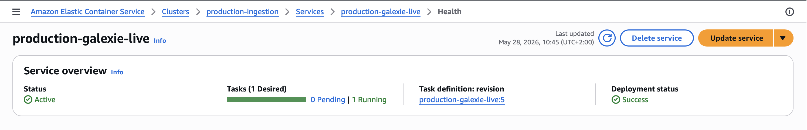
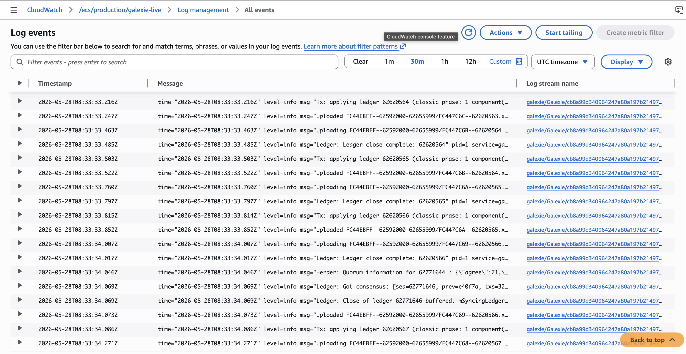
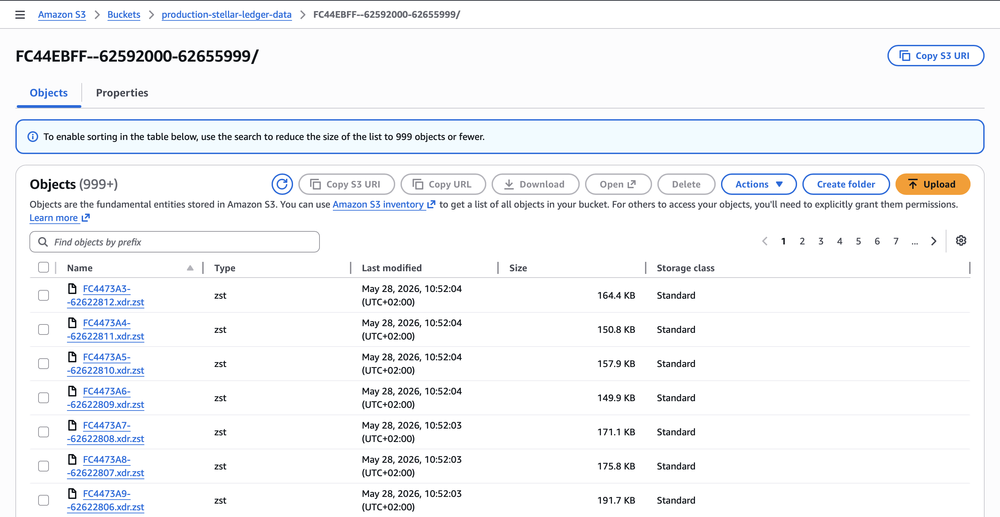
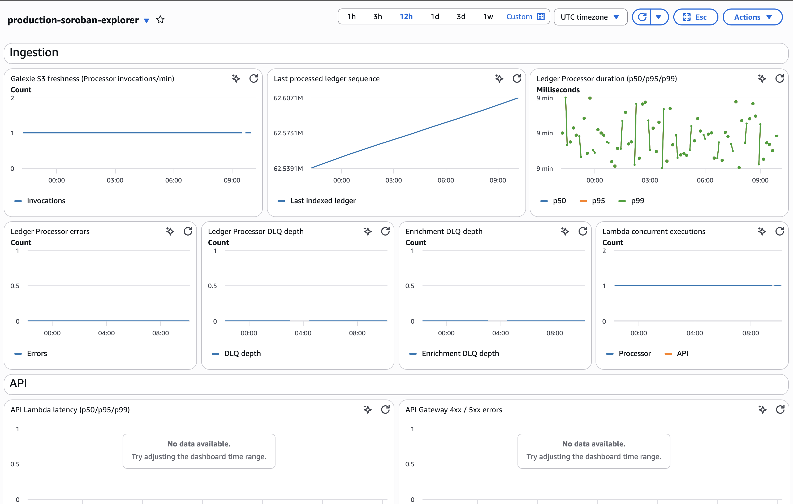
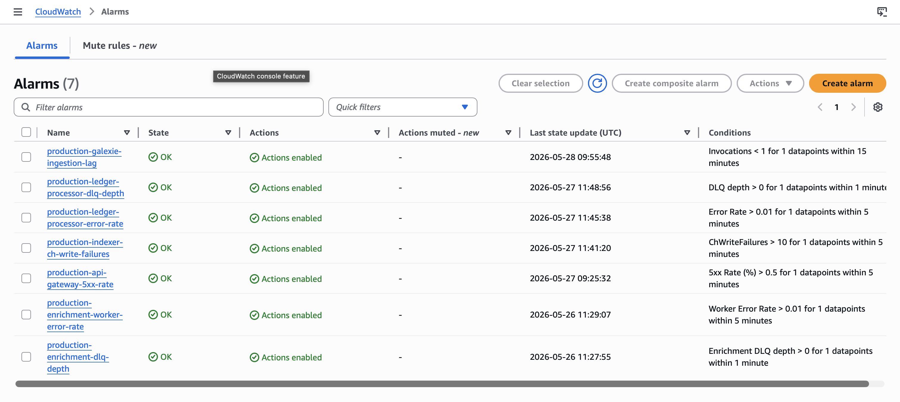

---
margin:
  x: 1.5cm
  y: 1.5cm
---

# Soroban Block Explorer — Milestone 1 Deliverable Evidence

> - **Project:** Soroban Block Explorer
> - **Team:** Rumble Fish
>
> This document is the full written companion to the Milestone 1 submission
> video. It maps every acceptance criterion from §7.4 of the technical design
> to concrete on-mainnet evidence — resource names, SQL queries with output,
> screenshots, and code references. It also documents the one mid-tranche
> scope refinement (PostgreSQL on AWS RDS → ClickHouse on Hetzner) honestly,
> with cost and fit rationale grounded in ADR 0047.
>
> Screenshot placeholders in this source are replaced with inline evidence
> images in the published PDF.

## Table of contents

1. [Executive summary](#1-executive-summary)
2. [Deliverable definition](#2-deliverable-definition)
3. [Architecture](#3-architecture)
4. [Scope refinement: PostgreSQL on RDS → ClickHouse on Hetzner](#4-scope-refinement-postgresql-on-rds--clickhouse-on-hetzner)
5. [Acceptance-criteria evidence](#5-acceptance-criteria-evidence)
   - [AC 1 — S3 ledger stream](#ac-1--s3-ledger-stream)
   - [AC 2 — Gap-free ClickHouse ledger history](#ac-2--gap-free-clickhouse-ledger-history)
   - [AC 3 — Full-content CAP-67 Soroban events](#ac-3--full-content-cap-67-soroban-events)
   - [AC 4 — Reproducible infrastructure as code](#ac-4--reproducible-infrastructure-as-code)
   - [AC 5 — Monitoring and alerting](#ac-5--monitoring-and-alerting)
6. [Live endpoints and access](#6-live-endpoints-and-access)
7. [Repository navigation](#7-repository-navigation)

## 1. Executive summary

Milestone 1 — **Indexing Pipeline & Core Infrastructure** — is complete and
running on Stellar mainnet. The system reads every ledger from the network,
parses the full XDR payload (including Soroban contract invocations and
CAP-67 contract events), and writes typed rows into our own database. There
is **no third-party chain API on the live read path**: the only inputs are
Stellar network peers (consumed by Galexie via Captive Core) and the public
Stellar history archive (consumed only by the one-time backfill).

End-to-end, the pipeline closes a ledger on mainnet and writes it to our
database in well under ten seconds. The database holds a **gap-free history
from the Soroban-mainnet activation ledger to the current tip**, and every
CAP-67 event is stored as one decoded row with topics and data fields — not
as raw XDR. The infrastructure is defined entirely as code (AWS CDK plus
Ansible). Monitoring and production alarms are in place and currently healthy.

One mid-tranche scope refinement is worth disclosing up front: the production
datastore was originally specified as PostgreSQL on AWS RDS and is now
ClickHouse on a Hetzner dedicated server. The deliverable scope — gap-free
mainnet indexing with full Soroban event data — is unchanged; details and
rationale are in [section 4](#4-scope-refinement-postgresql-on-rds--clickhouse-on-hetzner).

## 2. Deliverable definition

Verbatim from
[`docs/architecture/technical-design-general-overview.md` §7.4](https://github.com/rumblefishdev/soroban-block-explorer/blob/develop/docs/architecture/technical-design-general-overview.md)
("Three-Milestone Delivery Plan → Deliverable 1"):

> **Deliverable 1 — Indexing Pipeline & Core Infrastructure**
>
> Galexie ECS Fargate task running on mainnet, writing `LedgerCloseMeta` XDR
> files to S3 every ~5–6 seconds. Lambda Ledger Processor triggered per file,
> parsing and writing ledgers, transactions, operations, accounts, Soroban
> invocations, and CAP-67 events to a dedicated **ClickHouse on Hetzner**
> database (`ch-prod-01`, single-node MergeTree, mTLS behind Caddy).
> Historical backfill from Soroban mainnet activation ledger (late 2023)
> delivered via FREEZE + rsync + ATTACH PART transport per ADR 0045. Rust
> API scaffolding with core modules (axum + utoipa). OpenAPI specification.
> AWS CDK infrastructure-as-code (AWS side) plus an Ansible playbook for the
> Hetzner database host. CloudWatch dashboards and ingestion lag alarms.
>
> **Acceptance criteria:**
>
> 1. S3 bucket contains consecutive `LedgerCloseMeta` files with timestamps
>    matching mainnet ledger close times.
> 2. **ClickHouse on Hetzner** `ledgers` table contains all ledgers from
>    backfill start through current tip with no gaps.
> 3. **ClickHouse on Hetzner** `soroban_events` table contains full-content
>    rows for CAP-67 events in known Soroswap / Aquarius / Phoenix
>    transactions (spot-checked by transaction hashes); decoded events are
>    confirmed by fetching the corresponding `.xdr.zst` from the public
>    archive and re-expanding via `xdr_parser::extract_events`.
> 4. `cdk deploy` (AWS side) + `ansible-playbook` (Hetzner side) from clean
>    environments produces the full working stack with no manual steps.
> 5. CloudWatch dashboard accessible; Galexie lag alarm fires correctly in
>    staging.

_Editorial note on the "late 2023" date in the prose above: this matches the
in-tree §7.4 text we are quoting verbatim. The Soroban-protocol release
(Protocol 20) actually activated on Stellar mainnet on 2024-02-20; the
in-tree wording will be corrected in a follow-up documentation pass. The
on-mainnet activation ledger sequence is unaffected._

Section 5 of this document walks through each acceptance criterion in turn
and shows the concrete evidence that it is met.

## 3. Architecture

{width=80%}

_Figure 1 — Milestone 1 production indexing architecture: Galexie exports
mainnet ledger files to S3, the Rust Ledger Processor reconciles and writes
typed rows, and ClickHouse on Hetzner serves as the primary datastore._

**Why this shape:**

- **S3 between Galexie and the processor** makes the pipeline replayable.
  Every ledger is a durable file; a failed run does not lose a ledger
  because the Ledger Processor reconciles forward from
  `max(sequence) + 1` in ClickHouse on every invocation, replaying any
  S3 objects the previous run did not persist.
- **Galexie on Fargate**, not Lambda, because Captive Core holds an open
  connection to Stellar peers and resumes from a checkpoint after restart.
  Long-running with persistent state — a poor fit for Lambda's execution
  model.
- **Lambda for the processor**, driven by an **SQS doorbell + ClickHouse
  cursor reconcile** (task 0241): an S3 `ObjectCreated` notification
  enqueues a doorbell SQS message, one Lambda invocation persists the
  contiguous run from `max(sequence) + 1` oldest-first, and stops when
  the next ledger is absent on S3 (gap) or the 540 s time budget is
  reached. `reservedConcurrentExecutions = 1` guarantees ascending,
  gapless ordering without needing an SQS FIFO queue; per-invocation
  state lives in ClickHouse, so the Lambda itself is stateless and
  freely re-runnable. End-to-end per ledger — file download, XDR
  decode, typed INSERTs — runs in **about half a second**. SQS handles
  transient retries automatically; persistent failures land in a
  dead-letter queue (`production-ledger-processor-dlq`), so no ledger
  is lost silently.
- **Hybrid AWS + Hetzner** is deliberate. Compute stays on AWS. The
  database lives on Hetzner over mTLS — the Lambda does not care where the
  database is. Cost rationale in [section 4](#4-scope-refinement-postgresql-on-rds--clickhouse-on-hetzner).

The full architecture document is at
[`docs/architecture/technical-design-general-overview.md`](https://github.com/rumblefishdev/soroban-block-explorer/blob/develop/docs/architecture/technical-design-general-overview.md).

## 4. Scope refinement: PostgreSQL on RDS → ClickHouse on Hetzner

### What changed

The approved Milestone 1 plan specified PostgreSQL 16 on AWS RDS as the
primary datastore. During the milestone we migrated the primary datastore
to **ClickHouse 24 on a Hetzner dedicated server (`ch-prod-01`)**, accessed
by the Lambda over mutually-authenticated TLS behind a Caddy reverse proxy.

The decision is formally recorded in
[ADR 0047 — ClickHouse on Hetzner as primary API datastore](https://github.com/rumblefishdev/soroban-block-explorer/blob/develop/lore/2-adrs/0047_clickhouse-primary-api-datastore.md).
Related ADRs:

- [ADR 0044](https://github.com/rumblefishdev/soroban-block-explorer/blob/develop/lore/2-adrs/0044_clickhouse-pilot-parallel-store.md) — initial ClickHouse pilot as parallel store
- [ADR 0045](https://github.com/rumblefishdev/soroban-block-explorer/blob/develop/lore/2-adrs/0045_clickhouse-local-backfill-then-mirror-to-hetzner-via-freeze-rsync-attach.md) — historical backfill transport (local CH → Hetzner via FREEZE + rsync + ATTACH PART)

### Why we changed it

**Workload fit.** A block explorer is overwhelmingly read-heavy, and almost
every page is a time-range scan: "recent transactions for account X",
"events for contract Y in the last 24 h", "ledger N and the ten before it".
ClickHouse is a columnar OLAP engine designed for exactly this access
pattern. Blockchain data also compresses well in column form because the
same account IDs, contract addresses, and operation types repeat heavily.
Our full mainnet history occupies **~700 GB in ClickHouse** versus an
estimated **~8 TB in PostgreSQL** — roughly an order of magnitude smaller.

**Operating cost.** At eight terabytes, the cost gap is large. An RDS
instance class sized for the working set runs **over $800 per month for the
database alone**, before backups, IOPS provisioning, or read replicas. The
Hetzner setup — dedicated server plus storage box for backups —
totals **about $140 per month**. The compute stays on AWS, so the saving
is purely on the data tier and is sustained, not one-off.

### What did not change

- The deliverable scope: gap-free mainnet indexing with full Soroban event
  data. Both schemas (PG and CH) carry the same logical model — ledgers,
  transactions, operations, account changes, Soroban invocations, CAP-67
  events.
- The writer code. The historical backfill and the live Lambda share the
  same Rust writer implementation; the storage swap was a target change,
  not an algorithm change.

### What this means for the form's "match approved" note

Acceptance criteria 2 and 3 in the technical design now read "ClickHouse
on Hetzner" instead of "PostgreSQL on RDS" — the engine name changed, the
data shape and verifiable behaviour did not. The §7.4 source has been
updated in-tree (see the dated note at the top of the §7.4 block) so the
documentation and the reality match.

## 5. Acceptance-criteria evidence

Each subsection here corresponds to one acceptance criterion from §7.4 and
points to the concrete artefact that proves it. The submission video walks
through these in the same order.

### AC 1 — S3 ledger stream

> _"S3 bucket contains consecutive `LedgerCloseMeta` files with timestamps
> matching mainnet ledger close times."_

**Resources:**

- ECS cluster: `production-ingestion`
- ECS service: `production-galexie-live` (desired = running = 1, always-on)
- CloudWatch log group: `/ecs/production/galexie-live`
- S3 bucket: `production-stellar-ledger-data`
- Region: `eu-central-1`

**How to verify:**

1. AWS Console → ECS → cluster `production-ingestion` → service
   `production-galexie-live`: one running task, no recent restarts.
2. CloudWatch Logs → `/ecs/production/galexie-live`: ledgers being exported
   one by one with timestamps 5–6 seconds apart (mainnet close cadence).
3. S3 → bucket `production-stellar-ledger-data`, sorted by "Last modified"
   descending: a continuous stream of `<sequence>.xdr.zst` objects with
   timestamps seconds apart. Refresh the listing — new files appear at the
   top in real time.

**Current catch-up mode.** At the time this evidence was captured, Galexie
was intentionally running from the end of the imported ClickHouse backfill
toward the current live network head. That means the S3 bucket can receive
many ledger files in quick succession while Galexie closes the remaining
gap. Once it catches up to the live head, the same always-on task settles
into the normal mainnet cadence: one new `LedgerCloseMeta` file roughly
every 5-6 seconds. At the current catch-up rate, Galexie is expected to
reach the live head within approximately two days.



_Figure 2 — ECS service `production-galexie-live` is active with one desired
task and one running task._



_Figure 3 — CloudWatch log events show Galexie exporting consecutive mainnet
ledgers into the S3-backed ingestion path._



_Figure 4 — S3 bucket `production-stellar-ledger-data` contains fresh
`.xdr.zst` ledger objects ordered by latest modification time._

**Why S3 is on the live path.** Every ledger is a durable file. The
Ledger Processor is woken by an SQS doorbell and reconciles forward from
`max(sequence) + 1` in ClickHouse on every invocation, replaying any
S3 objects the previous run did not persist — no data is lost silently,
and a transient failure costs at most one extra Lambda warm-up before
the gap closes. SQS handles transient retries automatically; persistent
failures land in a dead-letter queue (`production-ledger-processor-dlq`)
for manual replay, so no ledger is dropped without an alarm trail. The
full per-ledger path — download, XDR decode, typed INSERTs into
ClickHouse — runs in about half a second.

### AC 2 — Gap-free ClickHouse ledger history

> _"ClickHouse on Hetzner `ledgers` table contains all ledgers from
> backfill start through current tip with no gaps."_

**Endpoint:** `ch.sorobanscan.rumblefish.dev` (mTLS-gated; client
certificates issued to reviewers on request).

**Coverage check.** How many distinct ledgers we hold and the range we cover:

```sql
SELECT count(DISTINCT sequence) AS distinct_ledgers,
       min(sequence)            AS first_ledger,
       max(sequence)            AS tip
FROM ledgers;
```

Expected: `first_ledger` is the Soroban-mainnet activation ledger, `tip`
is within seconds of network head, and `distinct_ledgers` equals
`(tip − first_ledger + 1)`.

Latest captured output from `komendy.txt` (captured while live ingestion was still advancing):

```text
┌─distinct_ledgers─┬─first_ledger─┬──────tip─┐
│         12154127 │     50457424 │ 62611550 │
└──────────────────┴──────────────┴──────────┘

1 row in set. Elapsed: 0.196 sec. Processed 12.15 million rows, 97.23 MB (62.08 million rows/s., 496.63 MB/s.)
Peak memory usage: 451.27 MiB.
```

_Output 1 — Coverage query over `ledgers`: 12,154,127 distinct ledgers
indexed from sequence 50,457,424 through 62,611,550 at capture time._

**The Milestone-1 proof — completeness.** This single query is the
gap-free guarantee:

```sql
SELECT (max(sequence) - min(sequence) + 1) AS expected_span,
       count(DISTINCT sequence)            AS distinct_ledgers,
       expected_span - distinct_ledgers    AS missing
FROM ledgers;
```

Expected: `missing = 0`.

Latest captured output from `komendy.txt`:

```text
┌─expected_span─┬─distinct_ledgers─┬─missing─┐
│      12154233 │         12154233 │       0 │
└───────────────┴──────────────────┴─────────┘

1 row in set. Elapsed: 0.203 sec. Processed 12.15 million rows, 97.23 MB (60.02 million rows/s., 480.16 MB/s.)
Peak memory usage: 451.17 MiB.
```

_Output 2 — Completeness query over `ledgers`: expected span equals distinct
ledger count and `missing = 0`._

**Live tail.** Run the same query repeatedly while ingestion is active —
the top `sequence` advances:

```sql
SELECT sequence, closed_at, transaction_count
FROM ledgers
ORDER BY sequence DESC
LIMIT 10;
```

Latest captured outputs from `komendy.txt`:

First capture:

```text
┌─sequence─┬───────────────closed_at─┬─transaction_count─┐
│ 62611722 │ 2026-05-17 16:18:12.000 │               373 │
│ 62611721 │ 2026-05-17 16:18:06.000 │               392 │
│ 62611720 │ 2026-05-17 16:18:00.000 │               378 │
│ 62611719 │ 2026-05-17 16:17:55.000 │               357 │
│ 62611718 │ 2026-05-17 16:17:49.000 │               382 │
│ 62611717 │ 2026-05-17 16:17:43.000 │               398 │
│ 62611716 │ 2026-05-17 16:17:37.000 │               393 │
│ 62611715 │ 2026-05-17 16:17:32.000 │               423 │
│ 62611714 │ 2026-05-17 16:17:26.000 │               313 │
│ 62611713 │ 2026-05-17 16:17:20.000 │               265 │
└──────────┴─────────────────────────┴───────────────────┘

10 rows in set. Elapsed: 0.005 sec. Processed 32.78 thousand rows, 655.66 KB (5.99 million rows/s., 119.87 MB/s.)
Peak memory usage: 4.31 MiB.
```

_Output 3 — First live-tail capture: latest returned ledger was 62,611,722._

Second capture from the same query while ingestion continued:

```text
┌─sequence─┬───────────────closed_at─┬─transaction_count─┐
│ 62611740 │ 2026-05-17 16:19:56.000 │               377 │
│ 62611739 │ 2026-05-17 16:19:50.000 │               360 │
│ 62611738 │ 2026-05-17 16:19:45.000 │               374 │
│ 62611737 │ 2026-05-17 16:19:39.000 │               369 │
│ 62611736 │ 2026-05-17 16:19:33.000 │               329 │
│ 62611735 │ 2026-05-17 16:19:27.000 │               382 │
│ 62611734 │ 2026-05-17 16:19:21.000 │               303 │
│ 62611733 │ 2026-05-17 16:19:16.000 │               228 │
│ 62611732 │ 2026-05-17 16:19:10.000 │               229 │
│ 62611731 │ 2026-05-17 16:19:05.000 │               295 │
└──────────┴─────────────────────────┴───────────────────┘

10 rows in set. Elapsed: 0.006 sec. Processed 32.80 thousand rows, 656.02 KB (5.36 million rows/s., 107.21 MB/s.)
Peak memory usage: 4.30 MiB.
```

_Output 4 — Second live-tail capture: latest returned ledger advanced to
62,611,740 while ingestion continued._

**How the historical range was populated.** Running the live pipeline back
through every ledger since Soroban activation would saturate the cloud
path with one-at-a-time S3-event invocations for millions of historical
ledgers. Instead, we indexed history on local machines (using the same
Rust writer code as the live Lambda) and transported the resulting
ClickHouse parts onto the Hetzner server with the FREEZE + rsync + ATTACH
PART procedure documented in
[ADR 0045](https://github.com/rumblefishdev/soroban-block-explorer/blob/develop/lore/2-adrs/0045_clickhouse-local-backfill-then-mirror-to-hetzner-via-freeze-rsync-attach.md).
This is purely a transport optimisation — the parsing logic is identical.

### AC 3 — Full-content CAP-67 Soroban events

> _"ClickHouse on Hetzner `soroban_events` table contains full-content rows
> for CAP-67 events in known Soroswap / Aquarius / Phoenix transactions
> (spot-checked by transaction hashes); decoded events are confirmed by
> fetching the corresponding `.xdr.zst` from the public archive and
> re-expanding via `xdr_parser::extract_events`."_

**Schema (relevant columns of `soroban_events`, defined in
[`crates/db-clickhouse/schema/init.sql`](https://github.com/rumblefishdev/soroban-block-explorer/blob/develop/crates/db-clickhouse/schema/init.sql)).**
Despite the `_xdr` suffix on `topics_xdr` and `data_xdr`, these columns
hold **decoded JSON** (ScVal-decoded by the indexer, ZSTD-compressed for
storage). The suffix is historical from an earlier raw-XDR draft of the
schema; the codec comment in `init.sql` documents the actual content.

| Column            | Meaning                                                       |
| ----------------- | ------------------------------------------------------------- |
| `ledger_sequence` | Ledger the event belongs to                                   |
| `transaction_id`  | FK to `transactions` (surrogate key)                          |
| `contract_id`     | FK to `soroban_contracts` (surrogate key)                     |
| `event_index`     | Ordinal of the event within its transaction                   |
| `event_type`      | `contract` / `system` / `diagnostic`                          |
| `signature`       | Event signature (function-name-like topic 0 for typed events) |
| `topics_xdr`      | Decoded topics (one row per event, not raw XDR concat)        |
| `data_xdr`        | Decoded data payload                                          |

_Table 1 — Relevant `soroban_events` columns used to verify full decoded
CAP-67 event content._

**Spot-check by contract.** The contract picked for this spot-check is
`CBQDHNBFBZYE4MKPWBSJOPIYLW4SFSXAXUTSXJN76GNKYVYPCKWC6QUK` — the
Aquarius soroswap-style multi-pool router on mainnet, one of the
contracts the AC wording calls out by name.

```sql
SELECT e.ledger_sequence,
       e.event_index,
       e.event_type,
       e.signature,
       e.topics_xdr,
       e.data_xdr
FROM   soroban_events AS e
WHERE  e.contract_id = (
           SELECT id
           FROM   soroban_contracts FINAL
           WHERE  contract_id = 'CBQDHNBFBZYE4MKPWBSJOPIYLW4SFSXAXUTSXJN76GNKYVYPCKWC6QUK'
           LIMIT  1
       )
ORDER  BY e.ledger_sequence DESC
LIMIT  20
SETTINGS optimize_read_in_order = 1
FORMAT Vertical;
```

The StrKey → surrogate-`Int64` resolution is moved into a scalar
subquery against `soroban_contracts FINAL` (PK lookup by `contract_id`
StrKey, microseconds). Substituting the resolved constant lets the
main statement use the `soroban_events` primary-key skip index
`(contract_id, ledger_sequence, transaction_id, event_index)` and
`optimize_read_in_order = 1` to stop the reverse scan as soon as the
first 20 rows are produced — no global sort. An `INNER JOIN
soroban_contracts` form would block that pushdown because ClickHouse
does not propagate values from a join's right-hand side into the
left-hand side's PK skip index.

**Result — 20 most-recent CAP-67 events for the Aquarius router**
(all of them `swap`s on different pool counterparties; the
`signature`, `topics_xdr` and `data_xdr` columns are the ScVal-decoded
JSON the indexer wrote, not raw XDR):

```text
Row 1:
──────
ledger_sequence: 62611855 -- 62.61 million
event_index:     17
event_type:      1
signature:       swap
topics_xdr:
  [
    {
      "type": "sym",
      "value": "swap"
    },
    {
      "type": "vec",
      "value": [
        {
          "type": "address",
          "value": "CAS3J7GYLGXMF6TDJBBYYSE3HQ6BBSMLNUQ34T6TZMYMW2EVH34XOWMA"
        },
        {
          "type": "address",
          "value": "CC5UXAGZOU27OQBKBYTQMES3NVO6EV6FCMWSNPPHAPIS6S24ENM3C24A"
        }
      ]
    },
    {
      "type": "address",
      "value": "GB7JRBCGTLHSWSIBLTXOMXJDQF7OOYEEEEBXJOBWIA2RJKG3GGCWG32X"
    }
  ]
data_xdr:
  {
    "type": "vec",
    "value": [
      {
        "type": "address",
        "value": "CAJXBOGWSRFT7Q7ZKHVTPWGODOBBSPYQVKN2WSMN2WFMPAXX2CETEBAZ"
      },
      {
        "type": "address",
        "value": "CC5UXAGZOU27OQBKBYTQMES3NVO6EV6FCMWSNPPHAPIS6S24ENM3C24A"
      },
      {
        "type": "address",
        "value": "CAS3J7GYLGXMF6TDJBBYYSE3HQ6BBSMLNUQ34T6TZMYMW2EVH34XOWMA"
      },
      {
        "type": "u128",
        "value": "2854455340306"
      },
      {
        "type": "u128",
        "value": "40507804"
      }
    ]
  }

Row 2:
──────
ledger_sequence: 62611855 -- 62.61 million
event_index:     12
event_type:      1
signature:       swap
topics_xdr:
  [
    {
      "type": "sym",
      "value": "swap"
    },
    {
      "type": "vec",
      "value": [
        {
          "type": "address",
          "value": "CBLLEW7HD2RWATVSMLAGWM4G3WCHSHDJ25ALP4DI6LULV5TU35N2CIZA"
        },
        {
          "type": "address",
          "value": "CC5UXAGZOU27OQBKBYTQMES3NVO6EV6FCMWSNPPHAPIS6S24ENM3C24A"
        }
      ]
    },
    {
      "type": "address",
      "value": "GB7JRBCGTLHSWSIBLTXOMXJDQF7OOYEEEEBXJOBWIA2RJKG3GGCWG32X"
    }
  ]
data_xdr:
  {
    "type": "vec",
    "value": [
      {
        "type": "address",
        "value": "CD2UBY4DOGL3FETXUNMSSEGKQAL35ABFG6WMO4P24GK2SH3GULFRCKFA"
      },
      {
        "type": "address",
        "value": "CBLLEW7HD2RWATVSMLAGWM4G3WCHSHDJ25ALP4DI6LULV5TU35N2CIZA"
      },
      {
        "type": "address",
        "value": "CC5UXAGZOU27OQBKBYTQMES3NVO6EV6FCMWSNPPHAPIS6S24ENM3C24A"
      },
      {
        "type": "u128",
        "value": "249567626"
      },
      {
        "type": "u128",
        "value": "2854455340306"
      }
    ]
  }

Row 3:
──────
ledger_sequence: 62611855 -- 62.61 million
event_index:     7
event_type:      1
signature:       swap
topics_xdr:
  [
    {
      "type": "sym",
      "value": "swap"
    },
    {
      "type": "vec",
      "value": [
        {
          "type": "address",
          "value": "CAUIKL3IYGMERDRUN6YSCLWVAKIFG5Q4YJHUKM4S4NJZQIA3BAS6OJPK"
        },
        {
          "type": "address",
          "value": "CBLLEW7HD2RWATVSMLAGWM4G3WCHSHDJ25ALP4DI6LULV5TU35N2CIZA"
        }
      ]
    },
    {
      "type": "address",
      "value": "GB7JRBCGTLHSWSIBLTXOMXJDQF7OOYEEEEBXJOBWIA2RJKG3GGCWG32X"
    }
  ]
data_xdr:
  {
    "type": "vec",
    "value": [
      {
        "type": "address",
        "value": "CBFXFTFLUUIBQGHLMSI762JUD34NHLFZ5AGPLEQ2WJ2CEQANDPZODNVN"
      },
      {
        "type": "address",
        "value": "CAUIKL3IYGMERDRUN6YSCLWVAKIFG5Q4YJHUKM4S4NJZQIA3BAS6OJPK"
      },
      {
        "type": "address",
        "value": "CBLLEW7HD2RWATVSMLAGWM4G3WCHSHDJ25ALP4DI6LULV5TU35N2CIZA"
      },
      {
        "type": "u128",
        "value": "18832335666"
      },
      {
        "type": "u128",
        "value": "249567626"
      }
    ]
  }

Row 4:
──────
ledger_sequence: 62611851 -- 62.61 million
event_index:     6
event_type:      1
signature:       swap
topics_xdr:
  [
    {
      "type": "sym",
      "value": "swap"
    },
    {
      "type": "vec",
      "value": [
        {
          "type": "address",
          "value": "CAUIKL3IYGMERDRUN6YSCLWVAKIFG5Q4YJHUKM4S4NJZQIA3BAS6OJPK"
        },
        {
          "type": "address",
          "value": "CBMFDIRY5OKI4JJURXC4SMEQPWB4UUADIADJK4NA6CYBNOYK4W4TMLLF"
        }
      ]
    },
    {
      "type": "address",
      "value": "GDERSSCKJQPPXUQOZIOXGRVAGNLVPVZCJ2MAX7RCMVMWGRPVAEG7XGTK"
    }
  ]
data_xdr:
  {
    "type": "vec",
    "value": [
      {
        "type": "address",
        "value": "CAMXZXXBD7DFBLYLHUW24U4MY37X7SU5XXT5ZVVUBXRXWLAIM7INI7G2"
      },
      {
        "type": "address",
        "value": "CAUIKL3IYGMERDRUN6YSCLWVAKIFG5Q4YJHUKM4S4NJZQIA3BAS6OJPK"
      },
      {
        "type": "address",
        "value": "CBMFDIRY5OKI4JJURXC4SMEQPWB4UUADIADJK4NA6CYBNOYK4W4TMLLF"
      },
      {
        "type": "u128",
        "value": "2093920028"
      },
      {
        "type": "u128",
        "value": "2094304941"
      }
    ]
  }

Row 5:
──────
ledger_sequence: 62611847 -- 62.61 million
event_index:     6
event_type:      1
signature:       swap
topics_xdr:
  [
    {
      "type": "sym",
      "value": "swap"
    },
    {
      "type": "vec",
      "value": [
        {
          "type": "address",
          "value": "CAUIKL3IYGMERDRUN6YSCLWVAKIFG5Q4YJHUKM4S4NJZQIA3BAS6OJPK"
        },
        {
          "type": "address",
          "value": "CBMFDIRY5OKI4JJURXC4SMEQPWB4UUADIADJK4NA6CYBNOYK4W4TMLLF"
        }
      ]
    },
    {
      "type": "address",
      "value": "GDERSSCKJQPPXUQOZIOXGRVAGNLVPVZCJ2MAX7RCMVMWGRPVAEG7XGTK"
    }
  ]
data_xdr:
  {
    "type": "vec",
    "value": [
      {
        "type": "address",
        "value": "CAMXZXXBD7DFBLYLHUW24U4MY37X7SU5XXT5ZVVUBXRXWLAIM7INI7G2"
      },
      {
        "type": "address",
        "value": "CAUIKL3IYGMERDRUN6YSCLWVAKIFG5Q4YJHUKM4S4NJZQIA3BAS6OJPK"
      },
      {
        "type": "address",
        "value": "CBMFDIRY5OKI4JJURXC4SMEQPWB4UUADIADJK4NA6CYBNOYK4W4TMLLF"
      },
      {
        "type": "u128",
        "value": "8750416245"
      },
      {
        "type": "u128",
        "value": "8752025410"
      }
    ]
  }

Row 6:
──────
ledger_sequence: 62611846 -- 62.61 million
event_index:     15
event_type:      1
signature:       swap
topics_xdr:
  [
    {
      "type": "sym",
      "value": "swap"
    },
    {
      "type": "vec",
      "value": [
        {
          "type": "address",
          "value": "CAS3J7GYLGXMF6TDJBBYYSE3HQ6BBSMLNUQ34T6TZMYMW2EVH34XOWMA"
        },
        {
          "type": "address",
          "value": "CCW67TSZV3SSS2HXMBQ5JFGCKJNXKZM7UQUWUZPUTHXSTZLEO7SJMI75"
        }
      ]
    },
    {
      "type": "address",
      "value": "CCPGFQUTSEHDIQODRE3GJDNE64A35HZ32L7LPDN7GXOCIYNBJSMS6V6B"
    }
  ]
data_xdr:
  {
    "type": "vec",
    "value": [
      {
        "type": "address",
        "value": "CBBMQBNHB2FYVZYV7VNHOJHUMTFJLR4PUMRVQYNW6RHIKZO2NQMIBUCV"
      },
      {
        "type": "address",
        "value": "CCW67TSZV3SSS2HXMBQ5JFGCKJNXKZM7UQUWUZPUTHXSTZLEO7SJMI75"
      },
      {
        "type": "address",
        "value": "CAS3J7GYLGXMF6TDJBBYYSE3HQ6BBSMLNUQ34T6TZMYMW2EVH34XOWMA"
      },
      {
        "type": "u128",
        "value": "1502939385"
      },
      {
        "type": "u128",
        "value": "9931549831"
      }
    ]
  }

Row 7:
──────
ledger_sequence: 62611846 -- 62.61 million
event_index:     9
event_type:      1
signature:       swap
topics_xdr:
  [
    {
      "type": "sym",
      "value": "swap"
    },
    {
      "type": "vec",
      "value": [
        {
          "type": "address",
          "value": "CAUIKL3IYGMERDRUN6YSCLWVAKIFG5Q4YJHUKM4S4NJZQIA3BAS6OJPK"
        },
        {
          "type": "address",
          "value": "CCW67TSZV3SSS2HXMBQ5JFGCKJNXKZM7UQUWUZPUTHXSTZLEO7SJMI75"
        }
      ]
    },
    {
      "type": "address",
      "value": "CCPGFQUTSEHDIQODRE3GJDNE64A35HZ32L7LPDN7GXOCIYNBJSMS6V6B"
    }
  ]
data_xdr:
  {
    "type": "vec",
    "value": [
      {
        "type": "address",
        "value": "CBRUQ7I6C6OGHMDYWD6XQUZFB6KJ3LLPNE34EPKSPFZ2YMBJ2GIWYYZ7"
      },
      {
        "type": "address",
        "value": "CAUIKL3IYGMERDRUN6YSCLWVAKIFG5Q4YJHUKM4S4NJZQIA3BAS6OJPK"
      },
      {
        "type": "address",
        "value": "CCW67TSZV3SSS2HXMBQ5JFGCKJNXKZM7UQUWUZPUTHXSTZLEO7SJMI75"
      },
      {
        "type": "u128",
        "value": "4641523835859"
      },
      {
        "type": "u128",
        "value": "1502939385"
      }
    ]
  }

Row 8:
──────
ledger_sequence: 62611834 -- 62.61 million
event_index:     8
event_type:      1
signature:       swap
topics_xdr:
  [
    {
      "type": "sym",
      "value": "swap"
    },
    {
      "type": "vec",
      "value": [
        {
          "type": "address",
          "value": "CAS3J7GYLGXMF6TDJBBYYSE3HQ6BBSMLNUQ34T6TZMYMW2EVH34XOWMA"
        },
        {
          "type": "address",
          "value": "CAUIKL3IYGMERDRUN6YSCLWVAKIFG5Q4YJHUKM4S4NJZQIA3BAS6OJPK"
        }
      ]
    },
    {
      "type": "address",
      "value": "CCPGFQUTSEHDIQODRE3GJDNE64A35HZ32L7LPDN7GXOCIYNBJSMS6V6B"
    }
  ]
data_xdr:
  {
    "type": "vec",
    "value": [
      {
        "type": "address",
        "value": "CDE57N6XTUPBKYYDGQMXX7E7SLNOLFY3JEQB4MULSMR2AKTSAENGX2HC"
      },
      {
        "type": "address",
        "value": "CAUIKL3IYGMERDRUN6YSCLWVAKIFG5Q4YJHUKM4S4NJZQIA3BAS6OJPK"
      },
      {
        "type": "address",
        "value": "CAS3J7GYLGXMF6TDJBBYYSE3HQ6BBSMLNUQ34T6TZMYMW2EVH34XOWMA"
      },
      {
        "type": "u128",
        "value": "77976866491"
      },
      {
        "type": "u128",
        "value": "167051949"
      }
    ]
  }

Row 9:
───────
ledger_sequence: 62611820 -- 62.61 million
event_index:     8
event_type:      1
signature:       swap
topics_xdr:
  [
    {
      "type": "sym",
      "value": "swap"
    },
    {
      "type": "vec",
      "value": [
        {
          "type": "address",
          "value": "CAS3J7GYLGXMF6TDJBBYYSE3HQ6BBSMLNUQ34T6TZMYMW2EVH34XOWMA"
        },
        {
          "type": "address",
          "value": "CCKCKCPHYVXQD4NECBFJTFSCU2AMSJGCNG4O6K4JVRE2BLPR7WNDBQIQ"
        }
      ]
    },
    {
      "type": "address",
      "value": "CCPGFQUTSEHDIQODRE3GJDNE64A35HZ32L7LPDN7GXOCIYNBJSMS6V6B"
    }
  ]
data_xdr:
  {
    "type": "vec",
    "value": [
      {
        "type": "address",
        "value": "CD65EROVLTDU2DWM4ZUJF4NHK4A46DX2UAOGCV7YDFPCSLFYNH57KGIY"
      },
      {
        "type": "address",
        "value": "CCKCKCPHYVXQD4NECBFJTFSCU2AMSJGCNG4O6K4JVRE2BLPR7WNDBQIQ"
      },
      {
        "type": "address",
        "value": "CAS3J7GYLGXMF6TDJBBYYSE3HQ6BBSMLNUQ34T6TZMYMW2EVH34XOWMA"
      },
      {
        "type": "u128",
        "value": "1000000000000"
      },
      {
        "type": "u128",
        "value": "29799312831"
      }
    ]
  }

Row 10:
───────
ledger_sequence: 62611813 -- 62.61 million
event_index:     9
event_type:      1
signature:       swap
topics_xdr:
  [
    {
      "type": "sym",
      "value": "swap"
    },
    {
      "type": "vec",
      "value": [
        {
          "type": "address",
          "value": "CAS3J7GYLGXMF6TDJBBYYSE3HQ6BBSMLNUQ34T6TZMYMW2EVH34XOWMA"
        },
        {
          "type": "address",
          "value": "CCW67TSZV3SSS2HXMBQ5JFGCKJNXKZM7UQUWUZPUTHXSTZLEO7SJMI75"
        }
      ]
    },
    {
      "type": "address",
      "value": "CCPGFQUTSEHDIQODRE3GJDNE64A35HZ32L7LPDN7GXOCIYNBJSMS6V6B"
    }
  ]
data_xdr:
  {
    "type": "vec",
    "value": [
      {
        "type": "address",
        "value": "CBBMQBNHB2FYVZYV7VNHOJHUMTFJLR4PUMRVQYNW6RHIKZO2NQMIBUCV"
      },
      {
        "type": "address",
        "value": "CCW67TSZV3SSS2HXMBQ5JFGCKJNXKZM7UQUWUZPUTHXSTZLEO7SJMI75"
      },
      {
        "type": "address",
        "value": "CAS3J7GYLGXMF6TDJBBYYSE3HQ6BBSMLNUQ34T6TZMYMW2EVH34XOWMA"
      },
      {
        "type": "u128",
        "value": "300185000"
      },
      {
        "type": "u128",
        "value": "1984363241"
      }
    ]
  }

Row 11:
───────
ledger_sequence: 62611808 -- 62.61 million
event_index:     8
event_type:      1
signature:       swap
topics_xdr:
  [
    {
      "type": "sym",
      "value": "swap"
    },
    {
      "type": "vec",
      "value": [
        {
          "type": "address",
          "value": "CAS3J7GYLGXMF6TDJBBYYSE3HQ6BBSMLNUQ34T6TZMYMW2EVH34XOWMA"
        },
        {
          "type": "address",
          "value": "CCKCKCPHYVXQD4NECBFJTFSCU2AMSJGCNG4O6K4JVRE2BLPR7WNDBQIQ"
        }
      ]
    },
    {
      "type": "address",
      "value": "CCPGFQUTSEHDIQODRE3GJDNE64A35HZ32L7LPDN7GXOCIYNBJSMS6V6B"
    }
  ]
data_xdr:
  {
    "type": "vec",
    "value": [
      {
        "type": "address",
        "value": "CD65EROVLTDU2DWM4ZUJF4NHK4A46DX2UAOGCV7YDFPCSLFYNH57KGIY"
      },
      {
        "type": "address",
        "value": "CCKCKCPHYVXQD4NECBFJTFSCU2AMSJGCNG4O6K4JVRE2BLPR7WNDBQIQ"
      },
      {
        "type": "address",
        "value": "CAS3J7GYLGXMF6TDJBBYYSE3HQ6BBSMLNUQ34T6TZMYMW2EVH34XOWMA"
      },
      {
        "type": "u128",
        "value": "1000000000000"
      },
      {
        "type": "u128",
        "value": "29955756534"
      }
    ]
  }

Row 12:
───────
ledger_sequence: 62611799 -- 62.61 million
event_index:     14
event_type:      1
signature:       swap
topics_xdr:
  [
    {
      "type": "sym",
      "value": "swap"
    },
    {
      "type": "vec",
      "value": [
        {
          "type": "address",
          "value": "CAS3J7GYLGXMF6TDJBBYYSE3HQ6BBSMLNUQ34T6TZMYMW2EVH34XOWMA"
        },
        {
          "type": "address",
          "value": "CCW67TSZV3SSS2HXMBQ5JFGCKJNXKZM7UQUWUZPUTHXSTZLEO7SJMI75"
        }
      ]
    },
    {
      "type": "address",
      "value": "CCPGFQUTSEHDIQODRE3GJDNE64A35HZ32L7LPDN7GXOCIYNBJSMS6V6B"
    }
  ]
data_xdr:
  {
    "type": "vec",
    "value": [
      {
        "type": "address",
        "value": "CBBMQBNHB2FYVZYV7VNHOJHUMTFJLR4PUMRVQYNW6RHIKZO2NQMIBUCV"
      },
      {
        "type": "address",
        "value": "CCW67TSZV3SSS2HXMBQ5JFGCKJNXKZM7UQUWUZPUTHXSTZLEO7SJMI75"
      },
      {
        "type": "address",
        "value": "CAS3J7GYLGXMF6TDJBBYYSE3HQ6BBSMLNUQ34T6TZMYMW2EVH34XOWMA"
      },
      {
        "type": "u128",
        "value": "387778951"
      },
      {
        "type": "u128",
        "value": "2563753038"
      }
    ]
  }

Row 13:
───────
ledger_sequence: 62611799 -- 62.61 million
event_index:     8
event_type:      1
signature:       swap
topics_xdr:
  [
    {
      "type": "sym",
      "value": "swap"
    },
    {
      "type": "vec",
      "value": [
        {
          "type": "address",
          "value": "CAUIKL3IYGMERDRUN6YSCLWVAKIFG5Q4YJHUKM4S4NJZQIA3BAS6OJPK"
        },
        {
          "type": "address",
          "value": "CCW67TSZV3SSS2HXMBQ5JFGCKJNXKZM7UQUWUZPUTHXSTZLEO7SJMI75"
        }
      ]
    },
    {
      "type": "address",
      "value": "CCPGFQUTSEHDIQODRE3GJDNE64A35HZ32L7LPDN7GXOCIYNBJSMS6V6B"
    }
  ]
data_xdr:
  {
    "type": "vec",
    "value": [
      {
        "type": "address",
        "value": "CA6GAFOJCW4MGQQBUCQUSA3CLIH25G4SNKB2JHYKZCVWZTNW5VXMSC4O"
      },
      {
        "type": "address",
        "value": "CAUIKL3IYGMERDRUN6YSCLWVAKIFG5Q4YJHUKM4S4NJZQIA3BAS6OJPK"
      },
      {
        "type": "address",
        "value": "CCW67TSZV3SSS2HXMBQ5JFGCKJNXKZM7UQUWUZPUTHXSTZLEO7SJMI75"
      },
      {
        "type": "u128",
        "value": "1197455089607"
      },
      {
        "type": "u128",
        "value": "387778951"
      }
    ]
  }

Row 14:
───────
ledger_sequence: 62611794 -- 62.61 million
event_index:     8
event_type:      1
signature:       swap
topics_xdr:
  [
    {
      "type": "sym",
      "value": "swap"
    },
    {
      "type": "vec",
      "value": [
        {
          "type": "address",
          "value": "CAS3J7GYLGXMF6TDJBBYYSE3HQ6BBSMLNUQ34T6TZMYMW2EVH34XOWMA"
        },
        {
          "type": "address",
          "value": "CAUIKL3IYGMERDRUN6YSCLWVAKIFG5Q4YJHUKM4S4NJZQIA3BAS6OJPK"
        }
      ]
    },
    {
      "type": "address",
      "value": "CCPGFQUTSEHDIQODRE3GJDNE64A35HZ32L7LPDN7GXOCIYNBJSMS6V6B"
    }
  ]
data_xdr:
  {
    "type": "vec",
    "value": [
      {
        "type": "address",
        "value": "CDE57N6XTUPBKYYDGQMXX7E7SLNOLFY3JEQB4MULSMR2AKTSAENGX2HC"
      },
      {
        "type": "address",
        "value": "CAUIKL3IYGMERDRUN6YSCLWVAKIFG5Q4YJHUKM4S4NJZQIA3BAS6OJPK"
      },
      {
        "type": "address",
        "value": "CAS3J7GYLGXMF6TDJBBYYSE3HQ6BBSMLNUQ34T6TZMYMW2EVH34XOWMA"
      },
      {
        "type": "u128",
        "value": "63174729433"
      },
      {
        "type": "u128",
        "value": "135377697"
      }
    ]
  }

Row 15:
───────
ledger_sequence: 62611788 -- 62.61 million
event_index:     8
event_type:      1
signature:       swap
topics_xdr:
  [
    {
      "type": "sym",
      "value": "swap"
    },
    {
      "type": "vec",
      "value": [
        {
          "type": "address",
          "value": "CAS3J7GYLGXMF6TDJBBYYSE3HQ6BBSMLNUQ34T6TZMYMW2EVH34XOWMA"
        },
        {
          "type": "address",
          "value": "CCW67TSZV3SSS2HXMBQ5JFGCKJNXKZM7UQUWUZPUTHXSTZLEO7SJMI75"
        }
      ]
    },
    {
      "type": "address",
      "value": "GBXD6YV6ZLMSQZDTRAAIWSG53CKNPXU2INSX4AZRFASAE3ETEWDSHULZ"
    }
  ]
data_xdr:
  {
    "type": "vec",
    "value": [
      {
        "type": "address",
        "value": "CBBMQBNHB2FYVZYV7VNHOJHUMTFJLR4PUMRVQYNW6RHIKZO2NQMIBUCV"
      },
      {
        "type": "address",
        "value": "CAS3J7GYLGXMF6TDJBBYYSE3HQ6BBSMLNUQ34T6TZMYMW2EVH34XOWMA"
      },
      {
        "type": "address",
        "value": "CCW67TSZV3SSS2HXMBQ5JFGCKJNXKZM7UQUWUZPUTHXSTZLEO7SJMI75"
      },
      {
        "type": "u128",
        "value": "6169670000"
      },
      {
        "type": "u128",
        "value": "931425803"
      }
    ]
  }

Row 16:
───────
ledger_sequence: 62611785 -- 62.61 million
event_index:     13
event_type:      1
signature:       swap
topics_xdr:
  [
    {
      "type": "sym",
      "value": "swap"
    },
    {
      "type": "vec",
      "value": [
        {
          "type": "address",
          "value": "CAS3J7GYLGXMF6TDJBBYYSE3HQ6BBSMLNUQ34T6TZMYMW2EVH34XOWMA"
        },
        {
          "type": "address",
          "value": "CCW67TSZV3SSS2HXMBQ5JFGCKJNXKZM7UQUWUZPUTHXSTZLEO7SJMI75"
        }
      ]
    },
    {
      "type": "address",
      "value": "CCPGFQUTSEHDIQODRE3GJDNE64A35HZ32L7LPDN7GXOCIYNBJSMS6V6B"
    }
  ]
data_xdr:
  {
    "type": "vec",
    "value": [
      {
        "type": "address",
        "value": "CA6PUJLBYKZKUEKLZJMKBZLEKP2OTHANDEOWSFF44FTSYLKQPIICCJBE"
      },
      {
        "type": "address",
        "value": "CCW67TSZV3SSS2HXMBQ5JFGCKJNXKZM7UQUWUZPUTHXSTZLEO7SJMI75"
      },
      {
        "type": "address",
        "value": "CAS3J7GYLGXMF6TDJBBYYSE3HQ6BBSMLNUQ34T6TZMYMW2EVH34XOWMA"
      },
      {
        "type": "u128",
        "value": "9587380725"
      },
      {
        "type": "u128",
        "value": "63356968062"
      }
    ]
  }

Row 17:
───────
ledger_sequence: 62611785 -- 62.61 million
event_index:     8
event_type:      1
signature:       swap
topics_xdr:
  [
    {
      "type": "sym",
      "value": "swap"
    },
    {
      "type": "vec",
      "value": [
        {
          "type": "address",
          "value": "CCW67TSZV3SSS2HXMBQ5JFGCKJNXKZM7UQUWUZPUTHXSTZLEO7SJMI75"
        },
        {
          "type": "address",
          "value": "CDOFW7HNKLUZRLFZST4EW7V3AV4JI5IHMT6BPXXSY2IEFZ4NE5TWU2P4"
        }
      ]
    },
    {
      "type": "address",
      "value": "CCPGFQUTSEHDIQODRE3GJDNE64A35HZ32L7LPDN7GXOCIYNBJSMS6V6B"
    }
  ]
data_xdr:
  {
    "type": "vec",
    "value": [
      {
        "type": "address",
        "value": "CCWNKTTMHZ4VRR3FYQT3G253MHOGRLUEVTO6YPENM7ZN65DGC345LHI6"
      },
      {
        "type": "address",
        "value": "CDOFW7HNKLUZRLFZST4EW7V3AV4JI5IHMT6BPXXSY2IEFZ4NE5TWU2P4"
      },
      {
        "type": "address",
        "value": "CCW67TSZV3SSS2HXMBQ5JFGCKJNXKZM7UQUWUZPUTHXSTZLEO7SJMI75"
      },
      {
        "type": "u128",
        "value": "9592891971"
      },
      {
        "type": "u128",
        "value": "9587380725"
      }
    ]
  }

Row 18:
───────
ledger_sequence: 62611755 -- 62.61 million
event_index:     14
event_type:      1
signature:       swap
topics_xdr:
  [
    {
      "type": "sym",
      "value": "swap"
    },
    {
      "type": "vec",
      "value": [
        {
          "type": "address",
          "value": "CCW67TSZV3SSS2HXMBQ5JFGCKJNXKZM7UQUWUZPUTHXSTZLEO7SJMI75"
        },
        {
          "type": "address",
          "value": "CDFZUVS5YNLXU7VENKOUDEOHCJGKQNVUBWD7KMN6E7ZROKPYPFLRUJFG"
        }
      ]
    },
    {
      "type": "address",
      "value": "CCPGFQUTSEHDIQODRE3GJDNE64A35HZ32L7LPDN7GXOCIYNBJSMS6V6B"
    }
  ]
data_xdr:
  {
    "type": "vec",
    "value": [
      {
        "type": "address",
        "value": "CBV6LZABOAJRXHLIEKILTWBPC2AXLYVR4CGGPKZQ3PWJ5QFTPIWSWGWQ"
      },
      {
        "type": "address",
        "value": "CDFZUVS5YNLXU7VENKOUDEOHCJGKQNVUBWD7KMN6E7ZROKPYPFLRUJFG"
      },
      {
        "type": "address",
        "value": "CCW67TSZV3SSS2HXMBQ5JFGCKJNXKZM7UQUWUZPUTHXSTZLEO7SJMI75"
      },
      {
        "type": "u128",
        "value": "490388422"
      },
      {
        "type": "u128",
        "value": "487349327"
      }
    ]
  }

Row 19:
───────
ledger_sequence: 62611755 -- 62.61 million
event_index:     8
event_type:      1
signature:       swap
topics_xdr:
  [
    {
      "type": "sym",
      "value": "swap"
    },
    {
      "type": "vec",
      "value": [
        {
          "type": "address",
          "value": "CAESLMGW5LYTIEJI7FJHK6SFSWRELLNVX5Q4WR4UZEALMTRWQDBKDPAG"
        },
        {
          "type": "address",
          "value": "CDFZUVS5YNLXU7VENKOUDEOHCJGKQNVUBWD7KMN6E7ZROKPYPFLRUJFG"
        }
      ]
    },
    {
      "type": "address",
      "value": "CCPGFQUTSEHDIQODRE3GJDNE64A35HZ32L7LPDN7GXOCIYNBJSMS6V6B"
    }
  ]
data_xdr:
  {
    "type": "vec",
    "value": [
      {
        "type": "address",
        "value": "CBHA22UACTWKPR7CPNFXYVX57QXQVOEPTWKBSWFQAPN7HB5GEBKRJB63"
      },
      {
        "type": "address",
        "value": "CAESLMGW5LYTIEJI7FJHK6SFSWRELLNVX5Q4WR4UZEALMTRWQDBKDPAG"
      },
      {
        "type": "address",
        "value": "CDFZUVS5YNLXU7VENKOUDEOHCJGKQNVUBWD7KMN6E7ZROKPYPFLRUJFG"
      },
      {
        "type": "u128",
        "value": "131391318644"
      },
      {
        "type": "u128",
        "value": "490388422"
      }
    ]
  }

Row 20:
───────
ledger_sequence: 62611680 -- 62.61 million
event_index:     13
event_type:      1
signature:       swap
topics_xdr:
  [
    {
      "type": "sym",
      "value": "swap"
    },
    {
      "type": "vec",
      "value": [
        {
          "type": "address",
          "value": "CBLLEW7HD2RWATVSMLAGWM4G3WCHSHDJ25ALP4DI6LULV5TU35N2CIZA"
        },
        {
          "type": "address",
          "value": "CCW67TSZV3SSS2HXMBQ5JFGCKJNXKZM7UQUWUZPUTHXSTZLEO7SJMI75"
        }
      ]
    },
    {
      "type": "address",
      "value": "CCPGFQUTSEHDIQODRE3GJDNE64A35HZ32L7LPDN7GXOCIYNBJSMS6V6B"
    }
  ]
data_xdr:
  {
    "type": "vec",
    "value": [
      {
        "type": "address",
        "value": "CB7FKGSTHP75ORTIZGGMVUTQLEMVTSEOI4QORQPCABJSGTAATDFCE2YV"
      },
      {
        "type": "address",
        "value": "CBLLEW7HD2RWATVSMLAGWM4G3WCHSHDJ25ALP4DI6LULV5TU35N2CIZA"
      },
      {
        "type": "address",
        "value": "CCW67TSZV3SSS2HXMBQ5JFGCKJNXKZM7UQUWUZPUTHXSTZLEO7SJMI75"
      },
      {
        "type": "u128",
        "value": "642358535"
      },
      {
        "type": "u128",
        "value": "15704591"
      }
    ]
  }
20 rows in set. Elapsed: 0.024 sec. Processed 264.59 thousand rows, 11.93 MB (11.22 million rows/s., 506.04 MB/s.)
Peak memory usage: 12.16 MiB.
```

_Output 5 — Contract-level CAP-67 spot-check: 20 most recent decoded events
for the Aquarius router contract, including pretty-printed decoded
`topics_xdr` and `data_xdr` JSON._

**Spot-check by transaction hash** (matches the AC wording).
Transaction `6cad2d49962ae5962722f1f90d4fd11f9e04bd644ad4873752ae1416fddd4740`
is a Soroswap multi-hop trade that routed funds through the Aquarius
router (`CBQDHNBF…6QUK`) — exactly the kind of "Soroswap / Aquarius /
Phoenix" interaction the AC requires.

```sql
WITH tx AS (
    SELECT ledger_sequence
    FROM   transaction_hash_index FINAL
    WHERE  hash = unhex('6cad2d49962ae5962722f1f90d4fd11f9e04bd644ad4873752ae1416fddd4740')
    LIMIT  1
)
SELECT e.event_index,
       e.event_type,
       e.signature,
       e.topics_xdr,
       e.data_xdr
FROM   soroban_events AS e
INNER  JOIN transactions AS t
       ON  t.id              = e.transaction_id
       AND t.ledger_sequence = e.ledger_sequence
WHERE  e.ledger_sequence = (SELECT ledger_sequence FROM tx)
  AND  t.hash            = unhex('6cad2d49962ae5962722f1f90d4fd11f9e04bd644ad4873752ae1416fddd4740')
ORDER  BY e.event_index
FORMAT Vertical;
```

The query first resolves the transaction's `ledger_sequence` via the
dedicated `transaction_hash_index` PK lookup (ORDER BY `hash`), then
uses that value to (a) partition-prune `soroban_events`
(`PARTITION BY intDiv(ledger_sequence, 500000)`) down to a single
500k-ledger part, and (b) activate the bloom-filter index
`idx_tx_hash_bloom` on `transactions.hash` via a raw `FixedString(32)`
comparison (a `lower(hex(t.hash))` form would defeat the bloom filter
because a function call on the indexed column blocks index use).

**Result — all 27 CAP-67 events emitted by that transaction,** in
their natural `event_index` order. The trade chains
`fee → transfer → trade → update_reserves → swap` four times across
the pools yUSDC → AQUA → PYUSD → USDC → native, finishing with a
`charge_provider_fee`:

```text
Row 1:
──────
event_index: 0
event_type:  1
signature:   fee
topics_xdr:
  [
    {
      "type": "sym",
      "value": "fee"
    },
    {
      "type": "address",
      "value": "GBUX7QKLFWWDJZH5MZECNVFZNPF6ZXYYF5ILG2IPFY2LJEAUW2OPHDQY"
    }
  ]
data_xdr:
  {
    "type": "i128",
    "value": "171241"
  }

Row 2:
──────
event_index: 1
event_type:  1
signature:   fee
topics_xdr:
  [
    {
      "type": "sym",
      "value": "fee"
    },
    {
      "type": "address",
      "value": "GBUX7QKLFWWDJZH5MZECNVFZNPF6ZXYYF5ILG2IPFY2LJEAUW2OPHDQY"
    }
  ]
data_xdr:
  {
    "type": "i128",
    "value": "-14854"
  }

Row 3:
──────
event_index: 2
event_type:  1
signature:   transfer
topics_xdr:
  [
    {
      "type": "sym",
      "value": "transfer"
    },
    {
      "type": "address",
      "value": "GBUX7QKLFWWDJZH5MZECNVFZNPF6ZXYYF5ILG2IPFY2LJEAUW2OPHDQY"
    },
    {
      "type": "address",
      "value": "CCPGFQUTSEHDIQODRE3GJDNE64A35HZ32L7LPDN7GXOCIYNBJSMS6V6B"
    },
    {
      "type": "string",
      "value": "yUSDC:GDGTVWSM4MGS4T7Z6W4RPWOCHE2I6RDFCIFZGS3DOA63LWQTRNZNTTFF"
    }
  ]
data_xdr:
  {
    "type": "i128",
    "value": "18175"
  }

Row 4:
──────
event_index: 3
event_type:  1
signature:   transfer
topics_xdr:
  [
    {
      "type": "sym",
      "value": "transfer"
    },
    {
      "type": "address",
      "value": "CCPGFQUTSEHDIQODRE3GJDNE64A35HZ32L7LPDN7GXOCIYNBJSMS6V6B"
    },
    {
      "type": "address",
      "value": "CBQDHNBFBZYE4MKPWBSJOPIYLW4SFSXAXUTSXJN76GNKYVYPCKWC6QUK"
    },
    {
      "type": "string",
      "value": "yUSDC:GDGTVWSM4MGS4T7Z6W4RPWOCHE2I6RDFCIFZGS3DOA63LWQTRNZNTTFF"
    }
  ]
data_xdr:
  {
    "type": "i128",
    "value": "18175"
  }

Row 5:
──────
event_index: 4
event_type:  1
signature:   transfer
topics_xdr:
  [
    {
      "type": "sym",
      "value": "transfer"
    },
    {
      "type": "address",
      "value": "CBQDHNBFBZYE4MKPWBSJOPIYLW4SFSXAXUTSXJN76GNKYVYPCKWC6QUK"
    },
    {
      "type": "address",
      "value": "CCBB55HJJQNOA56FT37SI3B6EYJ6VMW2RB4BZJZGTEZBT5QUMN3DUGCQ"
    },
    {
      "type": "string",
      "value": "yUSDC:GDGTVWSM4MGS4T7Z6W4RPWOCHE2I6RDFCIFZGS3DOA63LWQTRNZNTTFF"
    }
  ]
data_xdr:
  {
    "type": "i128",
    "value": "18175"
  }

Row 6:
──────
event_index: 5
event_type:  1
signature:   transfer
topics_xdr:
  [
    {
      "type": "sym",
      "value": "transfer"
    },
    {
      "type": "address",
      "value": "CCBB55HJJQNOA56FT37SI3B6EYJ6VMW2RB4BZJZGTEZBT5QUMN3DUGCQ"
    },
    {
      "type": "address",
      "value": "CBQDHNBFBZYE4MKPWBSJOPIYLW4SFSXAXUTSXJN76GNKYVYPCKWC6QUK"
    },
    {
      "type": "string",
      "value": "AQUA:GBNZILSTVQZ4R7IKQDGHYGY2QXL5QOFJYQMXPKWRRM5PAV7Y4M67AQUA"
    }
  ]
data_xdr:
  {
    "type": "i128",
    "value": "51328912"
  }

Row 7:
──────
event_index: 6
event_type:  1
signature:   trade
topics_xdr:
  [
    {
      "type": "sym",
      "value": "trade"
    },
    {
      "type": "address",
      "value": "CDOFW7HNKLUZRLFZST4EW7V3AV4JI5IHMT6BPXXSY2IEFZ4NE5TWU2P4"
    },
    {
      "type": "address",
      "value": "CAUIKL3IYGMERDRUN6YSCLWVAKIFG5Q4YJHUKM4S4NJZQIA3BAS6OJPK"
    },
    {
      "type": "address",
      "value": "CBQDHNBFBZYE4MKPWBSJOPIYLW4SFSXAXUTSXJN76GNKYVYPCKWC6QUK"
    }
  ]
data_xdr:
  {
    "type": "vec",
    "value": [
      {
        "type": "i128",
        "value": "18175"
      },
      {
        "type": "i128",
        "value": "51328912"
      },
      {
        "type": "i128",
        "value": "10"
      }
    ]
  }

Row 8:
──────
event_index: 7
event_type:  1
signature:   update_reserves
topics_xdr:
  [
    {
      "type": "sym",
      "value": "update_reserves"
    }
  ]
data_xdr:
  {
    "type": "vec",
    "value": [
      {
        "type": "i128",
        "value": "69962120443494"
      },
      {
        "type": "i128",
        "value": "24746933502"
      }
    ]
  }

Row 9:
───────
event_index: 8
event_type:  1
signature:   swap
topics_xdr:
  [
    {
      "type": "sym",
      "value": "swap"
    },
    {
      "type": "vec",
      "value": [
        {
          "type": "address",
          "value": "CAUIKL3IYGMERDRUN6YSCLWVAKIFG5Q4YJHUKM4S4NJZQIA3BAS6OJPK"
        },
        {
          "type": "address",
          "value": "CDOFW7HNKLUZRLFZST4EW7V3AV4JI5IHMT6BPXXSY2IEFZ4NE5TWU2P4"
        }
      ]
    },
    {
      "type": "address",
      "value": "CCPGFQUTSEHDIQODRE3GJDNE64A35HZ32L7LPDN7GXOCIYNBJSMS6V6B"
    }
  ]
data_xdr:
  {
    "type": "vec",
    "value": [
      {
        "type": "address",
        "value": "CCBB55HJJQNOA56FT37SI3B6EYJ6VMW2RB4BZJZGTEZBT5QUMN3DUGCQ"
      },
      {
        "type": "address",
        "value": "CDOFW7HNKLUZRLFZST4EW7V3AV4JI5IHMT6BPXXSY2IEFZ4NE5TWU2P4"
      },
      {
        "type": "address",
        "value": "CAUIKL3IYGMERDRUN6YSCLWVAKIFG5Q4YJHUKM4S4NJZQIA3BAS6OJPK"
      },
      {
        "type": "u128",
        "value": "18175"
      },
      {
        "type": "u128",
        "value": "51328912"
      }
    ]
  }

Row 10:
───────
event_index: 9
event_type:  1
signature:   transfer
topics_xdr:
  [
    {
      "type": "sym",
      "value": "transfer"
    },
    {
      "type": "address",
      "value": "CBQDHNBFBZYE4MKPWBSJOPIYLW4SFSXAXUTSXJN76GNKYVYPCKWC6QUK"
    },
    {
      "type": "address",
      "value": "CADFWSBBD6VMCL45DEPZ37X3JNXOZXIWEVJJTHMQH3UEB3JSQVJSPG2I"
    },
    {
      "type": "string",
      "value": "AQUA:GBNZILSTVQZ4R7IKQDGHYGY2QXL5QOFJYQMXPKWRRM5PAV7Y4M67AQUA"
    }
  ]
data_xdr:
  {
    "type": "i128",
    "value": "51328912"
  }

Row 11:
───────
event_index: 10
event_type:  1
signature:   transfer
topics_xdr:
  [
    {
      "type": "sym",
      "value": "transfer"
    },
    {
      "type": "address",
      "value": "CADFWSBBD6VMCL45DEPZ37X3JNXOZXIWEVJJTHMQH3UEB3JSQVJSPG2I"
    },
    {
      "type": "address",
      "value": "CBQDHNBFBZYE4MKPWBSJOPIYLW4SFSXAXUTSXJN76GNKYVYPCKWC6QUK"
    },
    {
      "type": "string",
      "value": "PYUSD:GDQE7IXJ4HUHV6RQHIUPRJSEZE4DRS5WY577O2FY6YQ5LVWZ7JZTU2V5"
    }
  ]
data_xdr:
  {
    "type": "i128",
    "value": "18310"
  }

Row 12:
───────
event_index: 11
event_type:  1
signature:   trade
topics_xdr:
  [
    {
      "type": "sym",
      "value": "trade"
    },
    {
      "type": "address",
      "value": "CAUIKL3IYGMERDRUN6YSCLWVAKIFG5Q4YJHUKM4S4NJZQIA3BAS6OJPK"
    },
    {
      "type": "address",
      "value": "CCCRWH6Q3FNP3I2I57BDLM5AFAT7O6OF6GKQOC6SSJNDAVRZ57SPHGU2"
    },
    {
      "type": "address",
      "value": "CBQDHNBFBZYE4MKPWBSJOPIYLW4SFSXAXUTSXJN76GNKYVYPCKWC6QUK"
    }
  ]
data_xdr:
  {
    "type": "vec",
    "value": [
      {
        "type": "i128",
        "value": "51328912"
      },
      {
        "type": "i128",
        "value": "18310"
      },
      {
        "type": "i128",
        "value": "25665"
      }
    ]
  }

Row 13:
───────
event_index: 12
event_type:  1
signature:   update_reserves
topics_xdr:
  [
    {
      "type": "sym",
      "value": "update_reserves"
    }
  ]
data_xdr:
  {
    "type": "vec",
    "value": [
      {
        "type": "i128",
        "value": "2540357503965"
      },
      {
        "type": "i128",
        "value": "907125471"
      }
    ]
  }

Row 14:
───────
event_index: 13
event_type:  1
signature:   swap
topics_xdr:
  [
    {
      "type": "sym",
      "value": "swap"
    },
    {
      "type": "vec",
      "value": [
        {
          "type": "address",
          "value": "CAUIKL3IYGMERDRUN6YSCLWVAKIFG5Q4YJHUKM4S4NJZQIA3BAS6OJPK"
        },
        {
          "type": "address",
          "value": "CCCRWH6Q3FNP3I2I57BDLM5AFAT7O6OF6GKQOC6SSJNDAVRZ57SPHGU2"
        }
      ]
    },
    {
      "type": "address",
      "value": "CCPGFQUTSEHDIQODRE3GJDNE64A35HZ32L7LPDN7GXOCIYNBJSMS6V6B"
    }
  ]
data_xdr:
  {
    "type": "vec",
    "value": [
      {
        "type": "address",
        "value": "CADFWSBBD6VMCL45DEPZ37X3JNXOZXIWEVJJTHMQH3UEB3JSQVJSPG2I"
      },
      {
        "type": "address",
        "value": "CAUIKL3IYGMERDRUN6YSCLWVAKIFG5Q4YJHUKM4S4NJZQIA3BAS6OJPK"
      },
      {
        "type": "address",
        "value": "CCCRWH6Q3FNP3I2I57BDLM5AFAT7O6OF6GKQOC6SSJNDAVRZ57SPHGU2"
      },
      {
        "type": "u128",
        "value": "51328912"
      },
      {
        "type": "u128",
        "value": "18310"
      }
    ]
  }

Row 15:
───────
event_index: 14
event_type:  1
signature:   transfer
topics_xdr:
  [
    {
      "type": "sym",
      "value": "transfer"
    },
    {
      "type": "address",
      "value": "CBQDHNBFBZYE4MKPWBSJOPIYLW4SFSXAXUTSXJN76GNKYVYPCKWC6QUK"
    },
    {
      "type": "address",
      "value": "CDMH535JSD224YXPET3B4SJOLXTQQ24GRSCWACGYBKSH2DKFJYWI7SUW"
    },
    {
      "type": "string",
      "value": "PYUSD:GDQE7IXJ4HUHV6RQHIUPRJSEZE4DRS5WY577O2FY6YQ5LVWZ7JZTU2V5"
    }
  ]
data_xdr:
  {
    "type": "i128",
    "value": "18310"
  }

Row 16:
───────
event_index: 15
event_type:  1
signature:   transfer
topics_xdr:
  [
    {
      "type": "sym",
      "value": "transfer"
    },
    {
      "type": "address",
      "value": "CDMH535JSD224YXPET3B4SJOLXTQQ24GRSCWACGYBKSH2DKFJYWI7SUW"
    },
    {
      "type": "address",
      "value": "CBQDHNBFBZYE4MKPWBSJOPIYLW4SFSXAXUTSXJN76GNKYVYPCKWC6QUK"
    },
    {
      "type": "string",
      "value": "USDC:GA5ZSEJYB37JRC5AVCIA5MOP4RHTM335X2KGX3IHOJAPP5RE34K4KZVN"
    }
  ]
data_xdr:
  {
    "type": "i128",
    "value": "18290"
  }

Row 17:
───────
event_index: 16
event_type:  1
signature:   trade
topics_xdr:
  [
    {
      "type": "sym",
      "value": "trade"
    },
    {
      "type": "address",
      "value": "CCCRWH6Q3FNP3I2I57BDLM5AFAT7O6OF6GKQOC6SSJNDAVRZ57SPHGU2"
    },
    {
      "type": "address",
      "value": "CCW67TSZV3SSS2HXMBQ5JFGCKJNXKZM7UQUWUZPUTHXSTZLEO7SJMI75"
    },
    {
      "type": "address",
      "value": "CBQDHNBFBZYE4MKPWBSJOPIYLW4SFSXAXUTSXJN76GNKYVYPCKWC6QUK"
    }
  ]
data_xdr:
  {
    "type": "vec",
    "value": [
      {
        "type": "i128",
        "value": "18310"
      },
      {
        "type": "i128",
        "value": "18290"
      },
      {
        "type": "i128",
        "value": "19"
      }
    ]
  }

Row 18:
───────
event_index: 17
event_type:  1
signature:   update_reserves
topics_xdr:
  [
    {
      "type": "sym",
      "value": "update_reserves"
    }
  ]
data_xdr:
  {
    "type": "vec",
    "value": [
      {
        "type": "i128",
        "value": "41287345834217"
      },
      {
        "type": "i128",
        "value": "39003786382504"
      }
    ]
  }

Row 19:
───────
event_index: 18
event_type:  1
signature:   swap
topics_xdr:
  [
    {
      "type": "sym",
      "value": "swap"
    },
    {
      "type": "vec",
      "value": [
        {
          "type": "address",
          "value": "CCCRWH6Q3FNP3I2I57BDLM5AFAT7O6OF6GKQOC6SSJNDAVRZ57SPHGU2"
        },
        {
          "type": "address",
          "value": "CCW67TSZV3SSS2HXMBQ5JFGCKJNXKZM7UQUWUZPUTHXSTZLEO7SJMI75"
        }
      ]
    },
    {
      "type": "address",
      "value": "CCPGFQUTSEHDIQODRE3GJDNE64A35HZ32L7LPDN7GXOCIYNBJSMS6V6B"
    }
  ]
data_xdr:
  {
    "type": "vec",
    "value": [
      {
        "type": "address",
        "value": "CDMH535JSD224YXPET3B4SJOLXTQQ24GRSCWACGYBKSH2DKFJYWI7SUW"
      },
      {
        "type": "address",
        "value": "CCCRWH6Q3FNP3I2I57BDLM5AFAT7O6OF6GKQOC6SSJNDAVRZ57SPHGU2"
      },
      {
        "type": "address",
        "value": "CCW67TSZV3SSS2HXMBQ5JFGCKJNXKZM7UQUWUZPUTHXSTZLEO7SJMI75"
      },
      {
        "type": "u128",
        "value": "18310"
      },
      {
        "type": "u128",
        "value": "18290"
      }
    ]
  }

Row 20:
───────
event_index: 19
event_type:  1
signature:   transfer
topics_xdr:
  [
    {
      "type": "sym",
      "value": "transfer"
    },
    {
      "type": "address",
      "value": "CBQDHNBFBZYE4MKPWBSJOPIYLW4SFSXAXUTSXJN76GNKYVYPCKWC6QUK"
    },
    {
      "type": "address",
      "value": "CA6PUJLBYKZKUEKLZJMKBZLEKP2OTHANDEOWSFF44FTSYLKQPIICCJBE"
    },
    {
      "type": "string",
      "value": "USDC:GA5ZSEJYB37JRC5AVCIA5MOP4RHTM335X2KGX3IHOJAPP5RE34K4KZVN"
    }
  ]
data_xdr:
  {
    "type": "i128",
    "value": "18290"
  }

Row 21:
───────
event_index: 20
event_type:  1
signature:   transfer
topics_xdr:
  [
    {
      "type": "sym",
      "value": "transfer"
    },
    {
      "type": "address",
      "value": "CA6PUJLBYKZKUEKLZJMKBZLEKP2OTHANDEOWSFF44FTSYLKQPIICCJBE"
    },
    {
      "type": "address",
      "value": "CBQDHNBFBZYE4MKPWBSJOPIYLW4SFSXAXUTSXJN76GNKYVYPCKWC6QUK"
    },
    {
      "type": "string",
      "value": "native"
    }
  ]
data_xdr:
  {
    "type": "i128",
    "value": "109465"
  }

Row 22:
───────
event_index: 21
event_type:  1
signature:   trade
topics_xdr:
  [
    {
      "type": "sym",
      "value": "trade"
    },
    {
      "type": "address",
      "value": "CCW67TSZV3SSS2HXMBQ5JFGCKJNXKZM7UQUWUZPUTHXSTZLEO7SJMI75"
    },
    {
      "type": "address",
      "value": "CAS3J7GYLGXMF6TDJBBYYSE3HQ6BBSMLNUQ34T6TZMYMW2EVH34XOWMA"
    },
    {
      "type": "address",
      "value": "CBQDHNBFBZYE4MKPWBSJOPIYLW4SFSXAXUTSXJN76GNKYVYPCKWC6QUK"
    }
  ]
data_xdr:
  {
    "type": "vec",
    "value": [
      {
        "type": "i128",
        "value": "18290"
      },
      {
        "type": "i128",
        "value": "109465"
      },
      {
        "type": "i128",
        "value": "10"
      }
    ]
  }

Row 23:
───────
event_index: 22
event_type:  1
signature:   update_reserves
topics_xdr:
  [
    {
      "type": "sym",
      "value": "update_reserves"
    }
  ]
data_xdr:
  {
    "type": "vec",
    "value": [
      {
        "type": "i128",
        "value": "135230799353474"
      },
      {
        "type": "i128",
        "value": "22571512200220"
      }
    ]
  }

Row 24:
───────
event_index: 23
event_type:  1
signature:   swap
topics_xdr:
  [
    {
      "type": "sym",
      "value": "swap"
    },
    {
      "type": "vec",
      "value": [
        {
          "type": "address",
          "value": "CAS3J7GYLGXMF6TDJBBYYSE3HQ6BBSMLNUQ34T6TZMYMW2EVH34XOWMA"
        },
        {
          "type": "address",
          "value": "CCW67TSZV3SSS2HXMBQ5JFGCKJNXKZM7UQUWUZPUTHXSTZLEO7SJMI75"
        }
      ]
    },
    {
      "type": "address",
      "value": "CCPGFQUTSEHDIQODRE3GJDNE64A35HZ32L7LPDN7GXOCIYNBJSMS6V6B"
    }
  ]
data_xdr:
  {
    "type": "vec",
    "value": [
      {
        "type": "address",
        "value": "CA6PUJLBYKZKUEKLZJMKBZLEKP2OTHANDEOWSFF44FTSYLKQPIICCJBE"
      },
      {
        "type": "address",
        "value": "CCW67TSZV3SSS2HXMBQ5JFGCKJNXKZM7UQUWUZPUTHXSTZLEO7SJMI75"
      },
      {
        "type": "address",
        "value": "CAS3J7GYLGXMF6TDJBBYYSE3HQ6BBSMLNUQ34T6TZMYMW2EVH34XOWMA"
      },
      {
        "type": "u128",
        "value": "18290"
      },
      {
        "type": "u128",
        "value": "109465"
      }
    ]
  }

Row 25:
───────
event_index: 24
event_type:  1
signature:   transfer
topics_xdr:
  [
    {
      "type": "sym",
      "value": "transfer"
    },
    {
      "type": "address",
      "value": "CBQDHNBFBZYE4MKPWBSJOPIYLW4SFSXAXUTSXJN76GNKYVYPCKWC6QUK"
    },
    {
      "type": "address",
      "value": "CCPGFQUTSEHDIQODRE3GJDNE64A35HZ32L7LPDN7GXOCIYNBJSMS6V6B"
    },
    {
      "type": "string",
      "value": "native"
    }
  ]
data_xdr:
  {
    "type": "i128",
    "value": "109465"
  }

Row 26:
───────
event_index: 25
event_type:  1
signature:   transfer
topics_xdr:
  [
    {
      "type": "sym",
      "value": "transfer"
    },
    {
      "type": "address",
      "value": "CCPGFQUTSEHDIQODRE3GJDNE64A35HZ32L7LPDN7GXOCIYNBJSMS6V6B"
    },
    {
      "type": "address",
      "value": "GBUX7QKLFWWDJZH5MZECNVFZNPF6ZXYYF5ILG2IPFY2LJEAUW2OPHDQY"
    },
    {
      "type": "string",
      "value": "native"
    }
  ]
data_xdr:
  {
    "type": "i128",
    "value": "108917"
  }

Row 27:
───────
event_index: 26
event_type:  1
signature:   charge_provider_fee
topics_xdr:
  [
    {
      "type": "sym",
      "value": "charge_provider_fee"
    }
  ]
data_xdr:
  {
    "type": "vec",
    "value": [
      {
        "type": "address",
        "value": "CAS3J7GYLGXMF6TDJBBYYSE3HQ6BBSMLNUQ34T6TZMYMW2EVH34XOWMA"
      },
      {
        "type": "u128",
        "value": "548"
      }
    ]
  }

27 rows in set. Elapsed: 0.088 sec. Processed 4.01 million rows, 196.14 MB (45.85 million rows/s., 2.24 GB/s.)
Peak memory usage: 97.71 MiB.
```

_Output 6 — Transaction-level CAP-67 spot-check: all 27 decoded events emitted
by the selected Soroswap / Aquarius multi-hop transaction._

**Independent verification.** The submission can be independently re-derived
from the public Stellar archive: download the `.xdr.zst` for the same
ledger, feed it to `xdr_parser::extract_events` (our in-repo
[`crates/xdr-parser/`](https://github.com/rumblefishdev/soroban-block-explorer/tree/develop/crates/xdr-parser),
built on top of Stellar's official `stellar-xdr` Rust crate), and the
resulting decoded events match what our database returns row-for-row.

### AC 4 — Reproducible infrastructure as code

> _"`cdk deploy` (AWS side) + `ansible-playbook` (Hetzner side) from clean
> environments produces the full working stack with no manual steps."_

**Two halves, both reproducible:**

| Half    | Definition                                  | How it deploys                                                                                            |
| ------- | ------------------------------------------- | --------------------------------------------------------------------------------------------------------- |
| AWS     | `infra/` — TypeScript CDK app               | `cdk deploy --app "node dist/bin/production.js" --all` from an operator's machine against a clean account |
| Hetzner | `infra-hetzner/ansible/` — Ansible playbook | `ansible-playbook site.yml` from a clean control host                                                     |

_Table 2 — Reproducible infrastructure entry points for AWS and Hetzner._

Both halves are run from an operator's machine — no manual one-off
configuration steps are required. The CDK app picks up environment
specifics from `infra/envs/production.json`; the Ansible playbook is
self-contained.

**Key in-repo entry points:**

- [`infra/`](https://github.com/rumblefishdev/soroban-block-explorer/tree/develop/infra) — CDK app, stacks under `infra/src/lib/stacks/`
- [`infra-hetzner/ansible/site.yml`](https://github.com/rumblefishdev/soroban-block-explorer/blob/develop/infra-hetzner/ansible/site.yml) — Hetzner provisioning entry point

### AC 5 — Monitoring and alerting

> _"CloudWatch dashboard accessible; Galexie lag alarm fires correctly in
> staging."_

**Dashboard:** `production-soroban-explorer` (AWS CloudWatch, eu-central-1).
The ingestion section shows Galexie freshness (time since last ledger
exported) and the Ledger Processor's invocation duration and error rate
on a single pane.

**Alarms (both green at the time of submission):**

| Alarm                                  | Trigger                                                      |
| -------------------------------------- | ------------------------------------------------------------ |
| `production-galexie-ingestion-lag`     | Fires if no new ledger is exported within the lag threshold. |
| `production-indexer-ch-write-failures` | Fires if the Lambda fails to write to ClickHouse.            |

_Table 3 — Production monitoring alarms relevant to Milestone 1 ingestion and
ClickHouse writes._



_Figure 5 — CloudWatch dashboard `production-soroban-explorer` shows
ingestion and API health signals over a 12-hour window._



_Figure 6 — CloudWatch alarms list shows the production ingestion, ClickHouse
write, API, and enrichment alarms in `OK` state._

## 6. Live endpoints and access

| Resource                         | URL / address                                             | Access                               |
| -------------------------------- | --------------------------------------------------------- | ------------------------------------ |
| Production ClickHouse            | `ch.sorobanscan.rumblefish.dev`                           | mTLS — client certificate on request |
| Production CloudWatch dashboard  | `production-soroban-explorer` (eu-central-1)              | IAM, read-only access on request     |
| GitHub repository (public)       | `https://github.com/rumblefishdev/soroban-block-explorer` | Anonymous                            |
| Project task ledger (lore board) | `https://rumblefishdev.github.io/soroban-block-explorer/` | Anonymous                            |

_Table 4 — Live verification endpoints and access model for reviewers._

Reviewers who want hands-on access to the private endpoints (production
ClickHouse, production CloudWatch) can request a short-lived mTLS client
certificate or a read-only IAM principal by emailing the address on the
SCF submission form.

## 7. Repository navigation

For direct review of the implementation and design decisions, the relevant
repository entry points are:

| Topic                                   | Path                                                            |
| --------------------------------------- | --------------------------------------------------------------- |
| Top-level architecture                  | `docs/architecture/technical-design-general-overview.md`        |
| Database schema (DDL + field reference) | `docs/architecture/database-schema/database-schema-overview.md` |
| Indexing pipeline                       | `docs/architecture/indexing-pipeline/`                          |
| XDR parsing                             | `docs/architecture/xdr-parsing/`                                |
| Rust XDR parser library                 | `crates/xdr-parser/`                                            |
| Ledger Processor Lambda                 | `crates/indexer/`                                               |
| AWS CDK app                             | `infra/`                                                        |
| Hetzner Ansible playbook                | `infra-hetzner/ansible/site.yml`                                |
| Lore: ADRs                              | `lore/2-adrs/`                                                  |
| Lore: completed M1 task ledger          | `lore/1-tasks/archive/` (tasks 0010–0042 and follow-ups)        |

_Table 5 — Repository paths for implementation, infrastructure, architecture,
and ADR review._

Key ADRs to read for Milestone 1 context:

- [ADR 0004](https://github.com/rumblefishdev/soroban-block-explorer/blob/develop/lore/2-adrs/0004_rust-only-xdr-parsing.md) — Rust-only XDR parsing
- [ADR 0044](https://github.com/rumblefishdev/soroban-block-explorer/blob/develop/lore/2-adrs/0044_clickhouse-pilot-parallel-store.md) — ClickHouse pilot
- [ADR 0045](https://github.com/rumblefishdev/soroban-block-explorer/blob/develop/lore/2-adrs/0045_clickhouse-local-backfill-then-mirror-to-hetzner-via-freeze-rsync-attach.md) — backfill transport
- [ADR 0047](https://github.com/rumblefishdev/soroban-block-explorer/blob/develop/lore/2-adrs/0047_clickhouse-primary-api-datastore.md) — ClickHouse as primary datastore
