---
margin:
  x: 1.5cm
  y: 1.5cm
---

# Soroban Block Explorer - Milestone 2 Evidence

Project: Soroban Block Explorer  
Team: Rumble Fish  
Deliverable: Milestone 2 - Complete API + Frontend

This document accompanies the Milestone 2 verification video and maps the
approved acceptance criteria to concrete evidence from the deployed API and
React frontend.

## 1. Executive Summary

Milestone 2 delivers the public explorer application and complete REST API for
Stellar mainnet data. The React SPA is deployed at:

`https://sorobanscan.rumblefish.dev`

The API is available through the Cloudflare-fronted host:

`https://api-sorobanscan.rumblefishdev.com/v1`

The API reads from the project's own indexed mainnet datastore in ClickHouse.
The frontend renders live data for transactions, ledgers, accounts, contracts,
assets, NFTs, liquidity pools, and search. Soroban invocations and CAP-67
events are decoded into readable fields rather than exposed only as raw XDR.

## 2. Approved Deliverable

Deliverable 2 - Complete API + Frontend:

> All REST API endpoints live and serving mainnet data: transactions (list +
> detail), ledgers (list + detail), accounts (detail + history), contracts
> (detail + invocations + events), assets, NFTs, liquidity pools, search (exact
> match + prefix). React SPA deployed via CloudFront with all pages. Rate
> limiting and response caching configured on API Gateway.

Acceptance criteria:

1. All API endpoints return schema-valid responses for mainnet entity IDs
   provided by the reviewer.
2. For at least 3 known contract transactions, the decoded invocation detail -
   function name, arguments, and return value (not raw XDR) - is reachable from
   the contract's Invocations tab via the linked Transaction Detail Advanced
   view.
3. CAP-67 events appear on Transaction Detail page under Events tab with
   decoded topics and data fields (not raw XDR).
4. Global search redirects to correct detail page for an exact transaction hash,
   account ID, and contract ID.
5. React frontend publicly accessible at staging URL; all pages render live
   mainnet data.

## 3. Live Endpoints and Reviewer Access

| Resource     | URL / Access                                                            |
| ------------ | ----------------------------------------------------------------------- |
| Frontend     | `https://sorobanscan.rumblefish.dev`                                    |
| API base     | `https://api-sorobanscan.rumblefishdev.com/v1`                          |
| Swagger UI   | `https://api-sorobanscan.rumblefishdev.com/api-docs`                    |
| OpenAPI JSON | `https://api-sorobanscan.rumblefishdev.com/api-docs-json`               |
| API access   | Gated (`x-api-key` header); demonstrated live in the verification video |

The API is access-controlled. Its endpoints and responses are demonstrated
end-to-end in the submission video; an **API key is available to reviewers on
request** if they wish to run the calls themselves. No key is embedded in this
document.

## 4. Architecture Evidence

The Milestone 2 read path is:

1. ClickHouse datastore with indexed Stellar mainnet data.
2. Rust API Lambda, implemented with axum and utoipa.
3. API Gateway and Cloudflare edge for access control, rate limiting, and
   caching.
4. React SPA deployed through CloudFront.

Evidence image:

{width=55%}

_Figure 1 — Milestone 2 read path. Static SPA delivery (Browser -> CloudFront -> S3) and the data path (Browser -> Cloudflare edge -> API Gateway -> API Lambda -> ClickHouse). The ingestion / write path is covered separately in the Milestone 1 evidence._

## 5. Acceptance Criteria Evidence

### AC1 - Schema-valid API responses

Mainnet entity IDs used for the run (abbreviated for layout; full IDs in the verification commands below):

| Entity            | Value                                               |
| ----------------- | --------------------------------------------------- |
| Ledger sequence   | `63300000`                                          |
| Transaction hash  | `4f6993de…4178b984` (full in verification commands) |
| Account ID        | `GA6G524Y…QSIAJ3O`                                  |
| Contract ID       | `CDL74RF5…VMFAIGWA` (KALE farm)                     |
| Asset ID          | `EURC-GDHU6WRG…ITNPP2`                              |
| NFT contract ID   | `CCAOCYAL…7B2YPKS`                                  |
| NFT token ID      | `8`                                                 |
| Liquidity pool ID | `LCSGRVA5…4PMAIQQUG`                                |

Representative endpoint coverage (all return HTTP 200 with schema-valid JSON;
full captured responses in the evidence package, `milestone-2-real-enpoints-responses.md`):

| Endpoint                                          | Result |
| ------------------------------------------------- | ------ |
| `GET /v1/ledgers`                                 | 200 OK |
| `GET /v1/ledgers/63300000`                        | 200 OK |
| `GET /v1/transactions`                            | 200 OK |
| `GET /v1/transactions/4f6993de…4178b984`          | 200 OK |
| `GET /v1/accounts/GA6G524Y…QSIAJ3O`               | 200 OK |
| `GET /v1/accounts/GA6G524Y…QSIAJ3O/transactions`  | 200 OK |
| `GET /v1/contracts/CDL74RF5…VMFAIGWA`             | 200 OK |
| `GET /v1/contracts/CDL74RF5…VMFAIGWA/invocations` | 200 OK |
| `GET /v1/contracts/CDL74RF5…VMFAIGWA/events`      | 200 OK |
| `GET /v1/assets`                                  | 200 OK |
| `GET /v1/assets/EURC-GDHU6WRG…ITNPP2`             | 200 OK |
| `GET /v1/nfts`                                    | 200 OK |
| `GET /v1/nfts/CCAOCYAL…7B2YPKS/8`                 | 200 OK |
| `GET /v1/liquidity-pools`                         | 200 OK |
| `GET /v1/liquidity-pools/LCSGRVA5…4PMAIQQUG`      | 200 OK |
| `GET /v1/search?q=GA6G524Y…QSIAJ3O`               | 200 OK |

Verification commands (demonstrated live in the video; API key provided to
reviewers on request, not embedded here):

```bash
API=https://api-sorobanscan.rumblefishdev.com/v1
KEY=<API_KEY>   # provided on request

curl -sS -H "x-api-key: $KEY" "$API/ledgers/63300000" | jq .
curl -sS -H "x-api-key: $KEY" "$API/transactions/4f6993de613664af15f0a17c0fade885da931db3c57a326c5144cccc4178b984" | jq .
curl -sS -H "x-api-key: $KEY" "$API/accounts/GA6G524YPEHXE7M5ICIDKBHPXM4HO7TKNAZYMLCRLB33CUNLQKSIAJ3O" | jq .
curl -sS -H "x-api-key: $KEY" "$API/contracts/CDL74RF5BLYR2YBLCCI7F5FB6TPSCLKEJUBSD2RSVWZ4YHF3VMFAIGWA" | jq .
curl -sS -H "x-api-key: $KEY" "$API/assets/EURC-GDHU6WRG4IEQXM5NZ4BMPKOXHW76MZM4Y2IEMFDVXBSDP6SJY4ITNPP2" | jq .
curl -sS -H "x-api-key: $KEY" "$API/nfts/CCAOCYALAGXC2NQMSB5TMNE56KMONZHR2U7DLOOXE7J4WJNPA7B2YPKS/8" | jq .
curl -sS -H "x-api-key: $KEY" "$API/liquidity-pools/LCSGRVA5R2NY6PDSBFSRMCFXJN63PLEZKLOK4DG7ESDR2HM4PMAIQQUG" | jq .
curl -sS -H "x-api-key: $KEY" "$API/search?q=GA6G524YPEHXE7M5ICIDKBHPXM4HO7TKNAZYMLCRLB33CUNLQKSIAJ3O" | jq .
```

Representative responses (schema-valid):

`GET /v1/ledgers/63300000`:

```json
{
  "sequence": 63300000,
  "hash": "99edd7a94468775367fb767404094c3b75f2293ceddda8f38b45cde26327a7db",
  "closed_at": "2026-07-02T20:36:34Z",
  "protocol_version": 26,
  "transaction_count": 302,
  "base_fee": 100
}
```

`GET /v1/assets/EURC-GDHU6WRG…ITNPP2`:

```json
{
  "id": "EURC-GDHU6WRG4IEQXM5NZ4BMPKOXHW76MZM4Y2IEMFDVXBSDP6SJY4ITNPP2",
  "asset_type_name": "classic_credit",
  "asset_code": "EURC",
  "issuer": "GDHU6WRG4IEQXM5NZ4BMPKOXHW76MZM4Y2IEMFDVXBSDP6SJY4ITNPP2",
  "sac_contract_id": "CDTKPWPLOURQA2SGTKTUQOWRCBZEORB4BWBOMJ3D3ZTQQSGE5F6JBQLV",
  "sac_deployed": true,
  "decimals": 7,
  "total_supply": "41000089363667",
  "holder_count": 4441
}
```

`GET /v1/liquidity-pools/LCSGRVA5…4PMAIQQUG` (XLM / USDC):

```json
{
  "pool_id": "LCSGRVA5R2NY6PDSBFSRMCFXJN63PLEZKLOK4DG7ESDR2HM4PMAIQQUG",
  "asset_a": { "asset_type_name": "native" },
  "asset_b": {
    "asset_type_name": "credit_alphanum4",
    "asset_code": "USDC",
    "issuer": "GA5ZSEJYB37JRC5AVCIA5MOP4RHTM335X2KGX3IHOJAPP5RE34K4KZVN"
  },
  "fee_bps": 30,
  "fee_percent": "0.3",
  "participant_count": 330,
  "reserve_a": "11865343.1320615",
  "reserve_b": "2381566.8329882",
  "total_shares": "3997972.8712451",
  "latest_snapshot_at": "2026-07-03T10:48:44Z"
}
```

Result: all listed endpoints return HTTP 200 with schema-valid JSON for the
mainnet entity IDs above.

### AC2 - Decoded Soroban invocations

The contract's **Invocations** tab (on Contract Detail) is an index of the
contract's invocation appearances - transaction hash, caller, status, ledger,
time. Per-call detail is XDR-only at that index layer (ADR 0034), so each row
links to the transaction that made the call. The **decoded** invocation detail -
function name, arguments, and return value (ScVal-decoded, not raw XDR) - is
shown on the linked **Transaction Detail** page under the **Advanced** view, and
is served by the transaction-detail (decoded-operation) API.

Reviewer navigation:

`Contract Detail -> Invocations tab -> open a transaction -> Transaction Detail -> Advanced`

Pages / API:

| Surface                                          | URL / endpoint                                                      |
| ------------------------------------------------ | ------------------------------------------------------------------- |
| Contract (invocations index)                     | `https://sorobanscan.rumblefish.dev/contracts/CDL74RF5…VMFAIGWA`    |
| Transaction (decoded call detail, Advanced view) | `https://sorobanscan.rumblefish.dev/transactions/e584ff2d…687b65c9` |
| API (decoded operation)                          | `GET /v1/transactions/e584ff2d…687b65c9`                            |

The contract (`GET /v1/contracts/CDL74RF5…VMFAIGWA`) reports **16,984,366
invocations by 6,500 unique callers over 7 days**. The Invocations tab is the
appearance index (tx hash / caller / status / ledger / time):

```json
{
  "data": [
    {
      "transaction_hash": "e584ff2d5c548b6302fba03354ca9a9f2fa13e3e133ea79db20c7eb2687b65c9",
      "caller_account": "GBME3YR3P3AG4BHZ4AZZQIVFZCSQYVVJIUZO6ZXI2OEH2VMDFTK6Y7AX",
      "ledger_sequence": 63310022,
      "successful": true,
      "created_at": "2026-07-03T12:42:31Z"
    }
  ]
}
```

Evidence set (three known contract transactions, all function `plant`):

1. `e584ff2d5c548b6302fba03354ca9a9f2fa13e3e133ea79db20c7eb2687b65c9`
2. `97073c3121861dfc457bdee1353f69b864d265aef8a6e01026f64fb12f6ab84e`
3. `e5f56501b97cad1c350648ab3867f1fd19e78d4f6c649ff64388acc23f039f4d`

For each, `GET /v1/transactions/<hash>` returns the **decoded operation** under
`heavy.operations[].details` — the ScVal-decoded function name, typed arguments,
and return value (not raw XDR). Example (tx 1, `e584ff2d…687b65c9`):

```json
{
  "op_type": "INVOKE_HOST_FUNCTION",
  "details": {
    "contractId": "CDL74RF5BLYR2YBLCCI7F5FB6TPSCLKEJUBSD2RSVWZ4YHF3VMFAIGWA",
    "functionName": "plant",
    "hostFunctionType": "invokeContract",
    "functionArgs": [
      {
        "type": "address",
        "value": "GBME3YR3P3AG4BHZ4AZZQIVFZCSQYVVJIUZO6ZXI2OEH2VMDFTK6Y7AX"
      },
      { "type": "i128", "value": "0" }
    ],
    "returnValue": { "type": "void", "value": null }
  }
}
```

Result:

For at least three known contract transactions, the Transaction Detail Advanced
view (reached from the contract's Invocations tab) shows the decoded function
name, arguments, and return value - not raw XDR - and the transaction-detail API
returns the same decoded operation data.

### AC3 - Decoded CAP-67 events on Transaction Detail

Transaction page:

`https://sorobanscan.rumblefish.dev/transactions/e584ff2d…687b65c9`

API endpoint (full hash):

`GET /v1/transactions/e584ff2d5c548b6302fba03354ca9a9f2fa13e3e133ea79db20c7eb2687b65c9`

Evidence:

| Item                     | Value                                                         |
| ------------------------ | ------------------------------------------------------------- |
| Transaction hash         | `e584ff2d…687b65c9` (full in verification commands)           |
| Contract emitting events | `CAS3J7GY…H34XOWMA` (native XLM Stellar Asset Contract)       |
| API output               | `heavy.contract_events` + `heavy.diagnostic_events` — decoded |

The transaction-detail API returns CAP-67 events decoded into typed topics and
data (not raw XDR). Example **contract event** — a `fee` charge emitted by the
XLM SAC (topics: symbol + address; data: `i128` amount):

```json
{
  "event_type": "contract",
  "contract_id": "CAS3J7GYLGXMF6TDJBBYYSE3HQ6BBSMLNUQ34T6TZMYMW2EVH34XOWMA",
  "topics": [
    { "type": "sym", "value": "fee" },
    {
      "type": "address",
      "value": "GA2JRQOF6EA3HQWDCEDBPPMLYPJCFLDDGYZLEQGMS5SOBQIB3BAFHVAW"
    }
  ],
  "data": { "type": "i128", "value": "288790" }
}
```

The Events tab renders these decoded events (typed topics/data); its count badge
reflects the _recent_ (7-day) window while the tab lists the full decoded history.

Result:

The Transaction Detail page decodes CAP-67 event topics and data into readable,
typed fields (`sym` / `address` / `i128` / …), and the transaction-detail API
returns the same decoded event data.

### AC4 - Global search redirects

Evidence:

| Search input                   | Expected route                    | Evidence         |
| ------------------------------ | --------------------------------- | ---------------- |
| `4f6993de…4178b984` (tx hash)  | `/transactions/4f6993de…4178b984` | routes correctly |
| `GA6G524Y…QSIAJ3O` (account)   | `/accounts/GA6G524Y…QSIAJ3O`      | routes correctly |
| `CDL74RF5…VMFAIGWA` (contract) | `/contracts/CDL74RF5…VMFAIGWA`    | routes correctly |

Result:

Exact global search redirects to the correct detail page for a transaction
hash, account ID, and contract ID.

### AC5 - Public React frontend with live mainnet data

Frontend URL:

`https://sorobanscan.rumblefish.dev`

Evidence — each page below renders live mainnet data (full-size files also in
`screenshots/`):

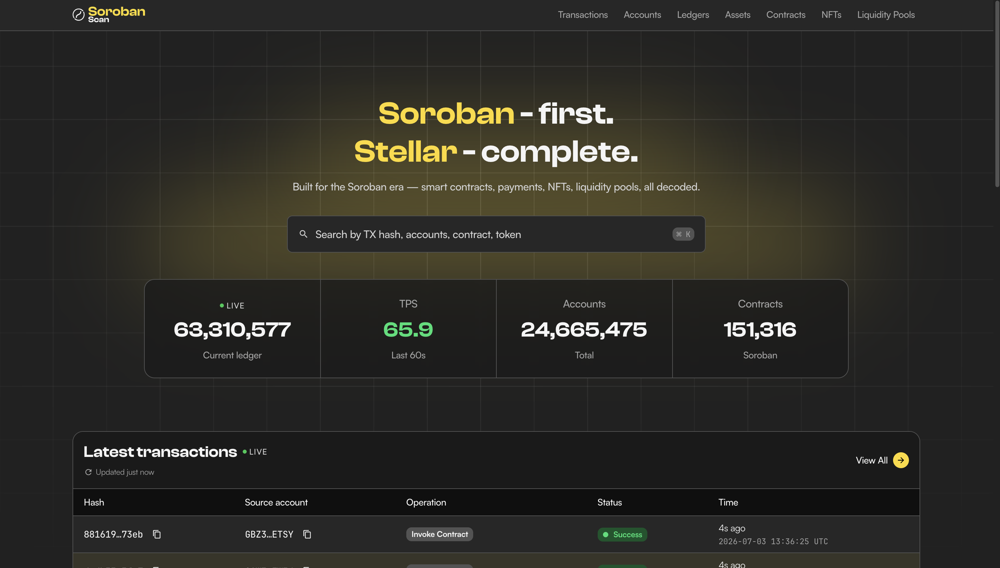{width=85%}

_Home_

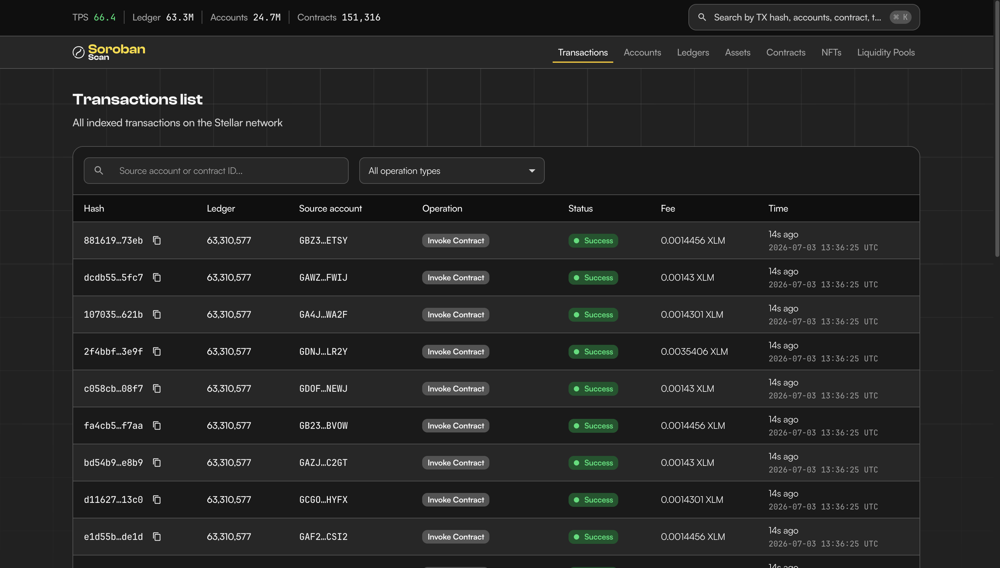{width=85%}

_Transactions — list_

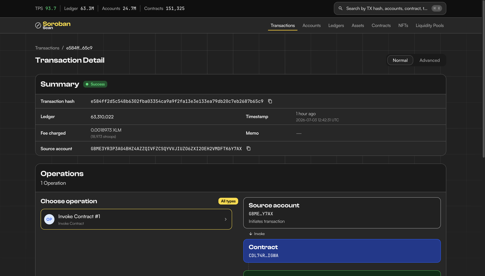{width=85%}

_Transaction — detail_

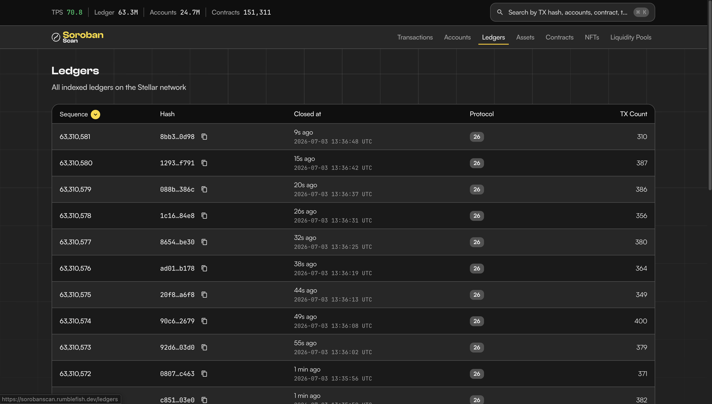{width=85%}

_Ledgers — list_

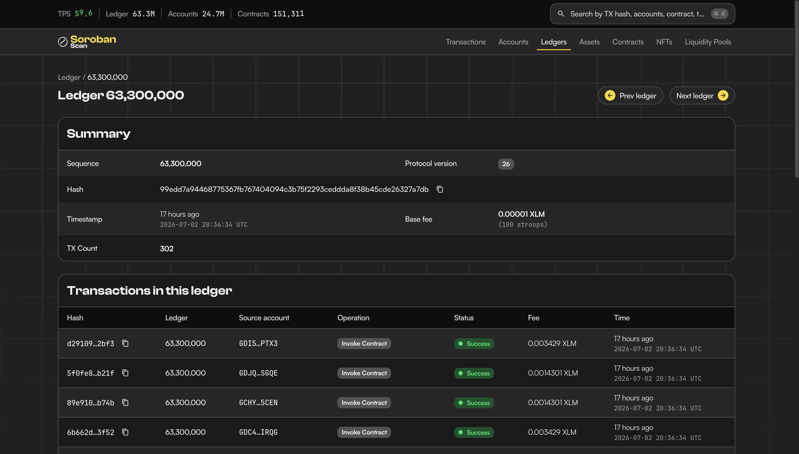{width=85%}

_Ledger — detail_

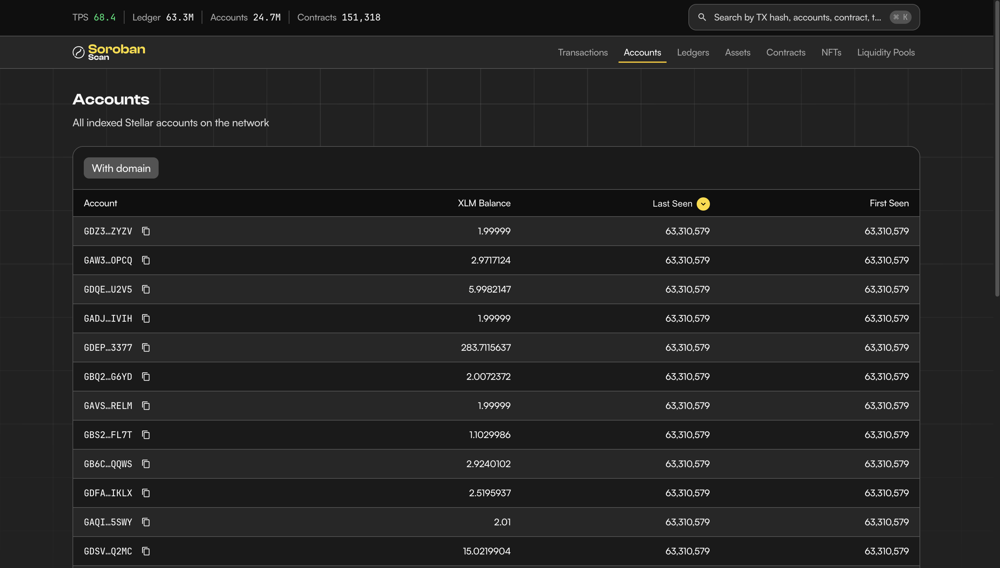{width=85%}

_Accounts — list_

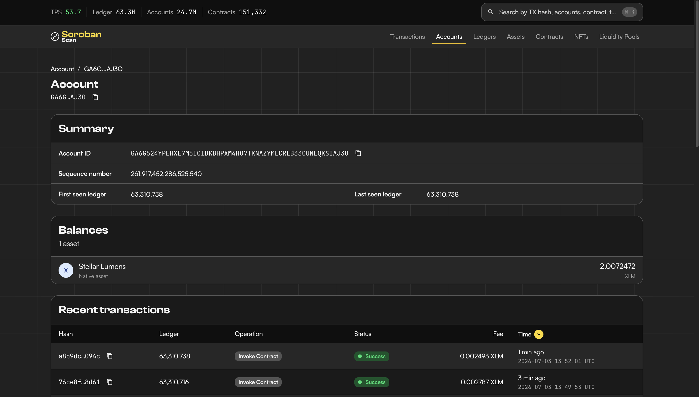{width=85%}

_Account — detail_

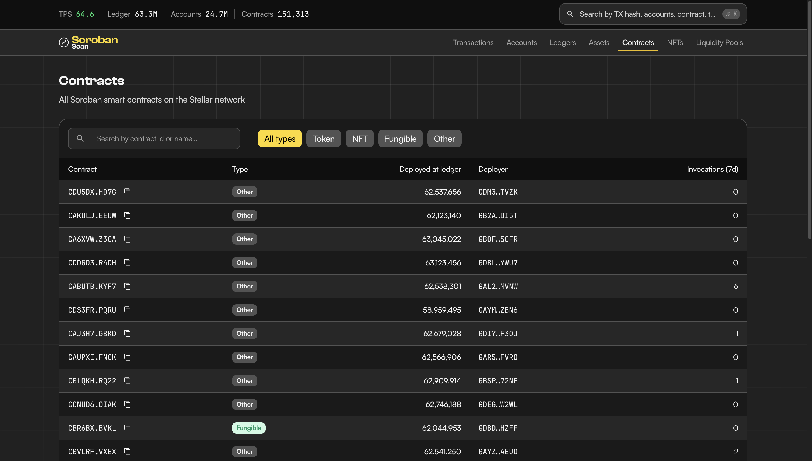{width=85%}

_Contracts — list_

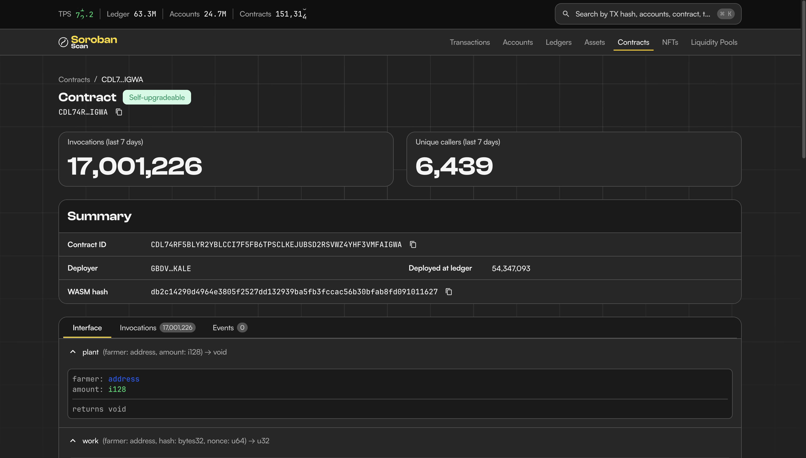{width=85%}

_Contract — detail (Invocations tab)_

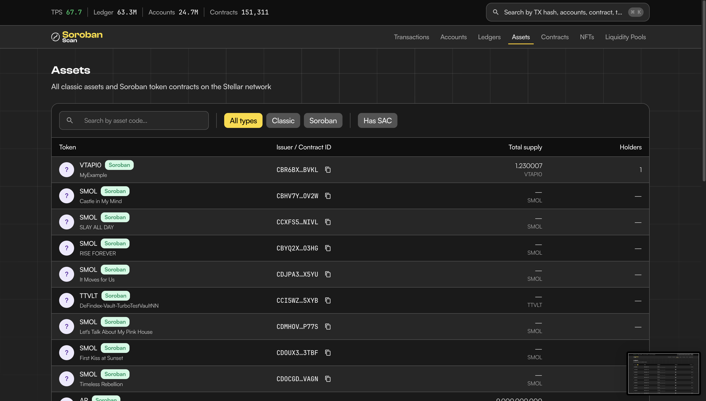{width=85%}

_Assets — list_

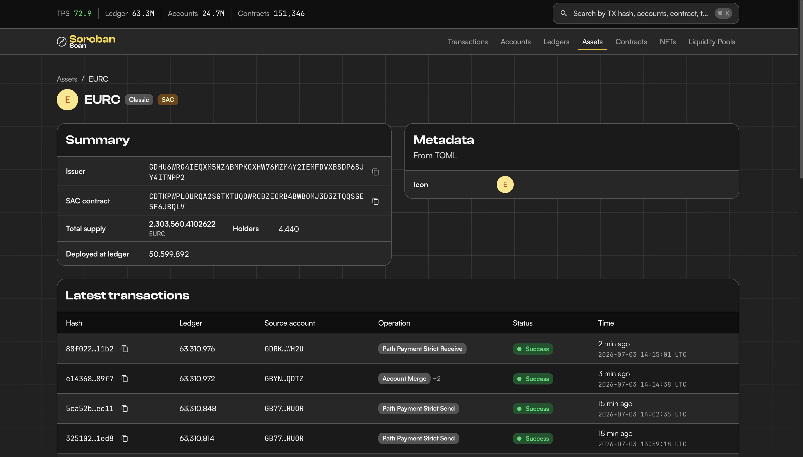{width=85%}

_Asset — detail_

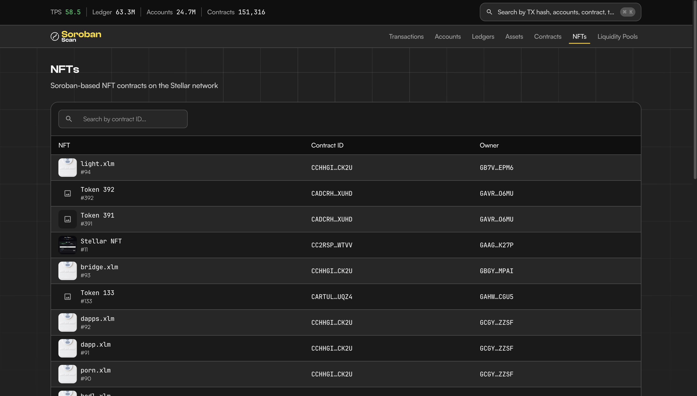{width=85%}

_NFTs — list_

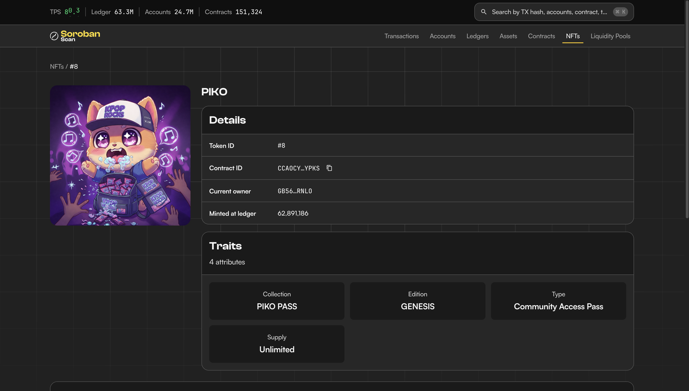{width=85%}

_NFT — detail (decoded name + image)_

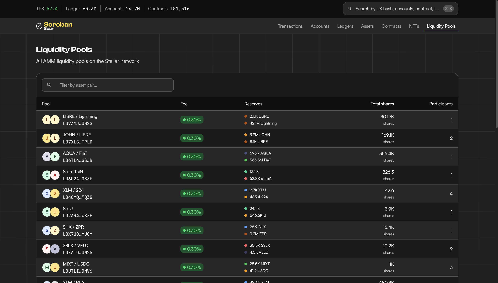{width=85%}

_Liquidity Pools — list_

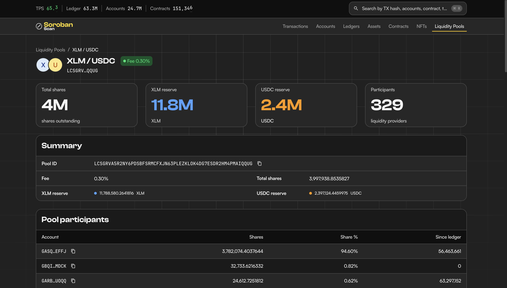{width=85%}

_Liquidity Pool — detail_

Result:

The public React frontend loads successfully and renders live Stellar mainnet
data across all top-level pages and representative detail pages.

## 6. Source References

| Resource          | Link                                                                                                                                                               |
| ----------------- | ------------------------------------------------------------------------------------------------------------------------------------------------------------------ |
| Public repository | [rumblefishdev/soroban-block-explorer](https://github.com/rumblefishdev/soroban-block-explorer)                                                                    |
| Technical design  | [technical-design-general-overview.md](https://github.com/rumblefishdev/soroban-block-explorer/blob/master/docs/architecture/technical-design-general-overview.md) |
| API code          | [crates/api/src](https://github.com/rumblefishdev/soroban-block-explorer/tree/master/crates/api/src)                                                               |
| Frontend code     | [web/src](https://github.com/rumblefishdev/soroban-block-explorer/tree/master/web/src)                                                                             |
