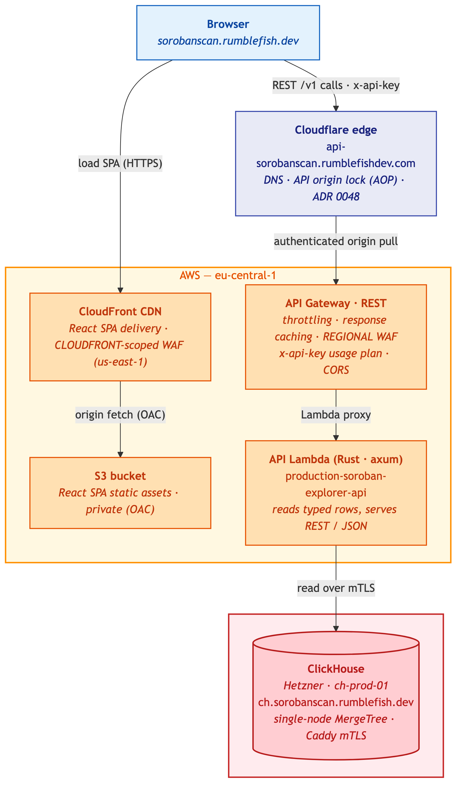
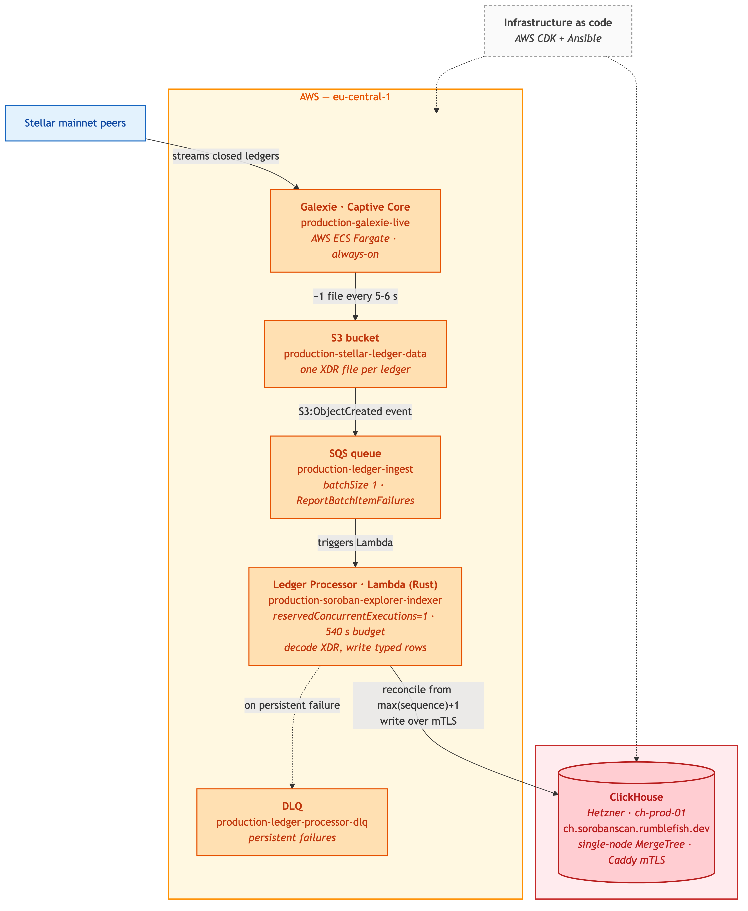
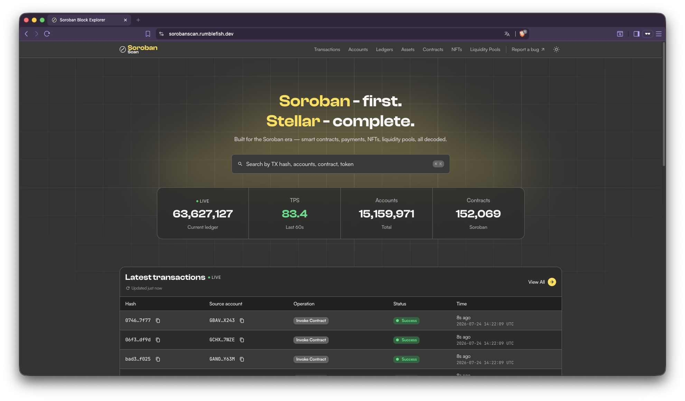
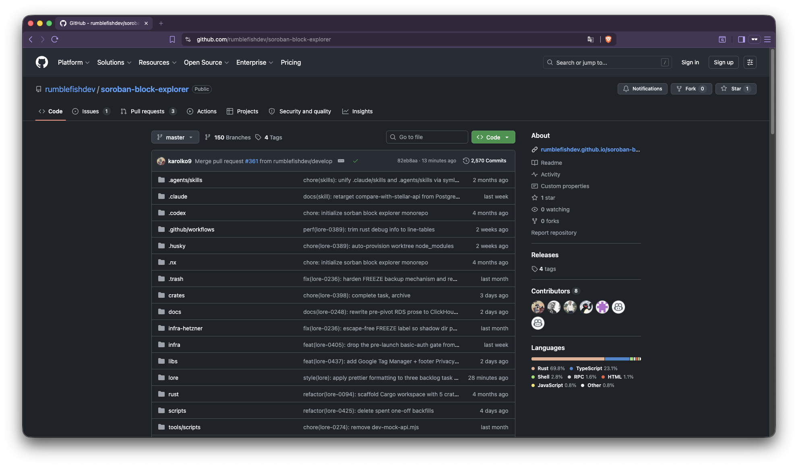
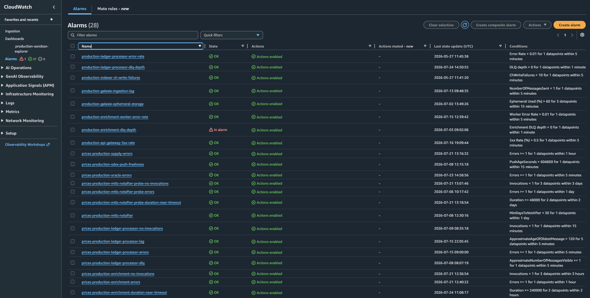

---
margin:
  x: 1.5cm
  y: 1.5cm
---

# Soroban Block Explorer - Milestone 3 Evidence

Project: Soroban Block Explorer  
Team: Rumble Fish  
Deliverable: Milestone 3 - Mainnet Launch

This document accompanies the Milestone 3 verification video and maps the
approved acceptance criteria to concrete evidence from the publicly launched
explorer, its monitoring, its load-test results, and its security posture.

## 1. Executive Summary

Milestone 3 is the public Mainnet Launch of the Soroban Block Explorer. The
explorer is publicly accessible at its production URL with the pre-launch access
gate removed; it renders live Stellar mainnet data within seconds of network
tip from the project's own indexed ClickHouse datastore (no third-party chain
API on the read path). The public surface is protected by AWS WAF and request
throttling; a CloudWatch dashboard with Slack-wired alarms gives live
visibility into ingestion lag, API health, and error rates. Capacity is demonstrated by a load test of the production API, and
all ingress and application security controls are verified against the security
checklist.

- Frontend: `https://sorobanscan.rumblefish.dev`
- API: `https://api-sorobanscan.rumblefishdev.com/v1`

## 2. Approved Deliverable

Deliverable 3 - Mainnet Launch:

> The explorer is opened to the public on mainnet, load-tested, monitored, and
> signed off against a security checklist, with a 7-day post-launch monitoring
> report demonstrating stability.

Acceptance criteria:

1. **AC1** — Publicly accessible at the production URL, serving live mainnet
   data within 30 seconds of network tip.
2. **AC2** — GitHub repository is public; `cdk deploy` from the README
   reproduces the stack on a fresh AWS account.
3. **AC3** — CloudWatch monitoring dashboard; alarms healthy; ingestion lag
   under 30 seconds.
4. **AC4** — Load-test report: p95 < 200 ms at the 1M-requests/month equivalent
   with error rate < 0.1%.
5. **AC5** — Security checklist signed off.
6. **AC6** — 7-day post-launch monitoring report (uptime, error rate, p95,
   ingestion lag per day).

## 3. Live Endpoints and Reviewer Access

| Resource         | URL / Access                                                                                                                                                                                                   |
| ---------------- | -------------------------------------------------------------------------------------------------------------------------------------------------------------------------------------------------------------- |
| Frontend         | `https://sorobanscan.rumblefish.dev` (public — gate removed)                                                                                                                                                   |
| API base         | `https://api-sorobanscan.rumblefishdev.com/v1`                                                                                                                                                                 |
| Swagger UI       | `https://api-sorobanscan.rumblefishdev.com/api-docs`                                                                                                                                                           |
| OpenAPI JSON     | `https://api-sorobanscan.rumblefishdev.com/api-docs-json`                                                                                                                                                      |
| API access model | Access-controlled — anonymous requests return `401`. The public explorer authenticates transparently at the edge; direct API access is available to reviewers on request (same model as Milestone 2).          |
| Monitoring       | CloudWatch dashboard `production-soroban-explorer` (eu-central-1) with Slack-wired alarms and X-Ray tracing. Read-only dashboard access for the Stellar team is available on request via a read-only IAM role. |

At launch the frontend is publicly accessible with no Basic Auth gate. The
verification video demonstrates the live application end-to-end.

## 4. Architecture Evidence

The launched system spans three paths, all reproducible from code (AWS CDK +
Hetzner Ansible):

1. **Ingestion / write path** (Milestone 1) — Galexie on ECS Fargate exports
   mainnet `LedgerCloseMeta` XDR to S3; a Rust indexer Lambda decodes each
   object and writes to ClickHouse. End-to-end ledger-close to DB-write is well
   under the 30-second target.
2. **Read path** (Milestone 2) — Browser → Cloudflare edge → API Gateway → Rust
   / axum API Lambda → ClickHouse (Hetzner, mTLS). Static SPA: Browser →
   CloudFront → private S3.
3. **Launch controls** (Milestone 3) — AWS WAF + request throttling on public
   ingress; CloudWatch dashboard + Slack alarms + X-Ray tracing.

Evidence images:

{width=55%}

_Figure 1 — Read path (reused from M2), including the launch controls on the
public ingress (AWS WAF + request throttling)._

{width=55%}

_Figure 2 — Ingestion / write path (reused from M1): Stellar mainnet peers →
Galexie on ECS Fargate → S3 → SQS → Rust indexer Lambda → ClickHouse on Hetzner
(mTLS). The CloudWatch dashboard and alarms are shown in § AC3._

## 5. Acceptance Criteria Evidence

### AC1 - Public access, live data ≤30s from tip

**Status: met.** The pre-launch Basic Auth gate was removed on 2026-07-17 (task
0405). `https://sorobanscan.rumblefish.dev` serves the explorer publicly —
HTTP 200 with no `WWW-Authenticate` challenge.

Data freshness is measured rather than asserted. The indexer publishes
`IngestionLagSeconds` (CloudWatch namespace `SorobanBlockExplorer/Indexer`,
dimension `Environment=production`): the wall-clock gap between a ledger closing
on mainnet and its row being committed to ClickHouse. Sampled over two hours on
2026-07-17 (15 × 5-minute datapoints):

| Measure                | Value     | Target | Verdict |
| ---------------------- | --------- | ------ | ------- |
| Ingestion lag, average | **3.1 s** | < 30 s | Met     |
| Ingestion lag, worst   | **6.0 s** | < 30 s | Met     |

In steady state the explorer is within ~3 seconds of network tip — a 5× margin
against the 30-second criterion, with the worst observed sample at 6 s.

{width=85%}

_Figure — production URL, no access gate; the newest entries are seconds old, corroborating the measured freshness above._

Data freshness is both **measured** (the `IngestionLagSeconds` figures above — average 3.1 s, worst 6.0 s) and **visible** in the capture, where the most recent transactions carry timestamps within seconds of real time. The read path is the project's own indexed ClickHouse, not a third-party chain API.

### AC2 - Public repo + reproducible `cdk deploy`

The repository is public and the stack is reproducible from code.

The workspace also carries a substantial automated test suite — **920 test
functions** across the Rust crates, including **360 in `xdr-parser`** (XDR
decoding, state-change extraction, and CAP-67 event interpretation —
trustline/asset/claimable-balance parsing, mint/burn event handling) and **248
in `api`** (endpoint responses, OpenAPI schema, pagination). The suite runs with
`cargo test`.

- Public repository: `https://github.com/rumblefishdev/soroban-block-explorer`
- Fresh-account deployment runbook: [`infra/README.md`](https://github.com/rumblefishdev/soroban-block-explorer/blob/master/infra/README.md) — prerequisites → `make bootstrap` → `make deploy-production` (all AWS stacks) plus the Hetzner Ansible side — with the operational guide in [`docs/deployment.md`](https://github.com/rumblefishdev/soroban-block-explorer/blob/master/docs/deployment.md). A few steps are manual by design: ordering the Hetzner dedicated server and Storage Box, and publishing the box IPv4 to SSM (`/soroban/production/ch-ip`).
  {width=85%}

_Figure — `github.com/rumblefishdev/soroban-block-explorer` is public and carries the Rust / ClickHouse / infrastructure code._

### AC3 - Monitoring dashboard, ingestion lag

CloudWatch dashboard with Slack-wired alarms and X-Ray is live.

**Ingestion lag under 30 s: met and measured.** The indexer emits
`SorobanBlockExplorer/Indexer / IngestionLagSeconds` per ledger written (task
0399, live in production) — average 3.1 s, worst 6.0 s against the < 30 s
criterion (figures and method in AC1). This metric is also the per-day source
for the AC6 report.

The dashboard's **API** section graphs API Lambda latency (p50/p95/p99) and API
Gateway 4xx/5xx error counts alongside the ingestion panels; AWS WAF and request
throttling protect the public ingress (see AC5). The alarms on the tracked metrics
— API 5XX-rate, Galexie ingestion-lag, ledger-processor error-rate, and
ClickHouse-write failures — are in OK state.

{width=95%}

_Figure — the production dashboard: ingestion and API health on a single pane._

{width=85%}

_Figure — production alarms. The API 5XX-rate, Galexie ingestion-lag, ledger-processor error-rate and ClickHouse-write alarms are in OK state. `prices-` entries belong to a separate project in the same AWS account. The one raised alarm, `production-enrichment-dlq-depth`, fires on queue depth > 0 and covers metadata enrichment — not any metric reported in § AC6._

### AC4 - Load-test report

**Status: partially met — error rate met with a ~100× margin; p95 not met.**
This section states the result plainly and then accounts for it in full.

| AC4 half    | Target   | Measured (1M-req/month equivalent) | Verdict     |
| ----------- | -------- | ---------------------------------- | ----------- |
| Error rate  | < 0.1 %  | **0.000 %** (0 failures)           | **Met**     |
| p95 latency | < 200 ms | **577 ms**                         | **Not met** |

Median latency (p50) is **168 ms** at the required load and **151 ms** at 40×
that load — the typical request is inside the target. The miss is in the tail.

#### Method: why the load is expressed as a rate, not as virtual users

The criterion is "1M requests/month equivalent" — a **request rate**
(1,000,000 / 30 days ≈ **0.4 req/s**). The harness therefore drives an **open
model**: requests arrive at a fixed rate (Poisson), independent of how fast the
server answers.

The earlier plan called for "≥1000 concurrent users". That framing was
abandoned for a measured reason, not for convenience: a virtual-user driver is
**closed-loop**, so its request rate is an _output_, not an input — each user
waits for a response before sending the next. Our own measurement of the same
`--vus 4` configuration produced **9,459 req/s against a local stub** and
**~10 req/s against production**. A VU count therefore cannot express "1M
requests/month"; only an arrival rate can. Open-model testing is what actually
measures the stated criterion. (Recorded in task 0357.)

#### Result across load tiers

Two open-model series were run against the production API (~33k requests
total). The runs targeted the API Gateway origin rather than the Cloudflare-fronted
hostname, so the figures measure the backend itself without the edge's own rate
limiting; the 40× tier additionally ran with the per-IP WAF rate rule lifted, since
that rule exists precisely to stop this traffic pattern from a single source.
These map to the proposal's two documented load points — the
**1.2M/month tier is the "1M baseline"** and the **10.2M/month tier is the "10M
stress"** run — plus an additional **40× (49.3M/month)** capacity check.
Representative tiers:

| Load tier                      |     Rate | Requests |  Error rate |    p50 |    **p95** |
| ------------------------------ | -------: | -------: | ----------: | -----: | ---------: |
| **1.2M req/month (AC4 level)** |  0.48 /s |      168 | **0.000 %** | 168 ms | **577 ms** |
| 10.2M req/month (8×)           |  3.95 /s |    2,363 | **0.000 %** | 149 ms |     567 ms |
| **49.3M req/month (40×)**      | 19.04 /s |   13,701 | **0.000 %** | 151 ms | **575 ms** |

**The p95 is flat across a 40× range of load (577 ms → 575 ms).** This is the
central finding: latency is **not load-dependent** in the tested range. The
system absorbs forty times the required traffic with an unchanged tail and zero
failures — capacity is proven far beyond the criterion. The p95 miss is
therefore **not a capacity problem**; it is a set of fixed per-request costs
that no amount of headroom removes.

#### Where the 577 ms comes from

Decomposing the same measurement by endpoint class:

| Scope                                                | p95 @ AC4 load | p95 @ 40× load |
| ---------------------------------------------------- | -------------: | -------------: |
| All 26 endpoints                                     |         577 ms |         575 ms |
| Excluding the 2 synchronous-external-fetch endpoints |         342 ms |         506 ms |
| Excluding those and `lplist`                         |     **280 ms** |         317 ms |

Three distinct causes, in order of size:

1. **Synchronous external fetches on two detail endpoints (largest).**
   `txdetail` and `nftdetail` fetch data from outside our infrastructure while
   the request is open. `txdetail` spends **53 ms in ClickHouse and 1,074 ms
   (p95) waiting on an S3 archive read in `us-east-2` from a Lambda in
   `eu-central-1`** — a cross-region round trip per request. `nftdetail`
   spends **96 ms in ClickHouse and 1,604 ms (p95)** on a third-party IPFS
   gateway plus a `token_uri()` RPC. These are **deliberate architectural
   decisions** (ADR 0029, ADR 0043: heavy/detail-only fields are fetched at
   read time rather than persisted), not defects — but they place the tail of
   those two endpoints partly outside our control.

2. **A known ClickHouse cost on one endpoint.** `lplist` derives each pool's
   creation ledger by scanning that pool's full snapshot history
   (8.28M rows/request). This is our own technical debt: the design decision
   that removed the stored column (task 0208) assumed this read would be cheap;
   measurement shows it is not. The cause is identified to the query, the fix is
   specified, and it is scheduled — not unexplained.

3. **A fixed infrastructure floor (irreducible today).** Every request pays
   **≈ 40 ms** before any data is read (API Gateway + Lambda + mTLS to
   ClickHouse), plus **≈ 15 ms per ClickHouse round trip**. Measured across all
   26 endpoints, the median non-database overhead fits
   `≈ 40 ms + 15 ms × (number of CH queries)` — from 51 ms for a
   single-query endpoint to 157 ms for an 8-query endpoint. An endpoint issuing
   five queries has **already spent ~115 ms of the 200 ms budget** before
   ClickHouse returns a single row.

#### Optimisation performed during this milestone

The load test drove a measured optimisation pass on the read path. Total
ClickHouse work per test run fell from **78.3 billion to 23.89 billion rows
(−69 %)** at identical load, via two query fixes ([#347], [#349]) and one index.
Endpoints that were **not modified at all** improved by 3–4× as a direct result
(`ldgdetail` p95 890 → 319 ms, `ldglist` 1015 → 229 ms) — evidence that the
earlier latency was contention from a saturated database rather than the
endpoints themselves.

**Raw measurement data:** [`load-tests/`](./load-tests/) holds the three tiers
quoted above — per tier a `results.csv` (one row per request: client latency
joined to the ClickHouse query log for that same request via `request_id`, so
each request carries its own `read_rows` / `ch_queries` / `ch_duration_ms`) and
a `client_summary.csv` (per-endpoint percentiles). The p50 / p95 figures in this
section are percentiles of `duration_ms` across a tier's `results.csv`;
[`load-tests/README.md`](./load-tests/README.md) maps each tier to its run and
restates the headline numbers.

#### Honest assessment

Restated plainly for the reviewer: **the p95 < 200 ms criterion is not met at
any tested tier, including the required one — 577 ms against a 200 ms target.**
It is not met even with all three causes above excluded (280 ms). What the
measurement does establish:

- the **error-rate half of AC4 is met with a ~100× margin** (0.000 % vs 0.1 %);
- the **median request meets the latency target** (168 ms at the required load);
- **capacity is proven at 40× the required load** with no degradation and no
  errors;
- every millisecond of the gap is **attributed to a named, measured cause**,
  each with a decided path: persist the two runtime-fetched field sets (or
  serve them asynchronously), restore `lplist`'s stored creation ledger, and
  reduce the per-query overhead if the 15 ms proves to be a per-query mTLS
  handshake rather than an irreducible round trip.

[#347]: https://github.com/rumblefishdev/soroban-block-explorer/pull/347
[#349]: https://github.com/rumblefishdev/soroban-block-explorer/pull/349

### AC5 - Security checklist signed off

All ingress and application controls are in place and verified: least-privilege
IAM (no wildcard actions), AWS WAF + request throttling, no public datastore
endpoint (ClickHouse published to loopback only — `127.0.0.1:8123`/`:9000` — behind
Caddy mTLS on a firewalled host that admits only ports 22/80/443), secrets in AWS
Secrets Manager, TLS end-to-end, server-side input validation on every endpoint,
SSE-S3 at rest on the public ledger bucket, and automated weekly off-box
ClickHouse backups.

The full control list and an OWASP Top 10 (2021) coverage mapping are in
[`milestone-3-security-checklist.md`](./milestone-3-security-checklist.md).
The original KMS-at-rest and point-in-time-recovery items were RDS-specific and
are met by equivalents after the RDS retirement — see § Scope Refinement.

### AC6 - 7-day post-launch monitoring report

Generated from production telemetry over the first 7 days after launch.

- Report template + metric queries: `milestone-3-7day-report.md`

The window ran **2026-07-17 13:40Z → 2026-07-24 13:40Z**. Per-day figures are in
the report; the window summary:

| Metric              | Result over the window                  | Target   | Verdict     |
| ------------------- | --------------------------------------- | -------- | ----------- |
| Uptime              | 100.00 % (derived — see report)         | ≥ 99.9 % | **Met**     |
| API error rate      | 0.000 % (zero 5XX, all 7 days)          | < 0.1 %  | **Met**     |
| Ingestion lag       | 7–9 s (worst 9 s)                       | < 30 s   | **Met**     |
| Ledger completeness | 0 gaps, all 7 days                      | 0 gaps   | **Met**     |
| API p95 latency     | 553 ms worst day (4 of 7 days < 200 ms) | < 200 ms | **Not met** |

The p95 line is the same criterion as AC4 and misses for the same reasons. Note
this report measures API Gateway `Latency` (server-side), which excludes the
client network leg the load test includes — hence the lower figures here, with
four of seven days under target. Uptime is derived from zero 5XX responses and
from `production-api-gateway-5xx-rate` holding OK throughout; the report records
which alarms were raised over the window and why they do not bear on these
metrics.

## Scope Refinement — Deviations from the Approved Plan

Two points where the launched system differs from the original Deliverable 3
wording, stated openly (following the Milestone 1 precedent, which recorded the
PostgreSQL-on-RDS → ClickHouse-on-Hetzner change the same way):

1. **p95 latency target not met (AC4).** Measured p95 is 577 ms against the
   200 ms target. It is not a capacity limit — the tail is flat across a 40× load
   range with zero errors — but a set of fixed per-request costs, each measured
   and attributed in § AC4. The error-rate half of AC4 is met with a ~100× margin.

2. **Data-at-rest / recovery wording was RDS-specific; RDS is retired.** The
   original security checklist named KMS-at-rest and point-in-time recovery, both
   specific to the PostgreSQL-on-RDS datastore that was retired (task 0239) in
   favour of ClickHouse on Hetzner. They are satisfied here by
   architecture-appropriate equivalents: the public ledger bucket is encrypted
   with SSE-S3 (AES256 — deliberately not SSE-KMS, since the contents are public
   on-chain XDR), and the ClickHouse store — which holds only public, fully
   re-derivable chain data — is protected by automated weekly off-box backups. No
   datastore is publicly reachable (ClickHouse is bound to loopback behind
   mTLS/Caddy on a firewalled host).

The p95 line is the same criterion as AC4 and misses for the same reasons. Note
this report measures API Gateway `Latency` (server-side), which excludes the
client network leg the load test includes — hence the lower figures here, with
four of seven days under target. Uptime is derived from zero 5XX responses and
from `production-api-gateway-5xx-rate` holding OK throughout; the report records
which alarms were raised over the window and why they do not bear on these
metrics.

## 6. Source References

| Resource          | Link                                                                                                                                                               |
| ----------------- | ------------------------------------------------------------------------------------------------------------------------------------------------------------------ |
| Public repository | [rumblefishdev/soroban-block-explorer](https://github.com/rumblefishdev/soroban-block-explorer)                                                                    |
| Technical design  | [technical-design-general-overview.md](https://github.com/rumblefishdev/soroban-block-explorer/blob/master/docs/architecture/technical-design-general-overview.md) |
| Infra / deploy    | [infra/README.md](https://github.com/rumblefishdev/soroban-block-explorer/blob/master/infra/README.md)                                                             |
| Load-test harness | [crates/load-tests](https://github.com/rumblefishdev/soroban-block-explorer/tree/master/crates/load-tests)                                                         |
| M1 / M2 evidence  | [milestone-1-evidence.md](./milestone-1-evidence.md) · [milestone-2-evidence.md](./milestone-2-evidence.md)                                                        |
