# LP analytics on ClickHouse — TVL-only decision + Prices-API contract

## Scope decision — 2026-06-09 daily: ship TVL only

Ship **TVL** now; **drop `volume` + `fee_revenue`** from the chart/detail and the
endpoint contract until the `gross_volume_a` backfill is feasible.

- TVL is derivable from the Prices API: `reserve_a·price_a + reserve_b·price_b`
  (reserves already stored, price from the API). No heavy backfill.
- `volume`/`fee_revenue` need `gross_volume_a` (per-pool swap volume) which is
  **on-chain**, not on the Prices API, and the historical XDR re-parse over the
  full snapshot range is too long to block launch.

**Consequence for launch:** no `gross_volume_a`, no Phase 1 `claimedOffers`
extractor, no XDR re-parse; task 0247 deferred (not launch-blocking). Remaining
launch scope collapses to: **price-sync job → `prices` table → TVL at read.**

## Implementation (Variant B — compute at read)

Each piece is a **single writer**:

1. **Indexer** → `liquidity_pool_snapshots`: `reserve_a/b`, `total_shares`
   (on-chain, price-independent). Only writer of this table.
2. **Price-sync job** → local `prices(asset, time_bucket) → usd`. The only
   Prices-API consumer; per-asset OHLCV, never per-snapshot.
3. **Read path** → `chart`/`detail` `JOIN snapshots × prices`
   (ledger → `closed_at` → candle) and compute TVL in SQL.

Why compute-at-read and not a write-back lambda: `liquidity_pool_snapshots` is
`ReplacingMergeTree` with no version column, so a per-snapshot `UPDATE` is a racy
read-modify-write of the whole row (a later plain insert can silently erase the
analytics). Writing only the `prices` table keeps the snapshot table
single-writer — no race. This applies equally if/when volume/fee return.

## Prices-API contract — confirmed (2026-06-08/09)

Sources: `prices-api-design-after-2nd-review.md` (rumblefishdev/stellar-scf-submissions) + Oskar.

| Need               | Answer                                                                                             |
| ------------------ | -------------------------------------------------------------------------------------------------- |
| History depth      | 1h/1d candles backfill to **2024-02-20** — covers our whole range                                  |
| Per-asset pull     | `GET /assets/{id}/ohlcv?timeframe=all` (1d) or `start`/`end`; 100 req/s; no cursor paging on OHLCV |
| Denomination price | per-candle **`vwap`** (or `close`)                                                                 |
| Asset identifier   | `{code}:{issuer}` / `{contract}` / `native` — matches our keys                                     |
| No price for asset | returns **`null`** (distinct from 5xx → write NULL vs retry)                                       |

→ For TVL the Prices API covers live + the full 273M-snapshot history. **No second API.**

Backfill pattern (TVL): pull per-asset OHLCV series once, cache in `prices`, join
locally against snapshots — never 273M per-snapshot API calls.

## Contract finalized — 2026-06-12 (direct in-cluster views + write-time USD)

> Supersedes the Variant B "price-sync job → local `prices` table" framing
> above. We read the prices service's `prices.*` **named views directly in the
> same CH cluster** (no HTTP, no sync job, no local copy). ADR 0053 Decision §2
> refined in lockstep; the compute-at-read core is unchanged.

**USD is materialized write-time.** Prices stores `close_usd` per aggregated
grain (`_1h`/`_1d`/…), so historical USD is **retention-proof** — independent of
`oracle_prices` (13-mo). Read-time computes only the TVL/volume multiply
(on-chain quantity × stored `close_usd`), not the asset→quote→USD pivot. This
refines the earlier "denomination price = vwap" row: candle `close`/`vwap` is in
**quote units**; USD is the separate materialized `close_usd`.

**Tiered USD reference** (prices-side): oracle USDC/XLM **in** the oracle window
(captures depeg) → USDC/USDT peg ≡ $1 × XLM/USDC candle **out** of window. Depth
reaches XLM/USDC genesis on SDEX (before our 2024-02-20 floor); exact first
ledger TBC from the backfill run. Peg ≡ $1 is an approximation during depeg —
accepted tolerance for LP analytics.

**Primitive & key.** `price_usd_series(identity, bucket) → close_usd` — a
JOIN-able series view (not a point function), single-asset (TVL = two legs;
`volume_usd = gross_volume_a × price(A)`). Key = **structured natural-identity
columns** `asset_kind + asset_code + issuer_address + contract_address`
(`native` / `(code, issuer)` / `contract`), **never** the internal `asset_id`
surrogate. No combined `asset_key` string. (See Final pins — the
`price_usd_at(id, ts)` shorthand used elsewhere above is superseded.)

**Failure contract (JOIN-friendly).** `close_usd` is NULL on any failure — never
an error, never drops the row (designed for our LEFT JOIN). Discriminator beside
the value:

- `ok` — priced.
- `no_asset_price` — asset has no candle at T but the USD reference **is** present
  → partial TVL from the other leg is valid.
- `no_reference` — the USD reference itself is absent at T (systemic; all
  XLM-pivot assets NULL). Nuance: a **stablecoin** leg (peg, not XLM-pivot) stays
  `ok`, so only pools with **both** legs XLM-pivot fully null.
- Companion `usd_reference(bucket)` view (value / bool per bucket) — LEFT JOIN it
  to detect systemic blackouts independently of any single asset.

Consumer-side policy (ours, 0199 Phase 2 matrix): `no_asset_price` → partial TVL
via the priced leg; `no_reference` → NULL when both legs XLM-pivot.

### Two prices-side implementation deps (gate coverage, not the contract)

> **Resolved 2026-06-16 — both shipped in prices PR #39.** Read the two items
> below as the original rationale; see **Final pins** for the settled result,
> including the SAC seam correction (`identity_by_contract`).

1. **`native`-key alignment.** Today the writer stores XLM as
   `asset_type='classic'` with empty issuer (`sink.rs:125`), not `native`; prices
   will expose XLM as `native` and map internally. **Gates XLM legs = most pools
   → critical-path.** Confirm: ETA; pure resolver mapping (no re-backfill); one
   canonical XLM row. Stopgap if delayed — query XLM by its current
   `(classic,'','')` key.
2. **SAC→classic resolver = their task 0061.** Today `AssetIdentity` has only
   `Native`/`Credit{code,issuer}` and the SDEX writer always sets
   `contract_address=''` (`canonical.rs:6-9`, `sink.rs:135`). Decision: SAC +
   underlying classic = **one row, one price** (ADR 0004 cross-source merge);
   pure Soroban-native tokens key on `contract_address`. **Gates SAC-wrapped legs
   = Soroban-DEX pools (Phoenix/Soroswap/Aquarius) → our 0199 Phase 3.** Phase 1/2
   (classic PathPayment) is unaffected — naturally phased.

Pending from prices (non-blocking): XLM/USDC first ledger; whether `_1m` carries
`close_usd` (for T < 7d); grain-selection ownership (view picks coarsest-for-T vs
caller passes `timeframe`).

## Final pins — 2026-06-16 (Oskar, prices PR #39)

Contract is final code-side; both prices-side deps **shipped (PR #39)**, pinned in
the prices `views.sql` header so they can't silently drift.

**Names & types.**

- Historical series view: **`price_usd_series`** (JOIN-able; `price_usd_at` was our
  shorthand — a point function can't be JOINed).
- Identifier: **structured columns** `asset_kind + asset_code + issuer_address +
contract_address`; no `asset_key` string.
- `asset_code` = **trimmed `String`** (`'XLM'`, `'USDC'`; `''` for native and
  pure-Soroban tokens) — not a padded `FixedString`.
- Time→bucket: `bucket` is a **grain-floored `DateTime`** — JOIN hourly on
  `toStartOfHour(closed_at)`, daily on `toStartOfDay(closed_at)`.
- `close_usd` / `price_usd` = **`Decimal(38, 14)`**.
- Grain = **caller-passes** — our `/chart` `interval` (1h/1d/1w, all
  forever-retained → no retention coupling). Series we consume: 1h + 1d.

**Live spot — view `current_price_usd`.** One row per asset, natural-identity key,
`price_usd Decimal(38,14)` + `updated_at`. **Never NULL for a known asset** —
returns last spot + `updated_at` (only an unknown asset → no row → NULL). Cadence
is owned by the **Current Price Updater (their task 0039)**, which writes
`current_prices`; the view is empty until 0039 runs. **Staleness = `now −
updated_at` is ours to threshold** (lenient on display via as-of; strict on
sort/rank) — _not_ feed-health (that is 0039's signal).

**SAC seam (correction to our assumption).** The SAC↔classic collapse is
**write-time**, so a SAC leg's price lives under the **classic** identity —
`price_usd_series` has **no row keyed by the SAC contract address**. Resolve a
Soroban-DEX leg first: `leg.contract_address → prices.identity_by_contract(contract)
→ natural identity → price_usd_series` (pure Soroban token → itself; SAC → classic
underlying; `prices.assets.sac_address` backs it). Classic/native legs JOIN the
series directly.

**Deps — shipped (PR #39).** native-key alignment (XLM exposed as `native`, pure
resolver mapping, one canonical row) + SAC→classic resolver (venue-agnostic;
Phoenix/Soroswap/Aquarius).

**Open on our side (waiting on no one).** The **live ingestion lambda's write-back**
at the tip vs the no-version `ReplacingMergeTree` race — version column /
side-table / stay compute-at-read. Partially revisits ADR 0053's "no write-back"
for the live band only.

**Operational pending (theirs, not code).** 0039 Current Price Updater (live-spot
writer); production backfill to **ledger 50,457,424 (2024-02-20)**; concrete first
XLM/USDC ledger reported from that run.

## Deferred — volume / fee_revenue (gated on 0247)

`gross_volume_a` = per-pool swap volume from PathPayment `claimedOffers[].amount_sold`.

- **Not** on the Prices API (that is per-asset, cross-venue) and **not**
  reconstructable from stored reserves (reserve-delta nets opposite swaps in a
  ledger — rejected in 0199 §Per-op volume).
- **Live (future):** cheap — indexer extracts at parse time (0199 Phase 1) and
  writes a new `gross_volume_a` column at insert. Schema ADD required.
- **Historical:** re-parse the ledger XDR (273M snapshots back to 2024-02-20) —
  a re-backfill. Heavy. Under research in **0247** (paths: A = on-demand XDR
  fetch + new extractor; C = ingest-side; E = CH reserve-delta via `lagInFrame`,
  exact only for single-LP-op-per-ledger — gated on collision rate).

## Provenance (boss question, 2026-06-09)

The customer RFP (`RFP 4: Soroban-first Block Explorer`) does **not** mention LP
analytics — it asks for human-readable transactions, CAP-67 events, per-tx swap
identification, and transaction history from 2024. TVL/volume/fee + the chart
endpoint come from **our own submission** (`soroban-first-block-explorer-after-review.md`),
i.e. self-imposed scope, not a customer requirement. Not an LLM invention. The
submission's own risk section permits "launching with recent history if backfill
is not complete" and "building [LP] pages last" — which is exactly what the
TVL-only + defer-volume decision does.

## Cross-links

0211 (price exposure), 0231 (CH SEP-1/NFT enrichment), 0247 (LP per-tx amounts /
gross_volume_a source), ADR 0043 (field-allocation rule — amendment for
compute-at-read), ADR 0047 (CH primary read store).
