# ClickHouse Pilot — ER Diagram + Engine Matrix

This is the canonical visual reference for the ClickHouse-side schema
that task 0204 implements. **Postgres is unchanged** — all decisions
recorded here are CH-side only. The PG schema lives in
[`../sources/db-schema-snapshot.md`](../sources/db-schema-snapshot.md);
the divergences (`soroban_events_appearances` → `soroban_events`,
`created_at` dropped except `ledgers`, `nfts.metadata` dropped,
`_sqlx_migrations` dropped, `transaction_hash_index` accessed via
Dictionary) are listed in ADR 0044 §Decision §4.

## ER diagram

Mermaid notes: ClickHouse has no FKs, so the relationships shown are
**logical** (the same `ledger_sequence`/`account_id`/`contract_id` IDs
appear on both sides) and not enforced by the engine. `PK` annotation
marks the first column of `ORDER BY` (CH's analogue of a primary key).

```mermaid
erDiagram
    ledgers {
        Int64 sequence PK
        FixedString32 hash UK
        DateTime64 closed_at
        Int32 protocol_version
        Int32 transaction_count
        Int64 base_fee
    }

    accounts {
        Int64 id PK
        String account_id UK
        Int64 first_seen_ledger
        Int64 last_seen_ledger
        Int64 sequence_number
        String home_domain "Nullable"
    }

    assets {
        Int32 id PK
        Int16 asset_type
        String asset_code "Nullable"
        Int64 issuer_id "Nullable, ref accounts.id"
        Int64 contract_id "Nullable, ref soroban_contracts.id"
        String name "Nullable"
        Decimal128 total_supply "Nullable"
        Int32 holder_count "Nullable"
        String icon_url "Nullable"
    }

    account_balances_current {
        Int64 account_id PK "ref accounts.id"
        Int16 asset_type
        String asset_code "Nullable"
        Int64 issuer_id "Nullable, ref accounts.id"
        Decimal128 balance
        Int64 last_updated_ledger "version col for ReplacingMergeTree"
    }

    soroban_contracts {
        Int64 id PK
        String contract_id UK
        FixedString32 wasm_hash "Nullable, ref wasm_interface_metadata.wasm_hash"
        Int64 wasm_uploaded_at_ledger "Nullable"
        Int64 deployer_id "Nullable, ref accounts.id"
        Int64 deployed_at_ledger "Nullable"
        Int16 contract_type "Nullable"
        Bool is_sac
        String name "Nullable"
    }

    wasm_interface_metadata {
        FixedString32 wasm_hash PK
        String metadata "JSON serialized as String"
    }

    transactions {
        Int64 ledger_sequence PK "ref ledgers.sequence, partition driver"
        Int16 application_order
        Int64 id "surrogate"
        FixedString32 hash
        Int64 source_id "ref accounts.id"
        Int64 fee_charged
        FixedString32 inner_tx_hash "Nullable"
        Bool successful
        Int16 operation_count
        Bool has_soroban
        Bool parse_error
    }

    transaction_hash_index {
        FixedString32 hash PK
        Int64 ledger_sequence "ref ledgers.sequence"
    }

    transaction_hash_dict {
        FixedString32 hash PK "DICTIONARY layout=cache"
        Int64 ledger_sequence "sourced from transaction_hash_index"
    }

    operations_appearances {
        Int64 ledger_sequence PK "partition driver"
        Int64 transaction_id "ref transactions.id"
        Int64 id "surrogate"
        Int16 type
        Int64 source_id "Nullable, ref accounts.id"
        Int64 destination_id "Nullable, ref accounts.id"
        Int64 contract_id "Nullable, ref soroban_contracts.id"
        String asset_code "Nullable"
        Int64 asset_issuer_id "Nullable, ref accounts.id"
        FixedString32 pool_id "Nullable, ref liquidity_pools.pool_id"
        Int64 amount
        Int16 application_order "Nullable"
    }

    transaction_participants {
        Int64 account_id PK "ref accounts.id"
        Int64 ledger_sequence "partition driver, ref ledgers.sequence"
        Int64 transaction_id "ref transactions.id"
    }

    soroban_events {
        Int64 contract_id PK "ref soroban_contracts.id"
        Int64 ledger_sequence "partition driver, ref ledgers.sequence"
        Int64 transaction_id "ref transactions.id"
        Int16 event_index
        Int16 event_type
        String signature "Nullable"
        String topics_xdr "raw bytes"
        String data_xdr "raw bytes"
    }

    soroban_invocations_appearances {
        Int64 contract_id PK "ref soroban_contracts.id"
        Int64 ledger_sequence "partition driver"
        Int64 transaction_id "ref transactions.id"
        Int64 caller_id "Nullable, ref accounts.id"
        Int64 caller_contract_id "Nullable, ref soroban_contracts.id"
        Int32 amount
    }

    nfts {
        Int32 id PK
        Int64 contract_id "ref soroban_contracts.id"
        String token_id
        String collection_name "Nullable"
        String name "Nullable"
        String media_url "Nullable"
        Int64 minted_at_ledger "Nullable"
        Int64 current_owner_id "Nullable, ref accounts.id"
        Int64 current_owner_ledger "Nullable, version col"
    }

    nft_ownership {
        Int32 nft_id PK "ref nfts.id"
        Int64 ledger_sequence "partition driver"
        Int16 event_order
        Int64 transaction_id "ref transactions.id"
        Int64 owner_id "Nullable, ref accounts.id"
        Int16 event_type
    }

    liquidity_pools {
        FixedString32 pool_id PK
        Int16 asset_a_type
        String asset_a_code "Nullable"
        Int64 asset_a_issuer_id "Nullable, ref accounts.id"
        Int16 asset_b_type
        String asset_b_code "Nullable"
        Int64 asset_b_issuer_id "Nullable, ref accounts.id"
        Int32 fee_bps
        Int64 created_at_ledger
    }

    liquidity_pool_snapshots {
        FixedString32 pool_id PK "ref liquidity_pools.pool_id"
        Int64 ledger_sequence "partition driver"
        Int64 id "surrogate"
        Decimal128 reserve_a
        Decimal128 reserve_b
        Decimal128 total_shares
        Decimal128 tvl "Nullable"
        Decimal128 volume "Nullable"
        Decimal128 fee_revenue "Nullable"
    }

    lp_positions {
        FixedString32 pool_id PK "ref liquidity_pools.pool_id"
        Int64 account_id "ref accounts.id"
        Decimal128 shares
        Int64 first_deposit_ledger
        Int64 last_updated_ledger "version col"
    }

    %% Logical relationships (not enforced in CH)
    ledgers ||--o{ transactions : "ledger_sequence"
    ledgers ||--o{ operations_appearances : "ledger_sequence"
    ledgers ||--o{ soroban_events : "ledger_sequence"
    ledgers ||--o{ soroban_invocations_appearances : "ledger_sequence"
    ledgers ||--o{ transaction_participants : "ledger_sequence"
    ledgers ||--o{ nft_ownership : "ledger_sequence"
    ledgers ||--o{ liquidity_pool_snapshots : "ledger_sequence"
    ledgers ||--o{ transaction_hash_index : "ledger_sequence"

    transactions ||--o{ operations_appearances : "transaction_id"
    transactions ||--o{ soroban_events : "transaction_id"
    transactions ||--o{ soroban_invocations_appearances : "transaction_id"
    transactions ||--o{ transaction_participants : "transaction_id"
    transactions ||--o{ nft_ownership : "transaction_id"
    transactions ||--|| transaction_hash_index : "hash 1:1"

    transaction_hash_index ||--|| transaction_hash_dict : "DICTIONARY source"

    accounts ||--o{ transactions : "source_id"
    accounts ||--o{ account_balances_current : "account_id, issuer_id"
    accounts ||--o{ assets : "issuer_id"
    accounts ||--o{ liquidity_pools : "asset_a_issuer_id, asset_b_issuer_id"
    accounts ||--o{ lp_positions : "account_id"
    accounts ||--o{ nfts : "current_owner_id"
    accounts ||--o{ nft_ownership : "owner_id"
    accounts ||--o{ operations_appearances : "source_id, destination_id, asset_issuer_id"
    accounts ||--o{ soroban_contracts : "deployer_id"
    accounts ||--o{ soroban_invocations_appearances : "caller_id"
    accounts ||--o{ transaction_participants : "account_id"

    soroban_contracts ||--o{ assets : "contract_id"
    soroban_contracts ||--o{ nfts : "contract_id"
    soroban_contracts ||--o{ operations_appearances : "contract_id"
    soroban_contracts ||--o{ soroban_events : "contract_id"
    soroban_contracts ||--o{ soroban_invocations_appearances : "contract_id, caller_contract_id"

    wasm_interface_metadata ||--o{ soroban_contracts : "wasm_hash"

    liquidity_pools ||--o{ liquidity_pool_snapshots : "pool_id"
    liquidity_pools ||--o{ lp_positions : "pool_id"
    liquidity_pools ||--o{ operations_appearances : "pool_id"

    nfts ||--o{ nft_ownership : "nft_id"
```



## ENGINE / PARTITION BY / ORDER BY per tabela

| Tabela                            | Engine                                        | PARTITION BY                      | ORDER BY                                                      | Obóz                    |
| --------------------------------- | --------------------------------------------- | --------------------------------- | ------------------------------------------------------------- | ----------------------- |
| `ledgers`                         | `MergeTree`                                   | `intDiv(sequence, 500000)`        | `(sequence)`                                                  | C immutable             |
| `accounts`                        | `ReplacingMergeTree(last_seen_ledger)`        | —                                 | `(id)`                                                        | B state                 |
| `assets`                          | `ReplacingMergeTree`                          | —                                 | `(id)`                                                        | B state                 |
| `account_balances_current`        | `ReplacingMergeTree(last_updated_ledger)`     | —                                 | `(account_id, asset_type, asset_code, issuer_id)`             | B state                 |
| `soroban_contracts`               | `ReplacingMergeTree(wasm_uploaded_at_ledger)` | —                                 | `(id)`                                                        | B state                 |
| `wasm_interface_metadata`         | `MergeTree`                                   | —                                 | `(wasm_hash)`                                                 | C immutable             |
| `transactions`                    | `ReplacingMergeTree`                          | `intDiv(ledger_sequence, 500000)` | `(ledger_sequence, application_order, id)`                    | A append-only           |
| `transaction_hash_index`          | `ReplacingMergeTree`                          | `intDiv(ledger_sequence, 500000)` | `(hash)`                                                      | A append-only           |
| `transaction_hash_dict`           | `DICTIONARY` (complex_key_cache, ~60 MB)      | n/a                               | `hash`                                                        | dict                    |
| `operations_appearances`          | `ReplacingMergeTree`                          | `intDiv(ledger_sequence, 500000)` | `(ledger_sequence, transaction_id, id)`                       | A append-only           |
| `transaction_participants`        | `ReplacingMergeTree`                          | `intDiv(ledger_sequence, 500000)` | `(account_id, ledger_sequence, transaction_id)`               | A append-only           |
| `soroban_events`                  | `ReplacingMergeTree`                          | `intDiv(ledger_sequence, 500000)` | `(contract_id, ledger_sequence, transaction_id, event_index)` | A append-only           |
| `soroban_invocations_appearances` | `ReplacingMergeTree`                          | `intDiv(ledger_sequence, 500000)` | `(contract_id, ledger_sequence, transaction_id)`              | A append-only           |
| `nfts`                            | `ReplacingMergeTree(current_owner_ledger)`    | —                                 | `(id)`                                                        | B state                 |
| `nft_ownership`                   | `ReplacingMergeTree`                          | `intDiv(ledger_sequence, 500000)` | `(nft_id, ledger_sequence, event_order)`                      | A append-only           |
| `liquidity_pools`                 | `MergeTree`                                   | —                                 | `(pool_id)`                                                   | C immutable post-create |
| `liquidity_pool_snapshots`        | `ReplacingMergeTree`                          | `intDiv(ledger_sequence, 500000)` | `(pool_id, ledger_sequence, id)`                              | A append-only           |
| `lp_positions`                    | `ReplacingMergeTree(last_updated_ledger)`     | —                                 | `(pool_id, account_id)`                                       | B state                 |

## Skip indexes (bloom filters)

```sql
ALTER TABLE transactions
    ADD INDEX idx_tx_hash_bloom hash TYPE bloom_filter(0.01) GRANULARITY 1;
```

(Replaces PG's `transaction_hash_index` partition-pruning role for
direct `WHERE hash = ?` scans on `transactions`. Dictionary serves the
fast-path `hash → ledger_sequence` lookup; bloom filter handles
"select the row by hash" if needed.)

## Dictionary DDL

```sql
CREATE DICTIONARY transaction_hash_dict (
    hash FixedString(32),
    ledger_sequence Int64
)
PRIMARY KEY hash
SOURCE(CLICKHOUSE(TABLE 'transaction_hash_index' DB 'default'))
LIFETIME(MIN 300 MAX 360)
LAYOUT(COMPLEX_KEY_CACHE(SIZE_IN_CELLS 1000000));
```

## Type legend

| Skrót w diagramie | CH type                                          |
| ----------------- | ------------------------------------------------ |
| `Int64`           | `Int64`                                          |
| `Int32`           | `Int32`                                          |
| `Int16`           | `Int16`                                          |
| `Bool`            | `Bool`                                           |
| `String`          | `String` (PG: `VARCHAR`/`TEXT`/variable `BYTEA`) |
| `FixedString32`   | `FixedString(32)` (PG: `BYTEA` of length 32)     |
| `Decimal128`      | `Decimal128(7)` (PG: `NUMERIC(28,7)`)            |
| `DateTime64`      | `DateTime64(3, 'UTC')` (PG: `TIMESTAMPTZ`)       |

## Co nie weszło do CH (vs PG snapshot)

- `_sqlx_migrations` — DROP, zastąpione przez `init.sql`
- `soroban_events_appearances` — zastąpione przez full-content `soroban_events`
- `nfts.metadata` — DROP (CH only, PG zostaje)
- `soroban_contracts.search_vector` (tsvector) — DROP, brak odpowiednika w CH
- `created_at` na fact tables — DROP wszędzie poza `ledgers.closed_at`

PG schema jest **niezmieniona** względem snapshotu z 2026-05-08 — wszystkie
powyższe drop-y dotyczą wyłącznie CH-owej wersji w `crates/db-clickhouse/schema/init.sql`.
