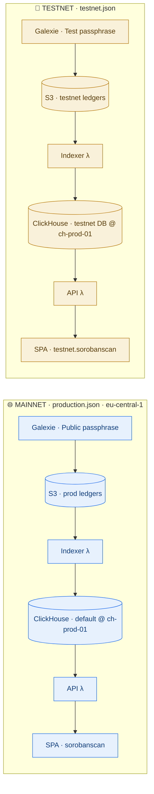
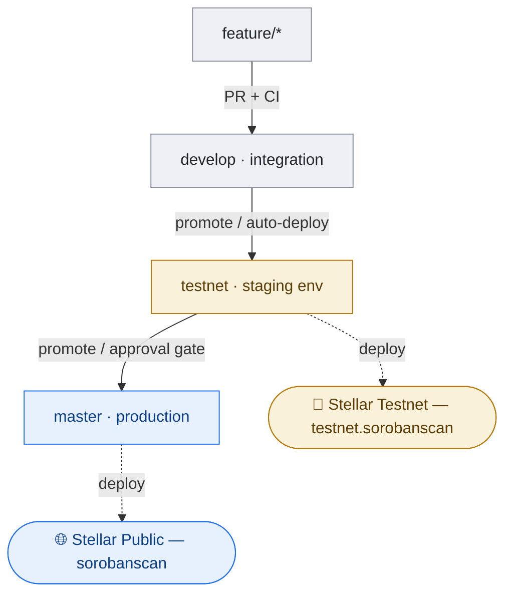

# ADR 0052: Testnet as a second environment and pre-mainnet staging tier

**Related:**

- ADR 0009 (staging-deploy trigger strategy) — **superseded**: the us-east-1
  staging it described is gone (0 stacks), the workflow + trigger retired in
  lore-0390 / PR #338.
- ADR 0047 (ClickHouse is the primary API datastore).

---

## Context

We need a **Stellar Testnet** deployment of the explorer (devs building on Soroban
testnet want it), and we have **no real staging** — the old us-east-1 "staging"
was a fossil pointing at a torn-down environment and was removed (lore-0390).

A testnet explorer and a staging tier are the same need answered once: an
environment that runs the **full pipeline** (Galexie → S3 → Indexer → ClickHouse
→ API → SPA) against real-but-low-stakes data, safe to break, deployed before
mainnet. That is a far better lower environment than a synthetic mirror of prod.

---

## Decision

### 1. Testnet is a second ENVIRONMENT, not a fork of the code

The indexer, API, enrichment worker and SPA are the **same binaries** as mainnet.
Everything that differs is configuration in one `envs/testnet.json` +
`infra/src/bin/testnet.ts` (a mirror of `production.ts`), deployed as
`Explorer-testnet-*` stacks. No code branches by network.

Each environment is a **fully separate stack** — its own Galexie, S3, **Lambda
functions** (`Indexer λ`, `API λ`) and SPA. The Lambdas and SPA are built from the
**same source** but deployed as **separate per-env functions**
(`production-…-indexer` vs `testnet-…-indexer`). Each env owns its S3, domains and
secrets; only **ClickHouse is shared** (see decision 2).

### 2. Testnet ClickHouse = a separate `testnet` database on the shared `ch-prod-01`

Testnet does **not** get a dedicated node. It becomes a third database alongside
`default` (the app) and `prices` inside the `app-clickhouse-1` container — the
proven **prices-tenant pattern**. Isolation is by RBAC, not hardware:

- `CREATE DATABASE testnet` + `apply_init_sql` into it (same schema).
- A testnet writer (indexer) and reader (API) user in `users.d/services.xml`,
  scoped to the `testnet` database.
- A **conservative profile + quota** (`profiles.xml` / `quotas.xml`): bounded
  `max_memory_usage`, `max_execution_time`, and a `read_rows` cap, so a testnet
  experiment cannot starve prod on the shared node.
- `testnet.json` points `CLICKHOUSE` at the same host with `database=testnet` and
  testnet credentials; mTLS/Caddy is shared.

### 3. Branch = environment (develop → testnet → master)

Each long-lived branch maps to a deployed environment; promotion up the chain
deploys the next tier. Mainnet stays behind a deliberate approval gate; testnet
can auto-deploy.

Start simpler if desired: deploy testnet straight from `develop` (bleeding-edge
staging) and add the `testnet` branch only when a stable promotion point is
wanted. The dispatch-only `deploy-production.yml` template (lore-0390) generalises
to `deploy-testnet` by parameterising the env config.

---

## Rationale

- **Same binaries → true integration test.** Testnet exercises the whole pipeline
  end-to-end, not a fake mirror. It catches functional/integration/deploy
  regressions that unit tests and query-string checks cannot.
- **prices-tenant CH is already proven** (ADR-era multi-tenant, task 0314 RBAC).
  Reusing it is cheaper than a second node and needs no new operational surface.
- **One need, answered once.** A public testnet explorer _is_ the staging tier —
  low-stakes, resettable, genuinely useful to Soroban devs.
- **Replaces the fossil staging done right** — real pipeline, real data.

---

## Consequences

**Non-negotiables:**

1. **Network passphrase → `network_id`.** The indexer derives `network_id()` from
   the passphrase (tx hashing / contract-id derivation). Testnet MUST use the
   testnet passphrase, or hashes/IDs are wrong — this enters parsing, not just config.
2. **CH isolation is quota-based.** Shared node ⇒ set the testnet profile/quota
   conservatively. The `read_rows` quota is a **hard error** when tripped (0290
   lesson), not a throttle — cap it generous-but-bounded (testnet data is tiny).
3. **Testnet resets (~quarterly).** SDF wipes testnet. Runbook: `DROP DATABASE
testnet` + restart Galexie from the new genesis — clean, isolated, no drop-size
   limit. A plus: the reset regularly exercises the bootstrap/backfill path.
4. **users.d change = compose recreate.** Adding the testnet CH user needs
   `docker compose up -d --force-recreate clickhouse` (single-file mount stale-inode;
   SQL-grant / restart won't apply it) — the 0314 `prices_writer`-grant lesson.
5. **Testnet Soroban RPC** for enrichment / NFT metadata (different endpoint).

**Critical caveat — testnet is FUNCTIONAL staging, not perf/scale staging.**
Testnet holds a fraction of mainnet's data (mainnet: 22M accounts; testnet: a
handful). It will **not** reproduce the scale problems fixed in the 0357 cluster
(acclist's 24M scan, `assets FINAL`, the tx-list drivers). Performance still needs
**mainnet byte-identical verification**; testnet complements, does not replace, it.

---

## Alternatives Considered

### Alternative 1: Dedicated testnet ClickHouse node (`ch-testnet-01`)

**Description:** A separate small Hetzner node for testnet CH.

**Pros:** Physical isolation — testnet load can never touch prod CH.

**Cons:** Extra box + Caddy + mTLS + backups to run; testnet data is tiny so the
node is mostly idle; duplicates operational surface.

**Decision:** REJECTED — quota-based isolation on the shared node (prices pattern)
gives enough safety at lower cost and no new ops surface.

### Alternative 2: Synthetic "staging" mirroring mainnet

**Description:** A staging env that replays/mirrors mainnet data (the old
us-east-1 model).

**Cons:** Fake data, another environment to feed, and it still wouldn't match
mainnet scale. No real user value.

**Decision:** REJECTED — testnet is a real network with real users and is
inherently the better lower environment.

### Alternative 3: A separate testnet code branch/fork

**Description:** Branch the code per network.

**Cons:** The code does not differ by network — only config does. A fork would
create permanent drift between two identical codebases.

**Decision:** REJECTED — testnet is an environment (config), not a code variant.

---

## Implementation

Phased (own task, TBD): (1) scaffold `testnet.json` + `bin/testnet.ts`; (2)
`CREATE DATABASE testnet` + testnet RBAC user (users.d → compose recreate) +
`apply_init_sql`; (3) Galexie testnet config → S3; (4) deploy
`Explorer-testnet-Compute`; (5) SPA → `testnet.sorobanscan`; (6) `deploy-testnet`
CI (auto-on-develop or dispatch); (7) testnet-reset runbook.

- [ ] **Docs updated** — deferred until implementation: on build, update the
      infrastructure/environments pages under `docs/architecture/**` per ADR 0032
      (adds the testnet environment + the CH multi-tenant note).
- [ ] **API types regenerated** — N/A (no API surface change; testnet serves the
      same API).
