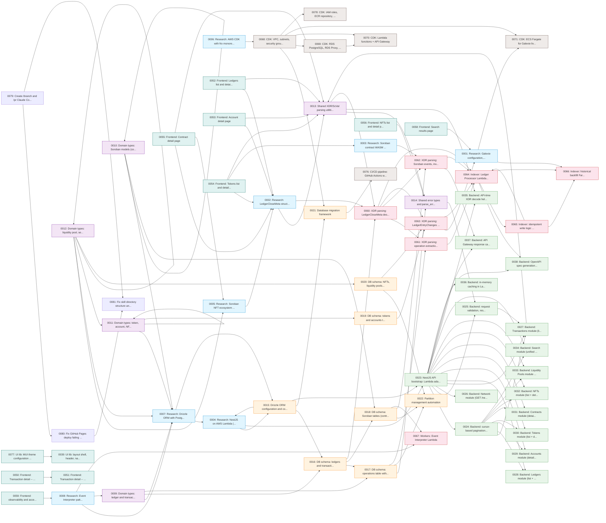

# Backlog Board

> **Auto-generated** — do not edit manually.
> Run `node tools/scripts/generate-lore-board.mjs` to regenerate.
> Last updated: 2026-03-25

## Overview

| Total  | 📋 Backlog | 🚧 Active | 🚫 Blocked | ✅ Done |
| :----: | :--------: | :-------: | :--------: | :-----: |
| **81** |     77     |     2     |     0      |    2    |

**Progress:** 2% complete · 2% in progress

## By Layer

| Layer             | Total | Backlog | Active | Blocked | Done |
| :---------------- | :---: | :-----: | :----: | :-----: | :--: |
| 🔬 Research       |   8   |    7    |   0    |    0    |  1   |
| 📦 Domain         |   6   |    6    |   0    |    0    |  0   |
| 🗄️ Database       |   8   |    8    |   0    |    0    |  0   |
| ⚙️ Backend API    |  16   |   16    |   0    |    0    |  0   |
| 🔄 Indexing       |   8   |    8    |   0    |    0    |  0   |
| 🖥️ Frontend       |  22   |   22    |   0    |    0    |  0   |
| ☁️ Infrastructure |  10   |   10    |   0    |    0    |  0   |
| 🔧 Tooling        |   3   |    0    |   2    |    0    |  1   |

## Tasks

### 🔬 Research

| ID                                                                                | Title                                                                       |    Status    | Priority  | Assignee |   Type   |
| :-------------------------------------------------------------------------------- | :-------------------------------------------------------------------------- | :----------: | :-------: | :------: | :------: |
| [0001](1-tasks/archive/0001_RESEARCH_galexie-captive-core-setup/README.md)        | Research: Galexie configuration, Captive Core setup, and output format      | ✅ completed |  🔴 high  | `filip`  | RESEARCH |
| [0002](1-tasks/backlog/0002_RESEARCH_ledgerclosemeta-xdr-parsing/README.md)       | Research: LedgerCloseMeta structure and @stellar/stellar-sdk XDR parsing    |  📋 backlog  |  🔴 high  |    —     | RESEARCH |
| [0003](1-tasks/backlog/0003_RESEARCH_soroban-wasm-interface-extraction/README.md) | Research: Soroban contract WASM interface extraction                        |  📋 backlog  |  🔴 high  |    —     | RESEARCH |
| [0004](1-tasks/backlog/0004_RESEARCH_nestjs-lambda-adapter/README.md)             | Research: NestJS on AWS Lambda (adapter, cold starts, connection lifecycle) |  📋 backlog  |  🔴 high  |    —     | RESEARCH |
| [0005](1-tasks/backlog/0005_RESEARCH_soroban-nft-patterns/README.md)              | Research: Soroban NFT ecosystem patterns and detection heuristics           |  📋 backlog  | 🟡 medium |    —     | RESEARCH |
| [0006](1-tasks/backlog/0006_RESEARCH_aws-cdk-nx-monorepo/README.md)               | Research: AWS CDK with Nx monorepo organization                             |  📋 backlog  | 🟡 medium |    —     | RESEARCH |
| [0007](1-tasks/backlog/0007_RESEARCH_drizzle-orm-postgres-partitioning/README.md) | Research: Drizzle ORM with PostgreSQL partitioning and advanced features    |  📋 backlog  |  🔴 high  |    —     | RESEARCH |
| [0008](1-tasks/backlog/0008_RESEARCH_event-interpreter-patterns/README.md)        | Research: Event Interpreter pattern matching and enrichment approach        |  📋 backlog  | 🟡 medium |    —     | RESEARCH |

### 📦 Domain

| ID                                                                          | Title                                                                  |   Status   | Priority  | Assignee |  Type   |
| :-------------------------------------------------------------------------- | :--------------------------------------------------------------------- | :--------: | :-------: | :------: | :-----: |
| [0009](1-tasks/backlog/0009_FEATURE_domain-types-ledger-transaction.md)     | Domain types: ledger and transaction models                            | 📋 backlog |  🔴 high  |    —     | FEATURE |
| [0010](1-tasks/backlog/0010_FEATURE_domain-types-soroban-models.md)         | Domain types: Soroban models (contract, invocation, event)             | 📋 backlog |  🔴 high  |    —     | FEATURE |
| [0011](1-tasks/backlog/0011_FEATURE_domain-types-token-account-nft.md)      | Domain types: token, account, NFT models                               | 📋 backlog |  🔴 high  |    —     | FEATURE |
| [0012](1-tasks/backlog/0012_FEATURE_domain-types-pool-search-pagination.md) | Domain types: liquidity pool, search, pagination, network stats models | 📋 backlog |  🔴 high  |    —     | FEATURE |
| [0013](1-tasks/backlog/0013_FEATURE_shared-xdr-scval-parsing-lib.md)        | Shared XDR/ScVal parsing utilities library                             | 📋 backlog |  🔴 high  |    —     | FEATURE |
| [0014](1-tasks/backlog/0014_FEATURE_shared-error-types-parse-error.md)      | Shared error types and parse_error handling                            | 📋 backlog | 🟡 medium |    —     | FEATURE |

### 🗄️ Database

| ID                                                                      | Title                                                                       |   Status   | Priority  | Assignee |  Type   |
| :---------------------------------------------------------------------- | :-------------------------------------------------------------------------- | :--------: | :-------: | :------: | :-----: |
| [0015](1-tasks/backlog/0015_FEATURE_drizzle-orm-config-connection.md)   | Drizzle ORM configuration and connection setup                              | 📋 backlog |  🔴 high  |    —     | FEATURE |
| [0016](1-tasks/backlog/0016_FEATURE_db-schema-ledgers-transactions.md)  | DB schema: ledgers and transactions tables                                  | 📋 backlog |  🔴 high  |    —     | FEATURE |
| [0017](1-tasks/backlog/0017_FEATURE_db-schema-operations.md)            | DB schema: operations table with transaction_id partitioning                | 📋 backlog |  🔴 high  |    —     | FEATURE |
| [0018](1-tasks/backlog/0018_FEATURE_db-schema-soroban-tables.md)        | DB schema: Soroban tables (contracts, invocations, events, interpretations) | 📋 backlog |  🔴 high  |    —     | FEATURE |
| [0019](1-tasks/backlog/0019_FEATURE_db-schema-tokens-accounts.md)       | DB schema: tokens and accounts tables                                       | 📋 backlog | 🟡 medium |    —     | FEATURE |
| [0020](1-tasks/backlog/0020_FEATURE_db-schema-nfts-pools-snapshots.md)  | DB schema: NFTs, liquidity pools, and pool snapshots tables                 | 📋 backlog | 🟡 medium |    —     | FEATURE |
| [0021](1-tasks/backlog/0021_FEATURE_db-migration-framework.md)          | Database migration framework                                                | 📋 backlog |  🔴 high  |    —     | FEATURE |
| [0022](1-tasks/backlog/0022_FEATURE_partition-management-automation.md) | Partition management automation                                             | 📋 backlog | 🟡 medium |    —     | FEATURE |

### ⚙️ Backend API

| ID                                                                              | Title                                                                  |   Status   | Priority  | Assignee |  Type   |
| :------------------------------------------------------------------------------ | :--------------------------------------------------------------------- | :--------: | :-------: | :------: | :-----: |
| [0023](1-tasks/backlog/0023_FEATURE_nestjs-api-bootstrap.md)                    | NestJS API bootstrap: Lambda adapter, app.module, env config           | 📋 backlog | 🟡 medium |    —     | FEATURE |
| [0024](1-tasks/backlog/0024_FEATURE_backend-pagination-query-parsing.md)        | Backend: cursor-based pagination helpers and query parsing             | 📋 backlog | 🟡 medium |    —     | FEATURE |
| [0025](1-tasks/backlog/0025_FEATURE_backend-validation-serialization-errors.md) | Backend: request validation, response serialization, error mapping     | 📋 backlog | 🟡 medium |    —     | FEATURE |
| [0026](1-tasks/backlog/0026_FEATURE_backend-network-module.md)                  | Backend: Network module (GET /network/stats)                           | 📋 backlog | 🟡 medium |    —     | FEATURE |
| [0027](1-tasks/backlog/0027_FEATURE_backend-transactions-module.md)             | Backend: Transactions module (list + detail + filters)                 | 📋 backlog | 🟡 medium |    —     | FEATURE |
| [0028](1-tasks/backlog/0028_FEATURE_backend-ledgers-module.md)                  | Backend: Ledgers module (list + detail + linked transactions)          | 📋 backlog | 🟡 medium |    —     | FEATURE |
| [0029](1-tasks/backlog/0029_FEATURE_backend-accounts-module.md)                 | Backend: Accounts module (detail + balances + transactions)            | 📋 backlog | 🟡 medium |    —     | FEATURE |
| [0030](1-tasks/backlog/0030_FEATURE_backend-tokens-module.md)                   | Backend: Tokens module (list + detail + transactions)                  | 📋 backlog | 🟡 medium |    —     | FEATURE |
| [0031](1-tasks/backlog/0031_FEATURE_backend-contracts-module.md)                | Backend: Contracts module (detail, interface, invocations, events)     | 📋 backlog | 🟡 medium |    —     | FEATURE |
| [0032](1-tasks/backlog/0032_FEATURE_backend-nfts-module.md)                     | Backend: NFTs module (list + detail + transfers)                       | 📋 backlog | 🟡 medium |    —     | FEATURE |
| [0033](1-tasks/backlog/0033_FEATURE_backend-liquidity-pools-module.md)          | Backend: Liquidity Pools module (list + detail + transactions + chart) | 📋 backlog | 🟡 medium |    —     | FEATURE |
| [0034](1-tasks/backlog/0034_FEATURE_backend-search-module.md)                   | Backend: Search module (unified search with query classification)      | 📋 backlog | 🟡 medium |    —     | FEATURE |
| [0035](1-tasks/backlog/0035_FEATURE_backend-xdr-decode-helpers.md)              | Backend: API-time XDR decode helpers for advanced transaction view     | 📋 backlog | 🟡 medium |    —     | FEATURE |
| [0036](1-tasks/backlog/0036_FEATURE_backend-inmemory-cache.md)                  | Backend: in-memory caching in Lambda execution environment             | 📋 backlog | 🟡 medium |    —     | FEATURE |
| [0037](1-tasks/backlog/0037_FEATURE_backend-api-gateway-caching.md)             | Backend: API Gateway response caching and cache-control headers        | 📋 backlog | 🟡 medium |    —     | FEATURE |
| [0038](1-tasks/backlog/0038_FEATURE_backend-openapi-docs-portal.md)             | Backend: OpenAPI spec generation and docs portal                       | 📋 backlog | 🟡 medium |    —     | FEATURE |

### 🔄 Indexing

| ID                                                                             | Title                                                                           |   Status   | Priority  | Assignee |  Type   |
| :----------------------------------------------------------------------------- | :------------------------------------------------------------------------------ | :--------: | :-------: | :------: | :-----: |
| [0060](1-tasks/backlog/0060_FEATURE_xdr-parsing-ledgerclosemeta.md)            | XDR parsing: LedgerCloseMeta deserialization, ledger and transaction extraction | 📋 backlog |  🔴 high  |    —     | FEATURE |
| [0061](1-tasks/backlog/0061_FEATURE_xdr-parsing-operations.md)                 | XDR parsing: operation extraction and INVOKE_HOST_FUNCTION details              | 📋 backlog |  🔴 high  |    —     | FEATURE |
| [0062](1-tasks/backlog/0062_FEATURE_xdr-parsing-soroban-events-invocations.md) | XDR parsing: Soroban events, invocation tree, contract interface extraction     | 📋 backlog |  🔴 high  |    —     | FEATURE |
| [0063](1-tasks/backlog/0063_FEATURE_xdr-parsing-ledger-entry-changes.md)       | XDR parsing: LedgerEntryChanges extraction                                      | 📋 backlog | 🟡 medium |    —     | FEATURE |
| [0064](1-tasks/backlog/0064_FEATURE_indexer-ledger-processor-handler.md)       | Indexer: Ledger Processor Lambda handler                                        | 📋 backlog |  🔴 high  |    —     | FEATURE |
| [0065](1-tasks/backlog/0065_FEATURE_indexer-idempotent-writes.md)              | Indexer: idempotent write logic and ledger-sequence watermarks                  | 📋 backlog |  🔴 high  |    —     | FEATURE |
| [0066](1-tasks/backlog/0066_FEATURE_indexer-historical-backfill.md)            | Indexer: historical backfill Fargate task                                       | 📋 backlog | 🟡 medium |    —     | FEATURE |
| [0067](1-tasks/backlog/0067_FEATURE_workers-event-interpreter.md)              | Workers: Event Interpreter Lambda                                               | 📋 backlog | 🟡 medium |    —     | FEATURE |

### 🖥️ Frontend

| ID                                                                           | Title                                                                  |   Status   | Priority  | Assignee |  Type   |
| :--------------------------------------------------------------------------- | :--------------------------------------------------------------------- | :--------: | :-------: | :------: | :-----: |
| [0039](1-tasks/backlog/0039_FEATURE_ui-layout-shell-header-nav.md)           | UI lib: layout shell, header, navigation, network indicator            | 📋 backlog |  🔴 high  |    —     | FEATURE |
| [0040](1-tasks/backlog/0040_FEATURE_ui-global-search-bar.md)                 | UI lib: global search bar component                                    | 📋 backlog |  🔴 high  |    —     | FEATURE |
| [0041](1-tasks/backlog/0041_FEATURE_ui-explorer-table-pagination.md)         | UI lib: explorer table, pagination controls, cursor pagination adapter | 📋 backlog |  🔴 high  |    —     | FEATURE |
| [0042](1-tasks/backlog/0042_FEATURE_ui-identifier-display-copy.md)           | UI lib: identifier display, copy button, linked identifiers            | 📋 backlog |  🔴 high  |    —     | FEATURE |
| [0043](1-tasks/backlog/0043_FEATURE_ui-badges-timestamps-polling.md)         | UI lib: badges, relative timestamps, polling indicator                 | 📋 backlog |  🔴 high  |    —     | FEATURE |
| [0044](1-tasks/backlog/0044_FEATURE_ui-loading-error-empty-states.md)        | UI lib: loading skeletons, error states, empty states                  | 📋 backlog |  🔴 high  |    —     | FEATURE |
| [0045](1-tasks/backlog/0045_FEATURE_ui-tabs-charts-tree-viz.md)              | UI lib: tabs, charts, and graph/tree visualization primitives          | 📋 backlog |  🔴 high  |    —     | FEATURE |
| [0046](1-tasks/backlog/0046_FEATURE_frontend-tanstack-query-api-client.md)   | Frontend: TanStack Query setup, API client, polling, env config        | 📋 backlog |  🔴 high  |    —     | FEATURE |
| [0047](1-tasks/backlog/0047_FEATURE_frontend-router-routes.md)               | Frontend: router setup, route definitions, param validation            | 📋 backlog |  🔴 high  |    —     | FEATURE |
| [0048](1-tasks/backlog/0048_FEATURE_frontend-home-page.md)                   | Frontend: Home page                                                    | 📋 backlog |  🔴 high  |    —     | FEATURE |
| [0049](1-tasks/backlog/0049_FEATURE_frontend-transactions-list.md)           | Frontend: Transactions list page                                       | 📋 backlog | 🟡 medium |    —     | FEATURE |
| [0050](1-tasks/backlog/0050_FEATURE_frontend-transaction-detail-normal.md)   | Frontend: Transaction detail -- normal mode                            | 📋 backlog |  🔴 high  |    —     | FEATURE |
| [0051](1-tasks/backlog/0051_FEATURE_frontend-transaction-detail-advanced.md) | Frontend: Transaction detail -- advanced mode                          | 📋 backlog |  🔴 high  |    —     | FEATURE |
| [0052](1-tasks/backlog/0052_FEATURE_frontend-ledgers-list-detail.md)         | Frontend: Ledgers list and detail pages                                | 📋 backlog | 🟡 medium |    —     | FEATURE |
| [0053](1-tasks/backlog/0053_FEATURE_frontend-account-detail.md)              | Frontend: Account detail page                                          | 📋 backlog | 🟡 medium |    —     | FEATURE |
| [0054](1-tasks/backlog/0054_FEATURE_frontend-tokens-list-detail.md)          | Frontend: Tokens list and detail pages                                 | 📋 backlog | 🟡 medium |    —     | FEATURE |
| [0055](1-tasks/backlog/0055_FEATURE_frontend-contract-detail.md)             | Frontend: Contract detail page                                         | 📋 backlog |  🔴 high  |    —     | FEATURE |
| [0056](1-tasks/backlog/0056_FEATURE_frontend-nfts-list-detail.md)            | Frontend: NFTs list and detail pages                                   | 📋 backlog | 🟡 medium |    —     | FEATURE |
| [0057](1-tasks/backlog/0057_FEATURE_frontend-liquidity-pools-list-detail.md) | Frontend: Liquidity Pools list and detail pages                        | 📋 backlog | 🟡 medium |    —     | FEATURE |
| [0058](1-tasks/backlog/0058_FEATURE_frontend-search-results.md)              | Frontend: Search results page                                          | 📋 backlog |  🔴 high  |    —     | FEATURE |
| [0059](1-tasks/backlog/0059_FEATURE_frontend-observability-accessibility.md) | Frontend: observability and accessibility baseline                     | 📋 backlog | 🟡 medium |    —     | FEATURE |
| [0077](1-tasks/backlog/0077_FEATURE_ui-mui-theme.md)                         | UI lib: MUI theme configuration and explorer-specific styling          | 📋 backlog |  🔴 high  |    —     | FEATURE |

### ☁️ Infrastructure

| ID                                                                 | Title                                                       |   Status   | Priority  | Assignee |  Type   |
| :----------------------------------------------------------------- | :---------------------------------------------------------- | :--------: | :-------: | :------: | :-----: |
| [0068](1-tasks/backlog/0068_FEATURE_cdk-vpc-networking.md)         | CDK: VPC, subnets, security groups, VPC endpoints           | 📋 backlog |  🔴 high  |    —     | FEATURE |
| [0069](1-tasks/backlog/0069_FEATURE_cdk-rds-s3-secrets.md)         | CDK: RDS PostgreSQL, RDS Proxy, S3 buckets, Secrets Manager | 📋 backlog |  🔴 high  |    —     | FEATURE |
| [0070](1-tasks/backlog/0070_FEATURE_cdk-lambda-api-gateway.md)     | CDK: Lambda functions + API Gateway                         | 📋 backlog |  🔴 high  |    —     | FEATURE |
| [0071](1-tasks/backlog/0071_FEATURE_cdk-ecs-fargate-galexie.md)    | CDK: ECS Fargate for Galexie live + backfill                | 📋 backlog | 🟡 medium |    —     | FEATURE |
| [0072](1-tasks/backlog/0072_FEATURE_cdk-cloudfront-waf-route53.md) | CDK: CloudFront, WAF, Route 53, S3 static hosting           | 📋 backlog | 🟡 medium |    —     | FEATURE |
| [0073](1-tasks/backlog/0073_FEATURE_cdk-cloudwatch-alarms.md)      | CDK: CloudWatch dashboards and alarms                       | 📋 backlog | 🟡 medium |    —     | FEATURE |
| [0074](1-tasks/backlog/0074_FEATURE_cdk-eventbridge-xray.md)       | CDK: EventBridge rules and X-Ray tracing                    | 📋 backlog | 🟡 medium |    —     | FEATURE |
| [0075](1-tasks/backlog/0075_FEATURE_cdk-environment-config.md)     | CDK: environment-specific configuration (dev/staging/prod)  | 📋 backlog |  🔴 high  |    —     | FEATURE |
| [0076](1-tasks/backlog/0076_FEATURE_cicd-github-actions.md)        | CI/CD pipeline: GitHub Actions workflows                    | 📋 backlog |  🔴 high  |    —     | FEATURE |
| [0078](1-tasks/backlog/0078_FEATURE_cdk-iam-ecr-nat.md)            | CDK: IAM roles, ECR repository, NAT Gateway                 | 📋 backlog |  🔴 high  |    —     | FEATURE |

### 🔧 Tooling

| ID                                                                          | Title                                                                       |    Status    | Priority |     Assignee     |  Type   |
| :-------------------------------------------------------------------------- | :-------------------------------------------------------------------------- | :----------: | :------: | :--------------: | :-----: |
| [0079](1-tasks/archive/0079_FEATURE_pr-and-branch-skills.md)                | Create /branch and /pr Claude Code skills for lore-aware git workflow       | ✅ completed | 🔴 high  | `stkrolikiewicz` | FEATURE |
| [0080](1-tasks/active/0080_BUG_deploy-board-duplicate-artifacts.md)         | Fix GitHub Pages deploy failing with duplicate artifacts                    |  🚧 active   | 🔴 high  | `stkrolikiewicz` |   BUG   |
| [0081](1-tasks/active/0081_BUG_fix-skills-structure-and-deploy-workflow.md) | Fix skill directory structure and deploy-board workflow duplicate artifacts |  🚧 active   | 🔴 high  | `stkrolikiewicz` |   BUG   |

## Dependency Graph

**Legend:** 🔬 Research · 📦 Domain · 🗄️ Database · ⚙️ Backend API · 🔄 Indexing · 🖥️ Frontend · ☁️ Infrastructure · 🔧 Tooling | 🔴 High · 🟡 Medium · ⚪ Low
